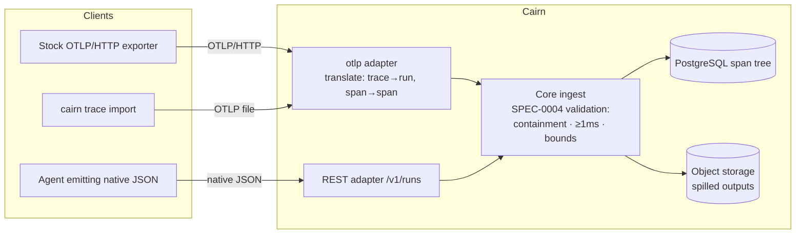

# ADR-0015: OTLP Trace Ingestion as a Translation Adapter

## Context and Problem Statement

ADR-0009 chose a native run/span tree and explicitly declined OTLP ingestion (its
Option B), accepting the consequence that "teams already exporting OTel get no free
bridge." That bill has now come due from an unexpected direction: not ops teams with
collector pipelines, but **the capturing agents themselves**. In the July 2026 stress
test, a harness attempting to share its run reached for OpenTelemetry *repeatedly and
unprompted* — it tried to express the capture as an OTel trace before contorting it
into Cairn's shape, and the contortion is where the data went bad. OTel is the
vocabulary the ecosystem already thinks in: agent frameworks ship OTel instrumentation
(often under `gen_ai.*` semantic conventions), and every harness that has a trace at
all has it in something OTel-shaped.

How does Cairn accept OTel-shaped traces without reversing ADR-0009's other half —
that Cairn is a sharing surface, not a tracing backend?

## Decision Drivers

* **Meet agents where they are** — repeated observed behavior beats guidance; if the
  natural emission is OTel, translation should be Cairn's job, not every agent's.
* **The native model stays canonical** — ADR-0009's reasons for not *storing* OTLP
  verbatim are all still true: `SpanKind` doesn't map to the category vocabularies,
  resource/scope topology is noise for a sharing product, and the viewer needs Cairn's
  fields.
* **New validation must not be bypassable** — SPEC-0004 now enforces temporal
  containment, ≥ 1 ms durations, and span bounds; an OTLP side door must land in the
  same core ingest path, not around it.
* **Stock exporters should just work** — the win condition is pointing an unmodified
  OTLP/HTTP exporter at Cairn with a bearer token and getting a shareable run.
* **One core, thin adapters (ADR-0012/ADR-0003)** — a second ingest dialect is
  affordable only if it is a translation layer over the same core methods REST and MCP
  already call.

## Considered Options

* **Option A — OTLP translation adapter in the core, exposed over REST and the CLI.**
  A `POST /v1/otlp/v1/traces` endpoint accepting standard OTLP/HTTP (protobuf and
  JSON) plus a `cairn trace import` CLI path, both feeding one `internal/otlp`
  translator that converts trace → run and span → span into the exact structs the
  native ingest path validates and persists.
* **Option B — Verbatim OTLP storage.** ADR-0009's rejected Option B, revisited.
* **Option C — CLI-only converter.** Ship the translation exclusively in the `cairn`
  CLI; the server keeps a single native dialect.
* **Option D — Guidance only.** Keep teaching agents the native shape via
  `run_capture` and tool schemas; add no OTel surface.

## Decision Outcome

Chosen option: **"Option A — OTLP translation adapter in the core, exposed over REST
and the CLI"**, because it converts the ecosystem's default emission into Cairn's
canonical model at the one boundary Cairn controls, reuses the incremental ingest
path (and therefore every SPEC-0004 validation) unchanged, and makes stock OTLP/HTTP
exporters a supported client. Option B stays rejected for ADR-0009's original
reasons — nothing about the stress test made verbatim storage more useful; the failure
was in *translation by the agent*, which is precisely the step this ADR moves
server-side. Option C leaves REST/MCP agents without the bridge and makes the CLI a
semantic gatekeeper, though its instinct survives in A: the CLI grows an import
command that fronts the same endpoint. Option D is the option we were already
running, and the stress test is what it produced.

### Shape of the adapter

* **Endpoint**: `POST /v1/otlp/v1/traces`, speaking OTLP/HTTP with both `content-type`
  encodings (`application/x-protobuf`, `application/json`). Authentication is the
  standard bearer token (OTLP exporters pass headers), with the same rate limits and
  body-size limits as native ingest. Not exposed over MCP — OTLP payloads are exactly
  the oversized captures SPEC-0004 steers off that transport.
* **Trace → run**: spans are grouped by `trace_id`; the first sight of a `trace_id`
  opens a run (ADR-0009 incremental path), later batches append, and the run closes
  via the native close call or the deployment's abandoned-run policy. The run's
  `started_at` is the earliest span start; offsets are recomputed run-relative.
* **Span → span**: `span_id`/`parent_span_id` carry over; nanosecond start/end become
  `start_offset_ms` and `duration_ms` (ceil to 1 ms so a real sub-millisecond
  operation is measurement, not a zero); `name` carries over; attributes map to
  `tool`, `args`, and `output` where the semantic conventions provide them.
* **Category**: an explicit `cairn.category` span attribute wins. Otherwise a mapping
  table (owned by the spec, not this ADR) derives a category from the `gen_ai.*` and
  general semconv attributes; the fallback is the open set ADR-0009 already grants —
  never a rejection for vocabulary.
* **Dropped, deliberately**: span events, span links, resource/scope topology (except
  `service.name`, which informs provenance), sampling flags, trace state. Span
  `status` is recorded nowhere in v1 — it joins the errored-run "try next" of
  ADR-0009 rather than smuggling a status field in through the side door.
* **Same validation, same atomicity**: the translated batch passes through the
  identical core ingest as native spans — temporal containment, ≥ 1 ms durations,
  category length, span bounds, output spill. An OTel trace that violates the tree
  rules is rejected with the same sentinels; the adapter adds no second, laxer
  standard.

### Consequences

* Good, because an agent's first instinct — "export my trace as OTel" — becomes a
  supported path instead of the first step of a garbling; the translation with the
  highest error rate moves from every agent to one tested implementation.
* Good, because stock instrumentation (agent frameworks' OTel integrations, `gen_ai`
  semconv emitters) can target Cairn with configuration only: an endpoint URL and an
  auth header.
* Good, because the native model remains the single canonical store and the viewer,
  stats, annotations, and validation are untouched — this is an adapter in the
  ADR-0012 sense, not a second system.
* Bad, because Cairn takes on an OTLP surface: a protobuf dependency, encoding
  negotiation, and a semconv mapping table that must track a moving ecosystem.
* Bad, because translation is lossy by design (events, links, resource topology,
  status); an OTel purist will notice, and a round-trip back out of Cairn is
  explicitly not promised.
* Neutral, because grouping by `trace_id` gives live OTLP export the semantics of the
  existing incremental path — but ties multi-batch ingest to the abandoned-run
  auto-close policy, which SPEC-0004's design doc already lists as an open question
  that now needs an answer.

### Confirmation

* A conformance test feeds a recorded OTLP/HTTP export (JSON and protobuf encodings
  of the same trace) through the adapter and asserts the resulting run passes
  SPEC-0004 validation, renders the expected waterfall, and derives the expected
  stats.
* A validation test asserts an OTel trace violating containment or carrying
  zero-duration spans is rejected with the same sentinels as native ingest — no
  second standard.
* The derived spec (`/sdd:spec otlp-ingest`) owns the attribute→category mapping
  table and the trace_id→run lifecycle rules, and is the checkable artifact for the
  adapter's behavior.

## Pros and Cons of the Options

### Option A — OTLP translation adapter in the core (REST + CLI)

* Good, because one tested translator replaces N agent-side contortions — the
  observed failure mode.
* Good, because it reuses the incremental ingest path and every validation on it.
* Good, because stock exporters work with config only.
* Neutral, because the semconv mapping table is a living document — but it lives in a
  spec, versioned with the code that implements it.
* Bad, because it adds a protobuf dependency and a second wire dialect to fuzz,
  limit, and secure.

### Option B — Verbatim OTLP storage

* Good, because ingestion is a copy, with no translation to maintain.
* Bad, because ADR-0009's analysis still holds: `SpanKind` maps to nothing the viewer
  shows, stats and annotations need Cairn's fields, so a read-time translation gets
  written anyway — plus a storage schema wedded to someone else's protocol.
* Bad, because SPEC-0004's tree validation would have to be re-expressed over OTel
  structures, duplicating the rules this ADR is careful to keep singular.

### Option C — CLI-only converter

* Good, because the server keeps one dialect; smallest server surface.
* Good, because it fits the "large captures go via the CLI" steering.
* Bad, because live OTLP export (the stock-exporter win) is impossible — a CLI can
  import a file, not receive a stream.
* Bad, because REST-capable agents without the binary are stranded; the bridge exists
  only where the CLI is installed.

### Option D — Guidance only

* Good, because it costs nothing to build.
* Bad, because it is the status quo that produced the stress-test garbling; observed
  behavior has already voted against it.
* Bad, because the guidance burden compounds per harness, while an adapter is paid
  for once.

## More Information

* ADR-0009 — the native span model this adapter translates *into*; its Option B
  rejection is narrowed by this ADR (ingest-time translation yes, verbatim storage
  still no).
* ADR-0012 / ADR-0003 — the one-core/thin-adapters architecture that makes the
  adapter cheap and parity mechanical.
* SPEC-0004 (trajectory-share) — the validation the translated spans must pass:
  temporal containment, ≥ 1 ms durations, ingest bounds, transport steering.
* OTLP/HTTP specification and the OpenTelemetry `gen_ai` semantic conventions — the
  wire format and the attribute vocabulary the mapping table tracks.
