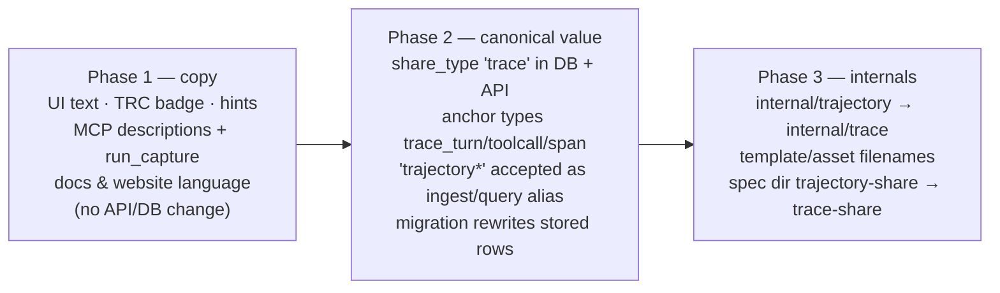

# ADR-0016: Traces, Not Trajectories

## Context and Problem Statement

Cairn's flagship share type has been called a **trajectory** since ADR-0009. The term
is technically apt — RL literature calls an agent's state/action sequence a trajectory —
and almost nobody else uses it. Everyone else, human and agent alike, says **trace**:
OpenTelemetry calls the artifact a trace, agent frameworks emit traces, and the July
2026 stress-test agent repeatedly described what it was posting as a trace (and tried
to send it as one — see ADR-0015). A product whose vocabulary differs from its users'
pays a tax on every interaction: prompts must translate, docs must define, and
"trajectory" signals ML-insider rather than the "pastebin for the agent era"
positioning of ADR-0001.

What is the canonical name for this share type, across UX, API, MCP, and the code —
and how does a rename land without breaking stored data, live links, or existing
clients?

## Decision Drivers

* **Speak the users' language** — agents and engineers say "trace"; the product should
  not make them learn a synonym.
* **OTel alignment just increased** — ADR-0015 makes Cairn an OTLP trace endpoint;
  advertising "export your OTel trace to see your trajectory" is self-inflicted
  confusion.
* **Links are sacred** — ADR-0005/ADR-0007 short URLs in the wild must keep resolving;
  a rename must never invalidate `cairn.stump.wtf/run/<id>`.
* **Wire compatibility** — existing clients (the MCP integrations, the CLI, the
  chezmoi-managed configs) send and expect `trajectory` today; a hard cutover breaks
  them for zero user value.
* **One vocabulary at the end** — a display-only rename that leaves the system
  bilingual forever is the worst steady state: every future contributor learns both.

## Considered Options

* **Option A — Canonical rename to `trace`, staged, with wire-compat aliases.**
  User-facing copy first; then the API/DB canonical value flips to `trace` with
  `trajectory` accepted on ingest and in queries indefinitely; then internal
  identifiers. URLs and existing MCP tool names never change.
* **Option B — Display-only rename.** UI and docs say "trace"; `share_type`,
  anchor types, and code keep `trajectory` forever.
* **Option C — Big-bang rename.** One release renames everything including stored
  values and API enums with no alias window.

## Decision Outcome

Chosen option: **"Option A — canonical rename to `trace`, staged, with wire-compat
aliases"**, because it ends in the right steady state (one vocabulary, the one users
already speak) without breaking a single stored row, live link, or existing client on
the way. Option B is the cheap first step of A masquerading as a destination — it
locks in permanent bilingualism, and Joe's directive was explicit that the *underlying
system* normalizes too. Option C burns existing clients (every MCP config and CLI in
the field sends `trajectory` today) to save an alias table that costs a few lines.

### The taxonomy

* **trace** — the share type: the captured, shareable record of an agent run. Badge
  `TRC`. This is the word in every heading, hint, legend, chip, doc, and tool
  description.
* **run** — the *execution* the trace records, and the resource name it already is:
  `cairn.stump.wtf/run/<id>`, `/v1/runs`, `run_create`/`run_append_spans`/`run_capture` all
  keep their names. "A trace of a run" reads naturally; renaming the resource would
  break every URL and tool integration for cosmetics.
* **span** — unchanged.
* **trajectory** — a deprecated alias, accepted on every wire surface that ever
  accepted it, emitted nowhere after Phase 2.

### Staging

* **Phase 1 (copy)** is pure presentation: templates, viewer strings, badge `TRJ` →
  `TRC`, MCP tool/prompt descriptions, README/docs/website. The ADR-0014 design record
  (tokens, chips, tile stylesheets, SHIPPED_VALUES) updates in the same change, since
  the badge and share-type chip are published design tokens.
* **Phase 2 (canonical value)** flips `share_type` to `trace` and the annotation
  anchor types to `trace_turn`/`trace_toolcall`/`trace_span`: one migration rewrites
  stored rows; the API emits the new values; ingest and queries accept the old ones
  indefinitely (a documented alias map at the adapter boundary, ADR-0012-style — the
  core knows only the canonical value). MCP schemas advertise `trace` and note the
  alias.
* **Phase 3 (internals)** renames packages, files, and identifiers
  (`internal/trajectory` → `internal/trace`, `trajectory.html/js/css` → `trace.*`,
  spec directory `trajectory-share` → `trace-share`). Behavior-free, reviewable as
  mechanical.
* **Never**: short URLs, existing MCP tool names, and historical ADRs. ADRs are
  immutable records — ADR-0009 keeps its title and this ADR records the rename; specs
  are living documents and do rename.

### Consequences

* Good, because the product finally calls the thing what its users call it, and the
  ADR-0015 OTLP story becomes coherent end-to-end ("export your OTel trace, share the
  trace").
* Good, because no stored row, live link, or deployed client breaks at any phase; the
  alias window is indefinite and cheap (a lookup table at the adapter boundary).
* Bad, because it is a genuinely wide mechanical change — 55 Go files, 52 docs/website
  files, the design record, the MCP surface, the `claude-plugin-cairn` skills — and
  half-done is worse than not started, so the phases must each land complete.
* Bad, because external writing that says "trajectory" (old shares, blog-style
  artifacts, this repo's own history) will coexist with "trace" copy forever; the
  alias and a line in the docs are the whole mitigation.
* Neutral, because `trajectory` remains a valid ingest value indefinitely — the alias
  is not scheduled for removal, only for silence (never emitted, never documented as
  primary).

### Confirmation

* Phase 1: no user-visible surface (templates, MCP descriptions, docs site) contains
  "trajectory" except where it documents the alias; the design-record checks pass with
  the `TRC` chip.
* Phase 2: an integration test posts a run with `share_type: trajectory` and the old
  anchor types and reads back `trace`/`trace_*`; stored pre-migration rows read back
  as `trace` after the migration; the API never emits `trajectory`.
* Phase 3: `git grep -i trajectory -- internal/ cmd/` returns only the alias map and
  historical comments; `make test lint` green.

## Pros and Cons of the Options

### Option A — Canonical rename, staged, with aliases

* Good, because it reaches one-vocabulary steady state with zero breakage.
* Good, because each phase is independently shippable and reviewable.
* Neutral, because the alias map is permanent — a few lines that must never be
  "cleaned up" by a future refactor.
* Bad, because three PRs' worth of mechanical churn touches most of the repo.

### Option B — Display-only rename

* Good, because it ships in an afternoon.
* Bad, because the API, MCP schemas, and code teach every future client and
  contributor the word the UI just stopped using — permanent bilingualism.
* Bad, because it silently fails Joe's actual directive ("normalize … throughout the
  UX/UI and underlying system").

### Option C — Big-bang rename

* Good, because the diff is honest about the end state and there is no alias to
  maintain.
* Bad, because every deployed MCP config and CLI sending `trajectory` breaks on
  upgrade day, and stored annotation rows referencing old anchor types must migrate
  in lockstep with every reader — maximum risk for zero user-visible gain over A.

## More Information

* ADR-0009 — the model this renames the *name* of; its content is untouched and its
  title is history.
* ADR-0015 — the OTLP adapter whose arrival made "trace" not just friendlier but
  self-consistent.
* ADR-0002 / ADR-0005 — the registry entry and URL scheme constraining what may
  change (registry value: yes, with alias; URLs: never).
* ADR-0014 — the design record that must move in Phase 1 (badge, chips, tokens).
