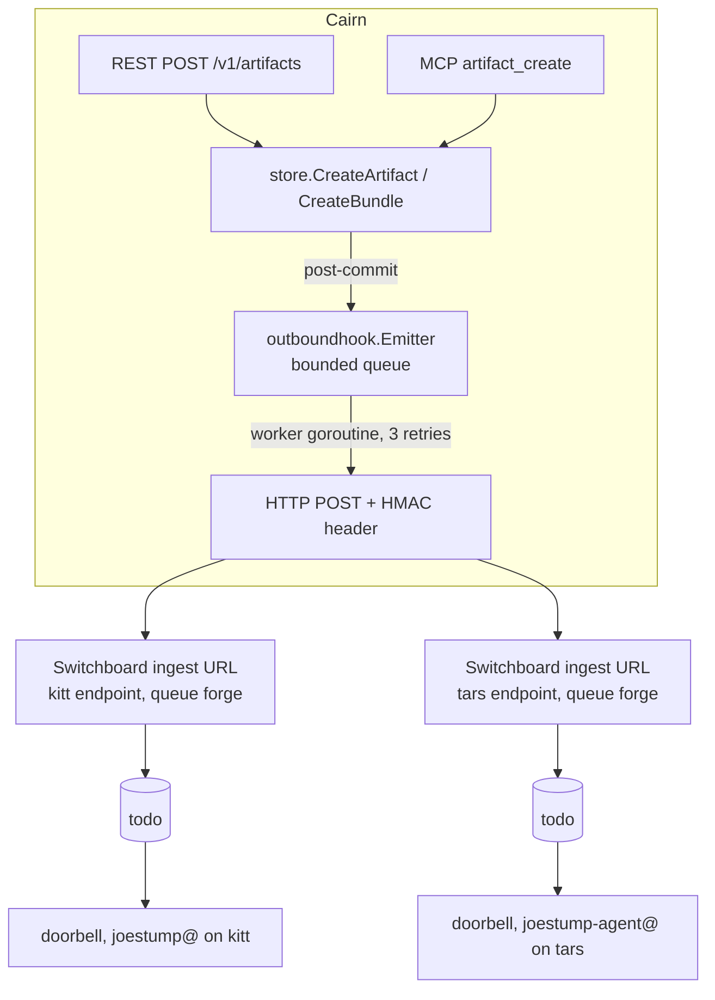

# ADR-0017: Outbound Webhooks on Artifact Creation

## Context and Problem Statement

Cairn artifacts are created by humans (CLI, web) and agents (MCP), but creation is a
dead end: nothing downstream learns an artifact exists until someone polls or is told
out of band. We want a posted Cairn to "ring a doorbell" at a durable work queue
(Switchboard) so a human or agent can pick it up as a review/feedback todo, without
the poster needing to know who should review it.

This is an *outbound* concern and must not collide with the inbound Webhook Inspector
(SPEC-0005, ADR-0010), where "webhook" already means anonymous request capture.

## Decision Drivers

* MVP-first: the feature is deliberately small; a working E2E path beats a durable
  delivery substrate.
* All three surfaces (REST, MCP, CLI→REST) must trigger emission without each
  adapter growing fan-out logic.
* Delivery targets are few (a couple of Switchboard ingest URLs) and internal;
  losing an event to a crash is tolerable, silent infinite retry is not.
* The event body must be verifiable later even though the initial consumer
  (Switchboard `generic` trust) authenticates by unguessable URL alone.

## Considered Options

* In-process async fan-out from the store's creation choke point
* Durable outbox table with a reaper-style delivery worker
* No server-side emission (agents POST to Switchboard themselves)

## Decision Outcome

Chosen option: "In-process async fan-out from the store's creation choke point",
because it covers every surface with one hook, needs no schema or migration, and
matches the scale of the problem (a handful of internal endpoints).

`Store.CreateArtifact` / `CreateBundle` gain an optional emitter (peer-service
pattern, like annotation/trajectory). Post-commit the store hands a small
`artifact.created` event to an `internal/outboundhook` emitter, which enqueues into
a bounded in-memory queue; a single worker goroutine POSTs each event to every
configured target with a short retry/backoff (3 attempts), started and stopped by
cairnd like the retention reaper. Configuration is env-based
(`CAIRN_OUTBOUND_WEBHOOK_URLS`, optional `CAIRN_OUTBOUND_WEBHOOK_SECRET`) and empty
by default, so the feature is inert unless wired.

Every delivery carries an HMAC-SHA256 signature header over the raw body
(`X-Cairn-Signature: sha256=<hex>`) plus `X-Cairn-Event` / `X-Cairn-Event-Id`
headers, so a consumer can upgrade to verified trust without a producer change.

### Consequences

* Good, because one hook at the store covers web, CLI, and MCP creation paths.
* Good, because no migration, queue table, or new infrastructure is required.
* Good, because signed payloads future-proof verification.
* Bad, because events in flight at process death are lost (acceptable: artifacts
  remain readable at their URL; the doorbell is a hint, the artifact is the record).
* Bad, because a slow consumer can apply backpressure only by dropping events once
  the bounded queue fills.

### Confirmation

SPEC-0012 scenarios; integration test creating an artifact through the REST API and
asserting a signed delivery arrives at an httptest receiver; E2E verification
against production Switchboard showing todos on both consuming endpoints.

## Pros and Cons of the Options

### In-process async fan-out

`Store` calls an emitter post-commit; emitter owns a bounded channel and one worker
goroutine with retry.

* Good, because single choke point covers all surfaces and future ones.
* Good, because zero persistence implies zero migrations and trivial rollback
  (unset the env vars).
* Neutral, because delivery is at-least-once-per-attempt within a process lifetime,
  not guaranteed.
* Bad, because crash loses queued events and there is no redelivery API.

### Durable outbox table with a reaper-style delivery worker

Persist events in a `webhook_outbox` table; a background worker delivers with
backoff, mirroring `store.RunReaper`.

* Good, because at-least-once delivery survives restarts.
* Good, because it gives a natural redelivery/dead-letter surface.
* Bad, because it is a schema, a migration, retention for the outbox itself, and a
  worker — significant machinery for a doorbell.
* Bad, because MVP explicitly prefers the smallest thing that works end to end.

### No server-side emission

Agents that want review POST to Switchboard themselves, naming the artifact URL.

* Good, because zero server code.
* Bad, because human-created artifacts (CLI/web) never ring the doorbell, defeating
  the "post a Cairn, get review" flow.
* Bad, because every producer must learn consumer addresses, re-coupling what the
  webhook decouples.

## Architecture Diagram

## More Information

* Implements into SPEC-0012 (`docs/openspec/specs/outbound-webhooks/`).
* Contrast with ADR-0010 / SPEC-0005: inbound webhook *capture*, unrelated.
* Switchboard generic-trust ingest: unguessable URL authenticates; body recorded
  verbatim as the todo payload.
