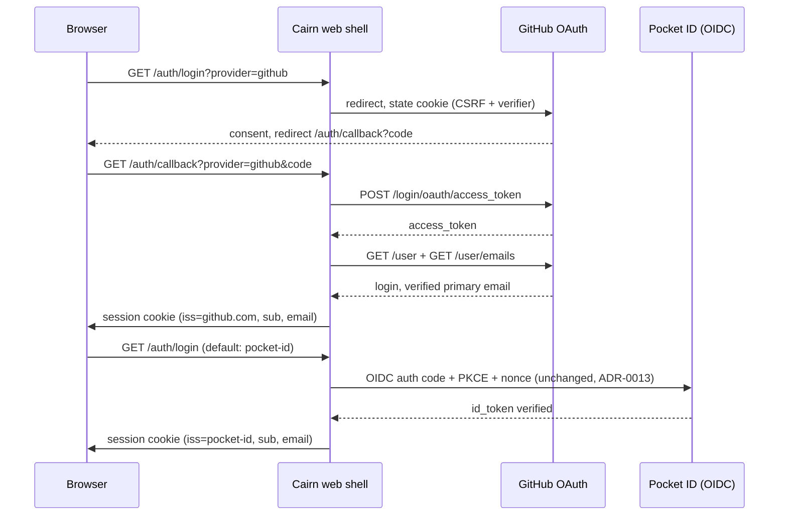

# ADR-0019: GitHub as an Additional Human Auth Provider

## Context and Problem Statement

ADR-0013 made Cairn a native OIDC relying party against Pocket ID, and that
remains the production login path. Two constituencies still hit friction: agents
and collaborators outside the household who have no Pocket ID identity but do
have a GitHub account, and Joe himself when working from a machine or browser
profile that is not enrolled with Pocket ID. "Log in with GitHub" is the
industry-standard answer for both. The question is how to add GitHub as a
*second* human-auth provider to the web app shell without disturbing the
Pocket ID flow (ADR-0013), the MCP OAuth 2.1 authorization server (ADR-0004),
or the single-session model that lets one browser session serve both.

A material constraint shapes every option: **GitHub does not run a standard
OIDC login flow for OAuth apps.** It issues no ID token from
`https://github.com/login/oauth/access_token` and publishes no OIDC discovery
document for user login. Identity at GitHub is plain OAuth 2.0 plus two REST
calls (`GET /user`, `GET /user/emails`). Cairn's OIDC code (PKCE, nonce, ID
token verification) does not transfer to GitHub as-is.

## Decision Drivers

* **Both providers must feed the same session.** A GitHub login and a Pocket ID
  login are the same human principal in Cairn's model; whatever provider issued
  the identity, the resulting session must be indistinguishable downstream.
* **GitHub's non-OIDC reality.** Any design must verify GitHub identity without
  an ID token, or it does not work at all.
* **No standing weak credential.** `dev_login_password` stays dev/CI-only per
  ADR-0013; GitHub login is an addition, not a replacement of that policy.
* **Small blast radius.** The existing Pocket ID flow is accepted and working;
  refactoring it into an abstraction must not change its observable behavior.
* **Future providers should be cheap.** If a third IdP arrives, the change
  should be configuration, not a new code path.

## Considered Options

* **Option A — A minimal `oauth2.Provider` interface with two implementations
  (Pocket ID OIDC, GitHub OAuth 2.0), selected by login-page button.** *(chosen)*
* **Option B — GitHub-specific bolt-on:** a parallel `/auth/github/*` route
  pair and session-establishment path duplicating `oidc.go`'s logic.
* **Option C — Say no: keep Pocket ID as the only production IdP** and onboard
  outsiders into Pocket ID instead.

## Decision Outcome

Chosen option: **(A) a minimal provider interface behind the existing OIDC
routes, with GitHub as the second implementation.**

Cairn keeps the route surface it already has (`/auth/login`,
`/auth/callback`) and adds a `provider` query parameter that selects between
configured providers. The interface is deliberately small — four methods
covering "start a login" and "finish a login" — because the only thing that
differs between Pocket ID and GitHub is the protocol dialect (OIDC with ID
token vs OAuth 2.0 with REST profile fetch). Everything downstream of
"identity established" (session cookie, CSRF token, audit log line) stays
exactly as ADR-0013 shipped it.

### Consequences

* Good, because outsiders authenticate with an identity they already have, and
  Cairn's MCP surfaces (issues, artifacts, comments) get populated by a wider
  set of humans without Joe hand-vending Pocket ID accounts.
* Good, because the third provider becomes a config entry plus one file.
* Good, because GitHub's OAuth 2.0 specifics (email verification check,
  `read:user` scope) are contained in one implementation.
* Bad, because session cookies now cannot tell Pocket ID sessions from GitHub
  sessions without an issuer claim — Cairn MUST store `iss`/`sub` in the
  session and MUST treat GitHub-verified email as lower-assurance identity
  (it is a phishable password login, unlike Pocket ID's passkey).
* Bad, because GitHub rate limits `GET /user` per token; a callback burst
  could throttle logins. Mitigated by caching the profile into the session at
  login time only (no per-request GitHub calls).
* Bad, because two providers means two sets of client ID/secret configuration
  and two things to rotate.

### Confirmation

Compliance is confirmed when: (1) `make test` covers both providers' start and
callback flows with a fake provider server; (2) a GitHub login establishes a
session that can post a comment and an artifact on the deployed instance;
(3) a Pocket ID login still works with no behavioral change, verified against
the existing oidc_integration_test.go suite.

## Pros and Cons of the Options

### Option A — Provider interface, two implementations *(chosen)*

* Good, because the route surface, session model, and CSRF machinery are
  untouched — the diff concentrates in one new package and one handler branch.
* Good, because GitHub's missing ID token is handled in exactly one place.
* Neutral, because an interface with two implementations is the smallest
  abstraction that still earns its keep; it would be premature with one.
* Bad, because a shared interface across two dialects tempts lowest-common-
  denominator modeling (e.g., dropping nonce on the OIDC side). Guarded by
  keeping the OIDC state struct as-is and making provider-specific state
  opaque to the handler.

### Option B — GitHub-specific bolt-on

* Good, because it is the shortest path to working: copy `oidc.go`, swap the
  token exchange for GitHub's, done in an afternoon.
* Bad, because it duplicates state handling, callback verification, and
  session establishment — every future security fix lands twice, and the two
  copies drift (the exact failure mode this codebase's SDD process exists to
  prevent).

### Option C — No GitHub login

* Good, because zero new code and zero new attack surface.
* Bad, because it leaves the actual users (external agents' humans, Joe's
  un-enrolled browsers) locked out, and the workaround — hand-vending Pocket
  ID accounts — is ongoing operational toil that grows with usage.

## Architecture Diagram

Both branches converge on the same `establishSession`; downstream code cannot
tell them apart except by the stored `iss` claim.

## More Information

* Governing spec: SPEC-0013 (`docs/openspec/specs/github-login/`).
* ADR-0013 — the Pocket ID relying-party decision this extends; its session
  and CSRF model are reused verbatim.
* ADR-0004 — the MCP authorization server; the ambient session it reads is the
  same one GitHub login now can establish.
* GitHub OAuth docs: `https://docs.github.com/en/apps/oauth-apps`. Note
  GitHub publishes OIDC discovery only for Actions/`token.githubusercontent.com`,
  not for user login — the reason Option A's interface cannot be "OIDC only."
