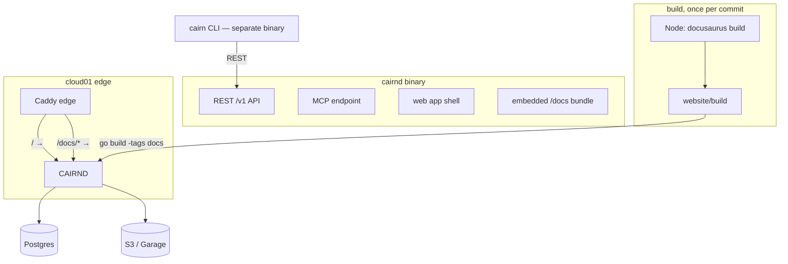

# ADR-0020: The Single-Binary Runtime — Docs Served From the Cairnd Process

## Context and Problem Statement

Cairn's runtime is two artifacts that must be kept in step: the `cairnd` server
container and a separate `cairn-docs` static container that hosts the Docusaurus
bundle behind its own edge-route config. Self-hosting is now a real audience
(the guide is live and `ghcr.io/stump-wtf/cairn` is publicly pullable), and the
story a stranger meets first is "one binary, one container, a Postgres and an S3
bucket" — except the docs container breaks it. The question: **what is the single
`cairnd` binary responsible for, and what does serving the docs from inside it
cost?**

## Decision Drivers

* Two images built and deployed separately drift; the docs a self-hoster reads
  should describe the version they are actually running.
* The docs bundle is static output of a Node/Docusaurus build; Go's `embed`
  makes in-binary serving tractable.
* The `ghcr.io` image contract and the published self-hosting guide must stay
  true across the change.
* `go build` and `go test` must keep working in environments without Node.

## Considered Options

* Embed the built docs bundle in the `cairnd` binary and serve `/docs/*` from it
* Keep the separate `cairn-docs` container (status quo)
* Serve docs from a CDN / object store rather than the binary

## Decision Outcome

Chosen option: **"Embed the built docs bundle in the `cairnd` binary and serve
`/docs/*` from it"**, because it collapses the runtime to one artifact whose docs
are version-exact by construction, removes an entire deployment surface (image,
edge route, compose service), and costs only build-order coupling and a few MB of
binary size — both acceptable for a server artifact shipped in a container.

The **`cairn` CLI stays a separate binary**. It is a pure REST client
(SPEC-0008, ADR-0003) with no server code; folding it into `cairnd` as a
subcommand would couple the Homebrew tap and the CLI release cadence to the
server for no gain. This ADR deliberately does *not* merge the CLI.

### Build-time coupling

The Docker build gains one stage: Docusaurus builds `website/` to
`website/build/` (Node 22, per the site's `engines`), then the Go build embeds
that directory via `go:embed` behind a build tag (`docs`). A bare `go build`
without the tag compiles an empty fallback (a stub page explaining the binary
was built without docs) so dev loops, `go test`, and CI's Go-only jobs never
require Node. The Dockerfile and the release workflow are the only places the
tagged build is produced — one path, wired once.

### Version accuracy and binary size

Embedded docs are built from the same commit as the binary, so "the docs
describe this version" holds by construction rather than by deploy discipline.
The Docusaurus bundle is a few MB, gzip-friendly, and irrelevant inside a
container image that already carries a Go runtime footprint.

### Migration path (cloud01)

The `cairn-docs` service and its `/docs/*` edge route are removed from the
compose stack once `cairnd` with embedded docs is deployed; the edge config
proxies `/docs/*` to `cairnd:8080` like every other route. Because the bundle
was already built with the `/docs/` base path for the live site, no URL
contract changes. The self-hosting guide was updated in the same PR that
landed the serving code; the repo-root `docker-compose.prod.yml` was retired
afterward (#345), leaving the published guide as the one self-host path.

### Consequences

* Good, because the runtime is one binary and one container: "a Postgres, an S3
  bucket, and `cairnd`".
* Good, because docs can never drift from the running version.
* Good, because the self-host compose file and the edge config both shrink.
* Bad, because a docs change now requires a server rebuild and redeploy (the
  GitHub Pages twin, built independently, still publishes from `main` for
  public discoverability — ADR-0014's "adding an ADR publishes it" survives
  there).
* Bad, because the build now has an ordered Node-then-Go dependency, with an
  escape hatch (the `docs` build tag) that must not silently rot.

### Confirmation

SPEC-0015 scenarios: the binary serves `/docs/` page content (asserted on body
text, never status codes — the bundle is an SPA that returns 200 for every
path); an untagged build serves the stub; the public image contract keeps
pulling and working. The cloud01 converge shows `cairn-docs` gone and the live
guide rendering from `cairnd`.

## Pros and Cons of the Options

### Embed in the binary

`go:embed` of the Docusaurus output behind a build tag; `cairnd` serves it.

* Good, because one artifact, version-exact docs, no extra deployment surface.
* Good, because self-hosters get the guide at the same origin they point their
  CLI at — no cross-origin storytelling.
* Bad, because docs-only fixes ride a server release.
* Bad, because the Go build depends on a prior Node build in the packaged path.

### Status quo: separate `cairn-docs` container

* Good, because docs and server deploy independently.
* Bad, because two images drift, and the self-host story is two services for
  one product.
* Bad, because a self-hoster can run docs for a version they are not running.

### CDN / object store

* Good, because the binary stays small and docs deploy independently.
* Bad, because it adds a third-party dependency to the minimal self-host path —
  the exact opposite of the convergence this ADR exists for.
* Bad, because version-exactness needs the same build-time coupling anyway.

## Architecture Diagram

## More Information

* `stump.wtf/cairn#246` — the epic this ADR answers. Not linked: the issue
  tracker is a repository host, which SPEC-0010 REQ "No Repository Links"
  excludes from the rendered record.
* ADR-0014 (the public site is the design record) still governs *content*; this
  ADR changes only *delivery* of the self-host copy. The Pages deployment keeps
  its own pipeline and least-privilege posture.
* SPEC-0008 keeps the CLI a separate artifact; no tap changes.
