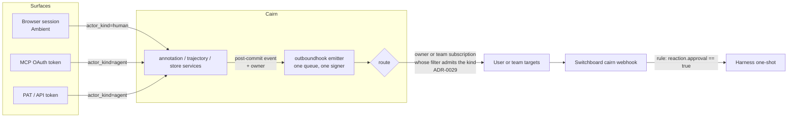

# ADR-0022: Annotation and Trace Lifecycle Events, With a Server-Derived Actor Kind

## Context and Problem Statement

Outbound webhooks (ADR-0017, SPEC-0012) announce exactly one thing: an artifact
was created. `internal/outboundhook/outboundhook.go` hard-codes it —
`const EventKind = "artifact.created"` — and the only emission point is
`store.emitCreated`, reached from `CreateArtifact` and `CreateBundle`. Everything
that happens to an artifact afterwards is silent. A comment, a reaction, a live
trace closing: none of them leave Cairn unless someone polls.

That silence is now the blocker for three things:

1. **On-demand one-shots.** The cross-product milestone for on-demand one-shots
   has a trusted signal from Switchboard start a Harness one-shot within seconds,
   with no polling. Cairn's contribution is a signal that says "a human looked at
   this and said yes" or "this trace finished". Today there is none.
2. **Approvals.** A self-hosting customer's rollout plan uses reactions as a
   lightweight approval gate: a human 👍 on a work order means "go". Cairn stores
   the reaction and tells nobody.
3. **Forgery.** Even if the reaction were announced, it could not be trusted. An
   agent's MCP OAuth token and the human's browser session **resolve to the same
   `actor_id`** (the human's email; ADR-0004 subject-vs-actor). The reactions
   table's uniqueness key is
   `(artifact_id, anchor_type, anchor_key, emoji, actor_id)` and has no
   `on_behalf_of` column at all (#159). So a 👍 posted by the human's own agent is
   indistinguishable from the human's own click. It is worse than that: the
   agent's 👍 **occupies the human's row**, so the human's later click is a no-op
   duplicate, and `Unreact` scoped by `actor_id` lets the agent withdraw a 👍 the
   human made. Agent tokens carry `annotations:write` by design
   (`agentScopes()` in `internal/httpapi/auth.go`), so this is reachable today.

The question: how does Cairn announce annotation and trace lifecycle events so
that a consumer can act on them, and specifically trust a human approval, without
building a second delivery system?

## Decision Drivers

* **One envelope, one signer, one queue.** ADR-0017's envelope
  (`{source, kind, event_id, created_at, data}`), HMAC signature and bounded
  delivery are deployed, and Switchboard verifies them. A second shape is a
  second verifier.
* **Additive or nothing.** SPEC-0012 REQ "Event Payload" requires payload changes
  to be additive, with the `artifact.created` bytes for an untagged artifact
  pinned by a golden test. Existing consumers must see nothing new unless they
  ask.
* **Human versus agent must be server-derived.** The only facts a client cannot
  forge are how it authenticated. `Principal.Ambient` is true only for a
  cookie session, which is CSRF-guarded. `Principal.IsAgent` is true for
  every MCP OAuth token. `on_behalf_of` is self-reported: on REST comments it is
  a request-body field (`commentRequest.OnBehalfOf`).
* **A human's credential can sit where an agent reads it.** A personal access
  token minted with `is_agent=false` still lives in a CLI config file on disk,
  and agents run shells. "Human token" is not "human presence".
* **Multi-tenancy is a hard rule.** Every resource a user creates is owned by that
  user or by a team, never globally. Events about a user's artifact must be
  routable to that owner's subscriptions (Teams, ADR-0029), and must
  never reach a target the operator chose. ADR-0029 removes that firehose
  (`CAIRN_OUTBOUND_WEBHOOK_URLS`, #185) outright.
* **Volume.** Annotation events can outnumber creations by an order of magnitude
  on a busy artifact. They must not starve `artifact.created` in the bounded
  queue, or flood a consumer that never asked for them.

## Considered Options

* **A. Extend ADR-0017's emitter with new kinds, a per-subscription kind filter,
  and a server-derived `actor_kind`. Approval-class reactions from non-session
  credentials are recorded, but marked `agent` and never counted as approval.**
* **B. As A, but refuse approval-class reactions from agent credentials
  outright** (403).
* **C. A separate annotation-event channel**: a new emitter, secret and target
  list for annotation events, leaving ADR-0017 frozen.
* **D. No push: consumers poll** the comment and reaction read endpoints (or
  subscribe to the live span SSE for run close).

## Decision Outcome

Chosen option: **A**. A is the only option that makes a forged approval
impossible without breaking agents that already react, and it reuses the one
delivery path Switchboard already verifies.

### Event kinds

Kinds are `<noun>.<past-tense verb>`. This ADR adds:

| Kind | Fires when | Notes |
|---|---|---|
| `comment.created` | a comment or reply commits | body carried, capped at 4 KiB |
| `reaction.added` | a reaction row is inserted | not on an idempotent duplicate |
| `reaction.removed` | a reaction row is deleted | an approval can be withdrawn, and a gate must see that |
| `run.closed` | a trace reaches `closed` | explicit close and batch runs born closed |

`reaction.removed` is included deliberately. An approval gate that sees only
additions cannot tell a live approval from a withdrawn one. `comment.edited` and
`comment.deleted` are reserved names, to be emitted by the comment edit and
delete routes when #158 lands. This ADR does not add those routes.

### Envelope and payload

The ADR-0017 envelope is unchanged. `X-Cairn-Event` carries the kind. In `data`,
for **every** kind:

* `id`, `url`, `share_type`, `title`, `tags`, `expires_at` always describe the
  **subject artifact**. Consumers already project these fields (Switchboard's
  routing envelope maps them to `.artifact`), so a rule written for
  `artifact.created` keeps resolving the artifact for every other kind.
* `actor_id`, `channel`, `on_behalf_of` describe **whoever caused the event**.
  For `artifact.created` that is the creator, as today.
* A kind-specific object carries the rest: `data.comment`, `data.reaction`,
  `data.run`.

Two new fields are added to every kind, including `artifact.created`:

* `actor_kind`: `"human"` **only** when the principal authenticated with an
  ambient browser session (`Principal.Ambient`: Pocket ID, GitHub, or the dev
  login). Every bearer credential is `"agent"`: MCP OAuth tokens, personal
  access tokens whatever their `is_agent` flag, and `CAIRN_API_TOKENS` entries.
* `auth`: `"session" | "oauth" | "pat" | "api_token"`, so a consumer can apply
  a finer policy than the binary kind.

Both are appended after the existing fields. Adding them to `artifact.created`
changes its bytes. That is additive under SPEC-0012, which keeps names and
meanings stable, but the golden fixture is updated and consumers see two extra
keys. The alternative, omitting `actor_kind` from `artifact.created`, would make
the most common event the one that cannot be trusted.

### Approval class: mark, do not refuse

An operator-configurable set of emoji is the **approval class**
(`CAIRN_APPROVAL_REACTIONS`, default 👍 ✅ ✔️, matched after stripping skin-tone
modifiers and variation selectors). A `reaction.added` event carries:

* `data.reaction.approval_class`: the emoji is in the class.
* `data.reaction.approval`: `approval_class && actor_kind == "human"`.

An agent's 👍 is recorded, shown and announced, but always with
`approval: false`. Consumers gate on `approval`, a field the server computes and
the signature covers, and no client input can set it.

The storage change is what makes this real rather than cosmetic.
`reactions` and `comments` gain `actor_kind`. The reaction uniqueness key
becomes `(artifact_id, anchor_type, anchor_key, emoji, actor_id, actor_kind)`,
and every un-react path (`Unreact`, `UnreactByID`) matches the caller's
`actor_kind` as well as its `actor_id`. The effects:

* The human's 👍 and the agent's 👍 are two rows.
* The agent cannot occupy the human's row.
* The agent cannot withdraw the human's approval.

The same rule governs comment edit and delete when #158 lands: an agent
credential cannot edit or delete a comment its human wrote from the browser.
This resolves #159's open uniqueness question in favour of per-kind idempotency.

### Who receives events

This ADR does not change who receives events.

* **Owner and team subscriptions (Teams, ADR-0029).** These are the intended
  audience. Every internal event carries the subject artifact's owner, so
  ADR-0029 routes a comment on Alice's artifact only to Alice's or Alice's team's
  subscriptions. The owner is internal routing data and is not on the wire.
* **No instance-wide target.** The new kinds are never sent to
  `CAIRN_OUTBOUND_WEBHOOK_URLS`. ADR-0029 removes those variables in the change
  that ships owned subscriptions, superseding ADR-0017's instance-wide delivery,
  and this ADR adds no kind allowlist, transition or interim path for them (Joe's
  design review, 2026-09-22: "nuke it 100%"). Each subscription's own event-type
  filter (ADR-0029) selects the kinds it receives.
* **Until subscriptions ship (#185), the new kinds have no recipient.** They are
  emitted internally and counted, and nothing is delivered. `artifact.created`
  keeps whatever delivery `main` has at the time, and gains the two actor keys.
* **Never the actor's subscriptions.** An event about Alice's artifact never goes
  to a subscription belonging to Bob just because Bob commented or reacted.

### Delivery

Delivery keeps the same queue, retry and signature as ADR-0017. Annotation events
must not starve creations: when the bounded queue is more than half full, new
annotation events are dropped (and counted) before any `artifact.created` is. The
doorbell stays a hint, and the artifact and its annotations stay the record.

### Consequences

* Good, because a human approval becomes a signed, server-derived fact that the
  human's own agents cannot mint, occupy or withdraw.
* Good, because one emitter, envelope and signer carry every kind, and a
  subscription sees only the kinds its filter admits. No operator-chosen target
  ever sees a comment or reaction.
* Good, because Switchboard's `.artifact` projection keeps working unchanged for
  every kind: the subject fields sit where they always have.
* Good, because it resolves #159's uniqueness question with a rule that also
  closes the un-react and edit hijacks.
* Bad, because a human who reacts 👍 from the CLI with their own personal token
  is recorded as `agent`, and the reaction is not an approval. Approvals happen in
  the browser. That is the honest price of "a token on disk is not human
  presence", and the docs say so plainly.
* Bad, because an agent driving the human's logged-in browser (browser
  automation over the human's own profile) *is* an ambient session. Server-side
  credential typing cannot see that. The residual risk is recorded, not solved.
* Bad, because `artifact.created` gains two keys, and the golden fixture pinning
  its bytes is deliberately updated.
* Bad, because the new kinds reach nobody until ADR-0029's owned subscriptions
  ship (#185, raised to P0 for this reason). The instance env targets that could have carried them sooner are
  being removed, not extended, so the approval signal waits for the tenancy work.
* Bad, because the reactions uniqueness change needs a migration (a new column,
  plus a unique index rebuilt concurrently).
* Neutral, because `on_behalf_of` stays self-reported context, as SPEC-0012
  already says. REST comments still accept it from the body; it is documented as
  asserted and never used for trust.

### Confirmation

* Golden tests pin the bytes of each new kind, and the updated `artifact.created`
  fixture shows the change is two appended keys.
* An integration test posts a 👍 over MCP, then the same 👍 from a browser
  session for the same human. It asserts two rows, `approval: false` on the
  first event and `approval: true` on the second. It then asserts the MCP
  un-react removes only the agent's row.
* A delivery test asserts that no new kind is ever sent to an env target while
  that code still exists, and that each kind reaches only subscriptions of the
  subject artifact's workspace whose filter admits it.
* Switchboard's story (below) verifies a signed `reaction.added` end to end.

## Pros and Cons of the Options

### A. Extend ADR-0017, filter kinds per subscription, mark agent approvals *(chosen)*

* Good, because no new secret, verifier or queue is needed.
* Good, because agents that react today keep working; their reactions are simply
  labelled.
* Good, because `approval` is computed where the credential is known, so a
  consumer cannot misinterpret it by forgetting a check.
* Bad, because a consumer that ignores `approval` and gates on the raw emoji can
  still be fooled. The field's name and the docs make that the consumer's
  explicit choice, not an accident.

### B. Refuse approval-class reactions from agent credentials

* Good, because there is no agent 👍 to misread, even for a careless consumer.
* Bad, because it breaks agents that already use 👍 to acknowledge an artifact.
  The unified annotation layer (ADR-0006) makes reactions a shared vocabulary for
  humans and agents.
* Bad, because it forces a per-emoji policy into the write path of every surface
  (REST, MCP, web), and a 403 on an emoji is an odd contract to explain.
* Bad, because it still needs A's storage fix. Without the per-kind uniqueness
  key, an agent could still withdraw the human's 👍.

### C. A separate annotation-event channel

* Good, because ADR-0017 stays frozen and its consumers are untouched.
* Bad, because it is a second emitter, secret, target list and verifier for
  Switchboard, for the same kind of fact.
* Bad, because per-owner routing (ADR-0029) would then have to be built twice.

### D. Poll

* Good, because it needs no server work.
* Bad, because it defeats the on-demand one-shot milestone, whose acceptance
  criterion is "no polling".
* Bad, because polling reads can't tell a human reaction from an agent's either,
  so the forgery problem remains.

## Architecture Diagram

## More Information

* **Extends ADR-0017.** This ADR deliberately reverses ADR-0017's "the sole event
  kind today" framing. It keeps ADR-0017's delivery semantics: in-memory,
  best-effort, three attempts.
* **Extends ADR-0006.** Reactions and comments gain a stored `actor_kind`, and
  reaction idempotency becomes per-kind.
* **Related records** (front-matter edges): Cairn ADR-0029 / SPEC-0023
  (Teams and tenancy; owner and team webhook subscriptions, folding in #185);
  Cairn ADR-0023 / SPEC-0017 (secret redaction runs before persist, so an event
  never carries an unredacted comment body).
* **Switchboard:** its `cairn` webhook kind must accept and project the new kinds.
  It is filed as a cross-repo story. `actor_kind` is a natural input to
  Switchboard's trusted-actors decision (Switchboard ADR-0031 / SPEC-0026) and to
  its notify hooks (Switchboard SPEC-0024).
* **Harness:** a Harness one-shot can be triggered from a Switchboard rule on
  `reaction.added` with `approval == true` (Harness ADR-0021, on-demand one-shots).
* Existing issues: #142 (annotation surface gaps), #158 (comment edit and
  delete), #159 (reaction `on_behalf_of`), #185 (instance-wide targets).
* Design review, Joe, 2026-09-22: the instance-wide env targets are removed
  outright by ADR-0029, with no deprecation or dual path, so this ADR drops the
  `CAIRN_OUTBOUND_WEBHOOK_EVENTS` allowlist it first proposed. Delivery of the new
  kinds therefore depends on #185.
* Design review, 2026-09-22, resolutions: #185 (owned subscriptions) is raised to
  **P0**, because it is the only delivery path for these events and this work is
  P0. An agent's approval-class reaction is recorded but marked `agent`, and only a
  browser session's reaction counts as an approval, as decided above.
* Spec: SPEC-0016 (`docs/openspec/specs/lifecycle-events/`).
