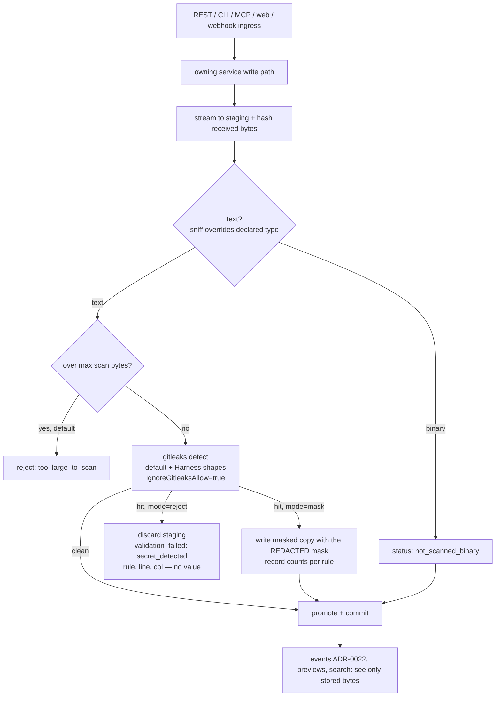

# ADR-0023: Secret Detection and Redaction at Ingest, With the Gitleaks Engine

## Context and Problem Statement

Cairn stores whatever it is given. A body streams through `store.streamBlob`
into a staging object, is hashed, and is promoted to its content-addressed key.
A comment is inserted as written. A trace span's `Args` and `Output` are
persisted, or spilled to object storage, verbatim. Nothing on any of those paths
looks for a credential.

That matters more for Cairn than for most stores, for three reasons:

* **The URL is the read capability** (ADR-0007). A link-visibility artifact is
  readable by anyone who holds its URL, and SPEC-0012 announces that URL to
  webhook targets. A token pasted into an artifact reaches everyone the link
  reaches.
* **Agents are the main writers, and agent transcripts carry credentials.** An
  agent runs `curl -H "Authorization: …"` or `git remote set-url` with a token in
  the URL, and the command text lands in its transcript. Harness measured this
  directly: 216 such lines across 80 log files on one host. It is now masking its
  durable logs because of it (Harness PR #345). A Cairn trace is that transcript,
  shared by URL.
* **"A leaked secret is burned."** Detection after publication is too late,
  because the credential has already left. The only useful place to catch it is
  before the bytes are stored, and before any event, preview or search index sees
  them.

Joe's decision for this programme: redaction is P0, it uses a library (ideally
gitleaks, MIT licensed), and it avoids AGPL scanners such as trufflehog.

The question: where does Cairn scan, with what engine and ruleset, and what
does it do with a hit? Reject the write, or mask the value and keep the rest?

## Decision Drivers

* **Before persist, or not at all.** A masked value must never have existed in a
  committed row, a promoted blob, an emitted event (ADR-0022) or a search index.
* **Library, permissive licence, maintained ruleset.** Around 200 vendor token
  shapes is not something to hand-maintain. The engine must be importable Go
  under MIT or Apache-2.0.
* **One vocabulary across the stack.** Harness already masks credentials as
  `[REDACTED]` with its own conservative rules (`internal/redact`). A reader who
  sees masked text in Harness output and in a Cairn trace should see the same
  thing, and the same credential shapes should be caught on both sides.
* **The writer cannot opt out.** Whatever the uploader controls, it must not be
  able to exempt its own content from the scan.
* **Fail closed, with an actionable error.** A write the server refuses must say
  what, where and how to fix it: rule, location and limit, never the secret
  itself.
* **Don't destroy content that must stay byte-exact.** A masked patch no longer
  applies, and a masked config file silently changes. A masked log line is still
  a perfectly good log line.
* **Bounded cost.** Scanning is CPU per byte. The cap must be explicit, and
  exceeding it must never be a silent skip.

## Considered Options

* **A. The gitleaks v8 detection engine, imported as a library, with Cairn's
  config (the default ruleset plus Harness's credential shapes), scanning before
  persist. The default mode (reject or mask) is chosen per content type.**
* **B. Port Harness's `internal/redact` regex rules into Cairn and use them
  alone.**
* **C. Scan asynchronously after persist, then quarantine or mask in place.**
* **D. Leave it to clients** (the CLI and MCP clients scan before upload).

## Decision Outcome

Chosen option: **A**.

### Engine

Cairn imports `github.com/zricethezav/gitleaks/v8` (MIT, v8.30.1 at the time of
writing; the module path is unchanged since the repository moved to the
`gitleaks` GitHub organisation). Only two packages are used:

* `config`: an embedded TOML, `[extend] useDefault = true`, plus Cairn's extra
  rules and allowlist, parsed through `config.ViperConfig.Translate()`;
* `detect`: `detect.NewDetector(cfg)` once at startup, then
  `Detector.DetectString` / `DetectBytes` per scanned field. Those methods
  return findings without adding them to the detector's accumulated findings
  list, so a long-lived detector does not grow.

Four detector settings are deliberate, because the CLI defaults are wrong for an
ingest scanner:

* `IgnoreGitleaksAllow = true`. By default, gitleaks drops any finding on a line
  containing `gitleaks:allow`. For an ingest scanner, that would let the uploader
  exempt its own content with one comment.
* `MaxTargetMegaBytes = 0`. By default, gitleaks silently skips a fragment larger
  than its limit. Cairn enforces its own cap (below) and never skips silently.
* `MaxArchiveDepth = 0`. Cairn does not unpack archives.
* `MaxDecodeDepth` is set explicitly, so base64- and percent-encoded secrets are
  decoded and caught.

No `.gitleaksignore` or baseline is ever loaded. Findings are keyed on the
content, not on a path or fingerprint the uploader could predict.

### Ruleset: gitleaks' default plus Harness's shapes

The default ruleset covers vendor token formats. Harness's `internal/redact`
covers contextual shapes the default misses or catches only by entropy:

* URL userinfo with a password;
* `Authorization` and `Proxy-Authorization` header values;
* API-key-style headers;
* secret-named assignments and flags;
* basic auth handed to `curl -u`.

These are ported as custom gitleaks rules, each with a `secretGroup`, so only the
value is masked and the label is kept. Harness does the same. The mask string is
Harness's: `[REDACTED]`.

A shared test corpus pins the equivalence. Cairn's tests use Harness's redaction
fixtures, assembled from split literals so no contiguous token exists in either
tree; Harness learned that lesson in PR #345. Harness is not asked to adopt
gitleaks. Its masking runs on every rendered log line, where a 200-rule scan is
the wrong cost, but the two rule sets are kept in step.

### Where and when

Scanning runs inside the owning service's write path, **before** the
transaction commits and before a staged blob is promoted:

| Surface | Scanned | Default mode |
|---|---|---|
| `markdown` bodies, and any body sniffed as text (`file`) | body, title | **mask** |
| `code` bodies | body, title | **reject** |
| `bundle` members | each text member, title | **reject** (the whole bundle; the error names the member) |
| trace runs (batch and appended spans) | run title and prompt, span `name`, `args`, inline and spilled `output` | **mask** |
| comments (create; edit when #158 lands) | body | **mask** |
| webhook captures (ADR-0010) | captured headers and body | **mask** |
| `image`, `gz`, and bodies sniffed as binary | nothing | not scanned |

**Why mask by default for prose, logs, traces, comments and captures.** The
secret is incidental and the rest of the content is the point. A masked log line
still reads. Some writers cannot act on a refusal at all:

* a live trace mid-run cannot un-send its last tool call;
* a third-party webhook sender will never read Cairn's error.

**Why reject by default for code and bundles.** Byte fidelity is the contract
there. A diff, patch or config file silently rewritten is corrupted in a way the
reader may not notice. The writer is present and synchronous (a CLI or MCP
call), so it can fix the content, or knowingly ask for masking. Test fixtures
are the common false positive, and the author is the right judge of those.

A writer may **downgrade** reject to mask for one request, with
`X-Cairn-Redaction: mask` over REST, `--redact=mask` in the CLI, or
`redaction: "mask"` on the MCP tools. Nothing a writer sends can **disable**
scanning.

### Binary content

A body is text if its resolved media type is textual (`text/*`, JSON, XML,
YAML, TOML, JavaScript, shell, or a `+json` / `+xml` suffix). It is also text if
its first 8 KiB are valid UTF-8 with no NUL byte, **regardless of the declared
type**: declaring `image/png` does not smuggle a text body past the scan. A body
whose leading bytes match a known binary signature (image formats, gzip, zip) is
recorded as `not_scanned_binary`. A secret inside an archive or an image is
out of scope, and that residual risk is stated in the spec.

### Size cap

`CAIRN_REDACTION_MAX_SCAN_BYTES` (default 16 MiB) caps each scanned field.
Large bodies are scanned in overlapping windows read back from the staging
object, so memory stays bounded. A text field over the cap is **rejected** by
default, with reason `too_large_to_scan` and the limit, because an unscanned
body is exactly what this decision exists to prevent. An operator who prefers
availability sets `CAIRN_REDACTION_OVERSIZE=store_unscanned`. The artifact is
then stored with status `not_scanned_oversize`, visible to its owner and
counted in metrics.

### Operator allowlist

`CAIRN_REDACTION_ALLOWLIST_FILE` points at an operator TOML of gitleaks
allowlist entries and disabled rule IDs. It follows the precedent of this
repository's own `.gitleaks.toml`: **match by value, never by path.** A path or
member-name allowlist cannot tell "no credential here" from "told not to look
here", and in an ingest scanner the uploader chooses the path. Allowlist
entries are exact values, anchored regexes, or stop words. The file is operator
configuration, never user input.

### Records, without the values

A scan outcome is recorded on the artifact (and per bundle member, comment and
run), with:

* its status: `clean`, `masked`, `not_scanned_binary`, `not_scanned_oversize`;
* a redaction count;
* counts per rule ID.

Never recorded: the secret, its hash, the matched line, or a gitleaks
fingerprint. A hash of a short secret is a guessing oracle. The owner sees
"2 values masked (github-pat ×2)". The create response and MCP output carry the
same summary, so the writer learns its stored bytes differ from what it sent.
`cairn_redactions_total{surface, outcome}` joins ADR-0021's metrics.

Masking changes the stored bytes, so the stored SHA-256 is of the masked body.
A client-declared checksum is verified against the **received** bytes (SPEC-0002
"Streaming Upload with Checksum Verification") before masking. The response
flags `redacted: true`, so a client comparing hashes knows why they differ.

### Errors

A rejection uses the ADR-0012 envelope with code `validation_failed`. It also
carries the structured violation shape that Cairn ADR-0025 / SPEC-0019
(actionable validation errors) defines: field (`body`,
`members[3].content`, `spans[12].args`), reason `secret_detected`, rule ID,
line and column. It never carries the secret or the line containing it.

### Security and tenancy

* Scanning runs before persist for **every** owner, whether a personal user or a
  team (Cairn ADR-0029). No user, team or token can opt its content
  out.
* The operator's settings (cap, oversize policy, reject types, value allowlist)
  are the instance floor. If per-workspace redaction settings are ever added,
  they belong to the owning workspace, and they may only tighten that floor (add
  reject types, lower the cap). They may never loosen it.
* Masked content is never stored, so nobody can read what was redacted away: not
  the owner, a team admin or the operator. The recorded outcome (status, counts,
  rule IDs) is visible to the owner and their workspace, and to operator
  metrics as aggregates without artifact identity.
* The operator allowlist relaxes detection instance-wide. That is an operator
  power over every tenant, so it accepts exact values and anchored regexes only,
  and the self-hosting guide tells operators to list only inert fixture values.

### How it composes with Harness and Switchboard

* **Harness** is the main producer of the content this scans: traces, bundles and
  handoff artifacts written by agents. Harness masks at display and export (its
  `internal/redact`, and telemetry export in Harness ADR-0022). Cairn masks at
  ingest, using the same mask string and the same contextual shapes, so a
  credential masked in one tool's output never reappears in the other's. When
  Harness exports traces to Cairn's future OTLP receiver (Cairn ADR-0015), those
  spans pass through this same scan.
* **Switchboard** receives Cairn events (ADR-0017, ADR-0022). Because scanning
  runs before any event is emitted, a comment body or title in an event is
  already redacted. Switchboard's own header sanitisation (`«redacted»` in its
  routing envelope) stays the defence for what Cairn puts in headers, which is
  never content.

### Consequences

* Good, because a credential in a trace, paste or comment is masked or refused
  before it exists anywhere Cairn serves, emits or indexes.
* Good, because about 200 maintained vendor rules plus Harness's contextual
  shapes give broad coverage, with one mask vocabulary across the stack.
* Good, because the uploader cannot exempt itself: no inline allow comment, no
  path allowlist, no scan-off switch.
* Good, because every rejection is actionable, and every mask is announced to
  the writer and the owner.
* Bad, because the gitleaks module is a large dependency tree (viper, cobra,
  archive handling). It grows the binary and the CVE surface the image job's
  Trivy scan reports. Only `config` and `detect` are imported, and
  `go mod why` is part of the dependency story's review.
* Bad, because code and bundle uploads that were accepted yesterday can be
  refused today. The error names the rule and location and offers
  `--redact=mask`. The operator allowlist handles recurring fixtures.
* Bad, because false positives in prose are masked silently from the reader's
  point of view (the owner sees the summary). A high-entropy value that is not
  a secret gets `[REDACTED]`. That is the accepted cost of mask-by-default.
* Bad, because scanning is CPU per byte on every write. The cap, windowing and
  a benchmark in the implementation story keep it bounded, and the metrics make
  it visible.
* Neutral, because raw bytes exist briefly in the staging prefix before the scan
  decides. They are never promoted. Staging objects are discarded on every
  rejection path and swept by the existing staging GC.

### Confirmation

* A table test over the shared Harness corpus asserts every Harness-masked shape
  is also caught by Cairn's config.
* An integration test posts a markdown artifact containing a split-literal token
  and asserts the stored body contains `[REDACTED]`, the response reports one
  redaction, and the `artifact.created` event carries no token. A second test
  posts the same content as `code` and asserts a `secret_detected` rejection with
  a rule ID and line, and nothing stored.
* A test asserts a `gitleaks:allow` comment on the secret's line does not
  exempt it.
* A test asserts a body declared `image/png` but consisting of UTF-8 text is
  scanned.

## Pros and Cons of the Options

### A. Gitleaks engine, before persist, per-type default *(chosen)*

* Good, because the ruleset is maintained upstream and MIT licensed.
* Good, because scanning before persist means nothing unredacted is ever
  committed, served, emitted or indexed.
* Good, because the per-type default respects what each kind of content is for.
* Bad, because of the dependency weight, and CLI-oriented defaults
  (`gitleaks:allow`, the silent size skip) that must be overridden correctly. A
  test pins each override.

### B. Harness's rules alone

* Good, because there is no new dependency, the rules are already reviewed, and
  consistency with Harness is exact.
* Bad, because there are about 10 rules against about 200. They were
  deliberately conservative for display masking, and they miss most vendor
  formats (cloud provider keys beyond AWS key IDs, payment, messaging and
  database URLs).
* Bad, because maintaining a vendor ruleset by hand is exactly the work the
  library exists to avoid.

### C. Scan after persist

* Good, because writes stay fast, and scanning can be retried or backfilled.
* Bad, because the secret is served for as long as the scan lags. The link may
  already have been announced (SPEC-0012) or read, and a leaked secret is burned
  the moment it is readable.
* Bad, because in-place masking breaks content addressing, and needs a
  rewrite path for blobs other artifacts may share.

### D. Client-side scanning

* Good, because it costs the server nothing.
* Bad, because it covers only clients Cairn ships. MCP clients, raw REST
  callers, webhook senders and browsers bypass it entirely.
* Bad, because the server is the only place a policy can be enforced.

## Architecture Diagram

## More Information

* **Extends ADR-0008.** The stored body may now differ from the uploaded body,
  and the stored checksum is of the stored bytes. Upload integrity is checked
  against the received bytes first.
* **Harness:** `internal/redact` (the mask string and contextual rules reused
  here), Harness PR #345 (durable-log masking), and Harness ADR-0022 /
  SPEC-0015 (telemetry export, which redacts before any byte leaves the process).
  Harness ADR-0022 is the same principle applied to Harness's own egress.
* **Related records** (front-matter edges): Cairn ADR-0025 /
  SPEC-0019 (the violation shape a rejection uses); Cairn ADR-0022 / SPEC-0016
  (events carry only stored, already-redacted text); Cairn ADR-0028 (search
  embeds only stored text).
* This repository's `.gitleaks.toml` is the precedent for value-only
  allowlisting.
* Spec: SPEC-0017 (`docs/openspec/specs/ingest-redaction/`).
