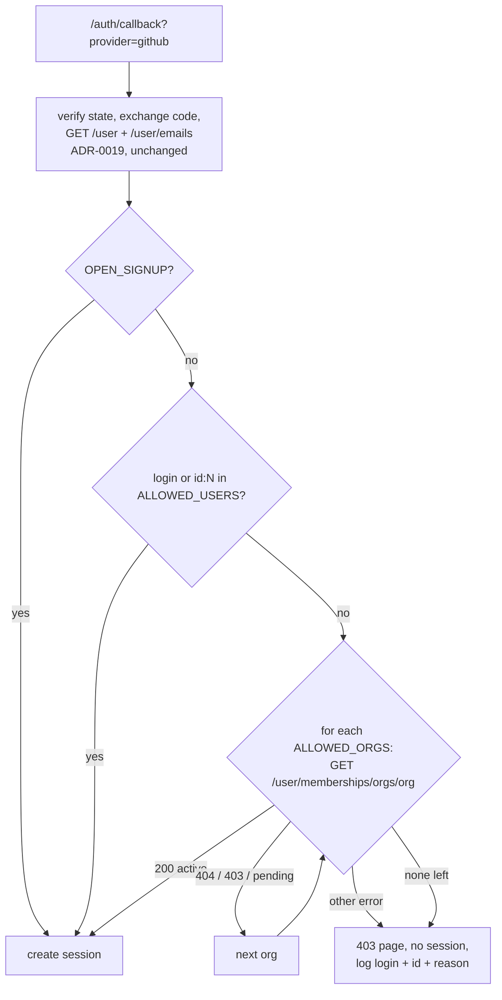

# ADR-0024: GitHub Login Is Allowlisted by Organisation and User, and Fails Closed

## Context and Problem Statement

ADR-0019 added "Log in with GitHub" as a second human-auth provider, and the
foundation shipped in #259. Once `CAIRN_GITHUB_CLIENT_ID` and
`CAIRN_GITHUB_CLIENT_SECRET` are set, **any GitHub account with a verified
primary email can sign in**. The code confirms it:

* `authprovider.GitHubProvider.FinishLogin` checks the state, exchanges the
  code, fetches `GET /user` and `GET /user/emails`, and returns an identity for
  the first primary verified email. There is no membership or identity check.
* `httpapi.handleGitHubCallback` passes that identity straight to
  `s.sessions.Create`.
* The requested scopes are `read:user user:email`. Cairn cannot see
  organisation membership even if it wanted to.

SPEC-0013's design left this as an open question ("Should GitHub logins be
allow-listed…? Default plan: any verified-email GitHub account may log in").
That default is now wrong, for three reasons:

1. **Cairn is multi-tenant.** The operator runs the instance, and users are the
   people the operator lets in (ADR-0029, Teams, in flight). An instance open to
   every GitHub account is an instance where strangers get an account, create
   artifacts, consume storage and receive MCP grants. None of that is a choice
   the operator made.
2. **A self-hosting customer** wants to enable GitHub login for their own
   organisation, and must be able to do so without opening the instance to the
   world.
3. **The GitHub login docs are blocked on this.** The env vars appear in no guide,
   no `.env.example` and no compose file. Documenting them as they stand would
   publish "set these two variables and anyone on GitHub can sign in".

The question: how does an operator restrict GitHub sign-in to the people they
intend, and what happens when they configure the provider but not the
restriction?

## Decision Drivers

* **Fail closed.** Enabling a login provider must never, by omission, admit
  everyone. The unsafe configuration must require an explicit, greppable flag.
* **Match how operators think.** "Members of my GitHub org" is the common case,
  and "these specific people" is the other.
* **Least privilege at GitHub.** Do not request `read:org` from users unless the
  operator actually configured an organisation check.
* **Identity that does not drift.** GitHub logins can be renamed and later
  reclaimed by someone else. The numeric user ID cannot.
* **No steady-state GitHub traffic.** ADR-0019's token containment stands: the
  access token lives only inside the callback.
* **Pocket ID and the dev login are untouched.**

## Considered Options

* **A. Operator allowlist of GitHub organisations and users, checked in the
  callback before a session exists. An empty allowlist refuses everyone, unless
  an explicit open-signup flag is set.**
* **B. An email-domain allowlist**, checking the verified primary email against
  operator domains.
* **C. Cairn-side invitations**: an admin invites an email, and only invited
  identities may sign in, whatever the provider.
* **D. Keep it open, and rely on the operator to leave GitHub disabled** unless
  they want open signup.

## Decision Outcome

Chosen option: **A**.

### Configuration

| Variable | Meaning |
|---|---|
| `CAIRN_GITHUB_ALLOWED_ORGS` | comma-separated GitHub organisation logins. Active members may sign in. |
| `CAIRN_GITHUB_ALLOWED_USERS` | comma-separated GitHub logins, or `id:<numeric id>` entries |
| `CAIRN_GITHUB_OPEN_SIGNUP` | `true` admits any GitHub account with a verified primary email. Default `false`. |

Matching is case-insensitive for logins. An `id:` entry matches GitHub's
immutable numeric user ID, which `GET /user` already returns. It is the form
recommended for individuals, because a renamed login can be reclaimed by a
stranger.

### Fail closed

When GitHub credentials are set but both allowlists are empty and
`CAIRN_GITHUB_OPEN_SIGNUP` is not `true`, **nobody can sign in with GitHub**.
The provider is treated as unconfigured:

* no login button;
* `/auth/login?provider=github` returns 404, indistinguishable from an unknown
  provider (SPEC-0013);
* cairnd logs a startup warning naming the missing variables.

That warning is the operator's diagnosis, and a dead-end button would be the
user's confusion. Setting both an allowlist and open signup is a startup error,
because the operator's intent is ambiguous.

### Check order in the callback

After identity verification (unchanged), and **before** a session is created:

1. `CAIRN_GITHUB_OPEN_SIGNUP=true` admits.
2. A user entry matching the login or the numeric ID admits.
3. For each allowed organisation, `GET /user/memberships/orgs/{org}` with the
   user's token:
   - `200` with `state: "active"` admits;
   - `404` means not a member, so try the next organisation;
   - `403` means the organisation restricts third-party OAuth app access and has
     not approved Cairn's app. This is logged with its own reason, because the
     fix is an organisation owner approving the app, and then the next
     organisation is tried;
   - any other response, or a network error, is **denied**. Fail closed.
4. Otherwise, deny.

A pending membership (`state: "pending"`) does not admit. A denial returns a 403
page ("This GitHub account is not permitted on this Cairn instance"), creates no
session, and logs the GitHub login, the numeric ID and the reason, never the
token.

### Scopes

`read:org` is requested **only when** `CAIRN_GITHUB_ALLOWED_ORGS` is non-empty.
A users-only or open-signup instance keeps `read:user user:email`. The consent
screen then matches what the instance actually checks.

### Membership is checked at login, not continuously

Consistent with ADR-0019's zero steady-state GitHub calls, the token is dropped
after the callback. Someone removed from the organisation keeps their Cairn
session until it expires or the operator revokes it. The session TTL bounds that
window, and the operator guide says so.

### Consequences

* Good, because enabling GitHub login can no longer admit strangers by omission.
  Open signup is an explicit, auditable flag.
* Good, because "my org" is one variable, and "these people" pins immutable IDs.
* Good, because `read:org` is asked for only when it is used.
* Good, because the GitHub login docs can now be published with a safe
  configuration as the documented default.
* Bad, because organisation checks depend on the organisation's OAuth app
  policy. An organisation with third-party restrictions must approve Cairn's
  OAuth app before its members can sign in. The 403 is logged distinctly, and the
  guide explains the fix.
* Bad, because removal from an organisation is not reflected until the session
  ends.
* Bad, because a deployment that relied on #259's open behaviour (none are
  documented, since the variables were never published) stops admitting GitHub
  users until it sets an allowlist or the open-signup flag. The startup warning
  names exactly what to set.
* Neutral, because the allowlist gates **instance sign-in** only. Team membership
  and resource ownership inside Cairn remain ADR-0029's concern.

### Confirmation

* Callback tests against a fake GitHub cover:
  - an allowlisted login, and an allowlisted `id:` entry;
  - an active organisation member, a pending member, a non-member (404), and a
    restricted organisation (403);
  - a network error on the membership call, which must deny;
  - open signup, and an empty allowlist without open signup (the provider is
    absent).
* A test asserts `read:org` appears in the authorisation URL if and only if
  organisations are configured.
* The existing token-containment tests still pass: no token appears in logs on
  the denial paths.

## Pros and Cons of the Options

### A. Organisation and user allowlist, fail closed *(chosen)*

* Good, because it maps directly onto how GitHub-using teams are already
  organised.
* Good, because the fail-closed default makes the unsafe state explicit.
* Bad, because it needs one extra GitHub API call per organisation at login, and
  the `read:org` scope when organisations are used.

### B. Email-domain allowlist

* Good, because it needs no extra scope and no extra API call. The verified
  primary email is already fetched.
* Bad, because a verified email proves control of an address, not membership of
  anything. Former employees keep verified addresses on personal accounts, and
  many organisations' members use personal email addresses on GitHub.
* Bad, because it does not match how the requesting self-hoster identifies their
  people, which is their GitHub organisation.

### C. Cairn-side invitations

* Good, because it is provider-agnostic and gives the operator exact control.
* Bad, because it is a new admin surface, invitation storage and lifecycle. That
  overlaps Teams (ADR-0029) and is far larger than the gap being closed.
* Neutral, because it may still be worth building later on top of Teams. This
  ADR does not preclude it.

### D. Keep it open

* Good, because it needs no code.
* Bad, because the safe state depends on every operator reading and
  understanding a warning, and the unsafe state is the default. That is the
  inverse of the driver.

## Architecture Diagram

## More Information

* **Extends ADR-0019.** This reverses SPEC-0013's design default ("any
  verified-email GitHub account may log in") and resolves that open question.
  SPEC-0013 is amended in the same change (new requirements AL-1 to AL-5).
* SPEC-0013 is the GitHub-login spec's number on `main`. The renumbering in
  `fix/spec-0013-collision` merged as #257 and moved embedded docs to
  SPEC-0015, so SPEC-0013 is stable and is amended rather than replaced.
* **Parallel record, cited in prose until it merges:** Cairn ADR-0029 /
  SPEC-0023 (Teams and tenancy), which owns what a signed-in user may do.
* GitHub REST: "Get an organization membership for the authenticated user"
  (`GET /user/memberships/orgs/{org}`, which returns `state` of `active` or
  `pending`, or 404 when the user is not a member).
