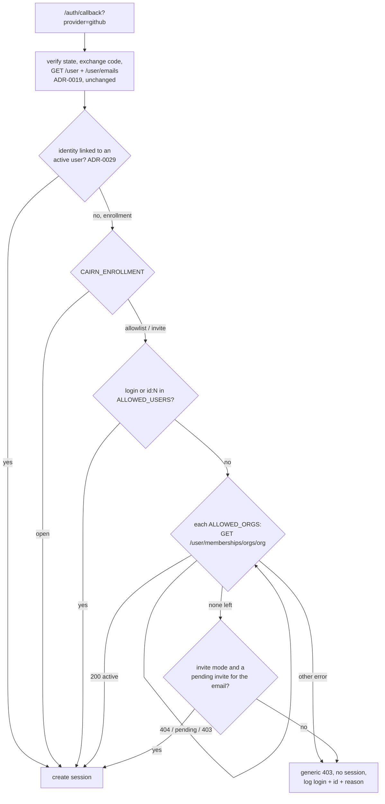

# ADR-0024: GitHub Sign-in Enrollment Is Allowlisted by Organisation and User, and Fails Closed

## Context and Problem Statement

ADR-0019 added "Log in with GitHub" as a second human-auth provider, and the
foundation shipped in #259. Once `CAIRN_GITHUB_CLIENT_ID` and
`CAIRN_GITHUB_CLIENT_SECRET` are set, **any GitHub account with a verified
primary email can sign in**. The code confirms it:

* `authprovider.GitHubProvider.FinishLogin` checks the state, exchanges the
  code, fetches `GET /user` and `GET /user/emails`, and returns an identity for
  the first primary verified email. There is no membership or identity check.
* `httpapi.handleGitHubCallback` passes that identity straight to
  `s.sessions.Create`.
* The requested scopes are `read:user user:email`. Cairn cannot see
  organisation membership even if it wanted to.

SPEC-0013's design left this open ("Should GitHub logins be allow-listed…?
Default plan: any verified-email GitHub account may log in"). That default is
now wrong:

1. **Cairn is multi-tenant.** There are two profiles: the operator, who runs the
   instance, and users, whom the operator lets in (Cairn ADR-0029, Teams and
   tenancy, in flight). An instance open to every GitHub account is one where
   strangers get an account, create artifacts, consume storage and receive MCP
   grants. The operator chose none of that.
2. **A self-hosting customer** wants GitHub login for their own organisation,
   without opening the instance to the world.
3. **The GitHub login docs are blocked on this.** The variables appear in no
   guide, no `.env.example` and no compose file. Documenting them as they stand
   would publish "set these two variables and anyone on GitHub can sign in".
4. **Switchboard has the same gap and is closing it** with enrollment modes
   (`SWITCHBOARD_ENROLLMENT=open|allowlist|invite`, Switchboard SPEC-0033, in
   flight). An operator running both products should meet one model, not two.

The question: how does an operator restrict GitHub sign-in to the people they
intend, and what happens when they enable the provider without saying who?

## Decision Drivers

* **Fail closed.** Enabling a login provider must never, by omission, admit
  everyone. The unsafe configuration must require an explicit, greppable setting.
* **Match how operators think.** "Members of my GitHub org" is the common case,
  and "these specific people" is the other.
* **One model across Cairn and Switchboard.** The same mode names, and the same
  rule about whom the gate applies to.
* **Least privilege at GitHub.** Do not request `read:org` unless an
  organisation check is configured.
* **Identity that does not drift.** GitHub logins can be renamed and later
  reclaimed by someone else. The numeric account id cannot.
* **No steady-state GitHub traffic.** ADR-0019's token containment stands: the
  access token lives only inside the callback.
* **Pocket ID and the dev login are untouched.** Pocket ID is operator-provisioned
  already.

## Considered Options

* **A. Enrollment modes (`allowlist` default, `invite`, `open`) with an operator
  allowlist of GitHub organisations and users.** The gate is checked in the
  callback before a session exists, applies to **enrollment** (a GitHub
  identity not yet linked to an active Cairn user), and denies on an empty
  allowlist or any check error.
* **B. The same allowlist, re-checked on every GitHub sign-in**, so leaving the
  organisation locks the person out at their next login.
* **C. An email-domain allowlist**, checking the verified primary email against
  operator domains.
* **D. Keep it open, and rely on the operator** to leave GitHub disabled unless
  they want open signup.

## Decision Outcome

Chosen option: **A**.

### Configuration

| Variable | Meaning |
|---|---|
| `CAIRN_ENROLLMENT` | `allowlist` (default), `invite`, or `open`. The same names and meanings as Switchboard's `SWITCHBOARD_ENROLLMENT`. |
| `CAIRN_GITHUB_ALLOWED_ORGS` | comma-separated GitHub organisation logins. Active members may enroll. |
| `CAIRN_GITHUB_ALLOWED_USERS` | comma-separated GitHub logins, or `id:<numeric account id>` entries |

The modes:

* **`allowlist`**: a GitHub identity may enroll only if it matches
  `CAIRN_GITHUB_ALLOWED_USERS`, or is an active member of an organisation in
  `CAIRN_GITHUB_ALLOWED_ORGS`.
* **`invite`**: as `allowlist`, **or** the identity's verified email holds a
  pending invitation. Invitations belong to Teams (ADR-0029). Until they exist,
  selecting `invite` fails startup with an error naming that dependency. Once
  they exist, ADR-0029 may make `invite` the default when GitHub is configured,
  as Switchboard does.
* **`open`**: any GitHub identity with a verified primary email may enroll. This
  is the explicit open-signup setting. `open` combined with a non-empty
  allowlist is a startup error, because the operator's intent is ambiguous.

Logins match case-insensitively. An `id:` entry matches GitHub's numeric account
id, which `GET /user` already returns. That form is recommended for
individuals, because a renamed login can be reclaimed by a stranger.

The GitHub session's `sub` becomes that numeric id, with the login kept for
display and logs. This amends SPEC-0013's "subject `login`" and matches the
identity key ADR-0029 uses: `(issuer, subject)`, linked to an existing user only
by verified, lower-cased email.

### Enrollment, not every sign-in

The gate decides whether a GitHub identity may **become or join** a Cairn user.
A sign-in is an enrollment when its GitHub identity is not yet linked to an
active user, and its verified email does not link it to one.

* **Until ADR-0029 introduces persistent users**, no identity is ever "already
  linked", so **every** GitHub sign-in is an enrollment and is checked.
* **Afterwards**, an existing user is never locked out by the allowlist. To
  revoke access, the operator suspends the user (ADR-0029). This matches
  Switchboard. It also means a GitHub API outage cannot lock out people who
  already have accounts.

### Fail closed

In `allowlist` mode with both lists empty, no GitHub identity can enroll. While
no GitHub sign-in could succeed (always true before ADR-0029), the provider is
treated as unconfigured:

* no login button;
* `/auth/login?provider=github` returns 404, indistinguishable from an unknown
  provider (SPEC-0013);
* cairnd logs a startup warning naming the variables that would enable it.

### Check order in the callback

After identity verification (unchanged), and **before** a session is created:

1. Is the identity already linked to an active user? Admit. (This applies only
   after ADR-0029.)
2. Is `CAIRN_ENROLLMENT=open`? Admit.
3. Does a user entry match the login or the numeric id? Admit.
4. For each allowed organisation, `GET /user/memberships/orgs/{org}` with the
   user's token:
   - `200` with `state: "active"` admits;
   - `404` (not a member) or `state: "pending"` means try the next organisation;
   - `403` means the organisation restricts third-party OAuth apps and has not
     approved Cairn's app. This is logged with its own reason, because the fix
     is an organisation owner approving the app, and the next organisation is
     then tried;
   - any other response, or a network error, **denies**. Fail closed.
5. In `invite` mode, a pending invitation for the verified email admits.
6. Otherwise, deny.

A denial returns a generic 403 page ("This GitHub account is not permitted on
this Cairn instance") and creates no session. The page **reveals nothing** about
which organisations, users, teams or invitations exist. The log records the
GitHub login, the numeric id and the reason, never the token.

### Scopes

`read:org` is requested **only when** `CAIRN_GITHUB_ALLOWED_ORGS` is non-empty. A
users-only, invite-only or open instance keeps `read:user user:email`, so the
consent screen matches what the instance actually checks.

### Security and tenancy

* The enrollment mode and allowlist are **operator** configuration. No user,
  team admin, token or request can change them.
* The gate controls who may have an account. What an account may do (teams,
  ownership, visibility) is ADR-0029's concern.
* Linking by verified email only is safe for enrollment, because a verified
  email proves control of the address. An allowlisted identity cannot acquire
  another user's account unless it controls that user's verified email.
* Offboarding is suspension, not re-checking. Someone who leaves an allowed
  organisation keeps their account until the operator suspends them. After
  ADR-0029 this is a deliberate trade for cross-product consistency and
  outage-resilience (option B was rejected), and the operator guide says so.

### How it composes with Switchboard and Harness

* **Switchboard** uses the same three mode names and the same "gate enrollment,
  suspend to revoke" rule (Switchboard SPEC-0033). An operator configures both
  products with one mental model. Switchboard's GitHub login design carried the
  same "allow-list?" open question, and its SPEC-0033 answers it.
* **Harness** is unaffected. Harness agents authenticate to Cairn with MCP OAuth
  or tokens, never with GitHub login.

### Consequences

* Good, because enabling GitHub login can no longer admit strangers by omission.
  Open signup is an explicit, auditable setting.
* Good, because "my org" is one variable, and "these people" pins immutable ids.
* Good, because operators meet the same enrollment model in Cairn and
  Switchboard.
* Good, because `read:org` is asked for only when it is used.
* Good, because the GitHub login docs can now be published, with a safe
  configuration as the documented default.
* Bad, because once persistent users exist (ADR-0029), leaving the organisation
  does not revoke Cairn access. The operator must suspend the user.
* Bad, because organisation checks depend on the organisation's OAuth app
  policy. An organisation with third-party restrictions must approve Cairn's app
  before its members can enroll. The 403 is logged distinctly, and the guide
  explains the fix.
* Bad, because a deployment that relied on #259's open behaviour stops admitting
  GitHub users until it sets an allowlist or `CAIRN_ENROLLMENT=open`. No such
  deployment is documented, because the variables were never published. The
  startup warning names exactly what to set.
* Bad, because `sub` changes from the login to the numeric id for new GitHub
  sessions. Sessions are short-lived, and the migration is to let old sessions
  expire.

### Confirmation

Callback tests run against a fake GitHub. They cover:

* an allowlisted login;
* an allowlisted `id:` entry after a simulated rename;
* an active organisation member, a pending member, a non-member (404), and a
  restricted organisation (403);
* a network error on the membership call, which must deny;
* `open` mode;
* `invite` selected before invitations exist, which must be a startup error;
* `allowlist` mode with empty lists, where the provider must be absent.

A test also asserts that `read:org` appears in the authorisation URL if and only
if organisations are configured. The existing token-containment tests must still
pass, with no token appearing in logs on the denial paths.

## Pros and Cons of the Options

### A. Enrollment modes plus allowlist, gate enrollment, fail closed *(chosen)*

* Good, because it maps onto how GitHub-using teams are organised, and onto
  Switchboard's model.
* Good, because a GitHub outage cannot lock out existing users.
* Bad, because it needs one extra GitHub API call per organisation at enrollment,
  and the `read:org` scope when organisations are used.
* Bad, because offboarding requires an operator action (suspension).

### B. Re-check the allowlist on every sign-in

* Good, because leaving the organisation revokes access at the next login, with
  no operator action.
* Bad, because a GitHub API error at login locks out every existing user of an
  org-gated instance (fail closed cuts both ways).
* Bad, because it diverges from Switchboard's enrollment rule, so an operator
  running both products gets two behaviours for one configuration.
* Neutral, because an existing session outlives the membership change either way.
  Only the next login differs.

### C. Email-domain allowlist

* Good, because it needs no extra scope and no extra API call.
* Bad, because a verified email proves control of an address, not membership of
  anything. Former employees keep verified addresses on personal accounts, and
  many organisations' members use personal email addresses on GitHub.

### D. Keep it open

* Good, because it needs no code.
* Bad, because the safe state depends on every operator reading a warning, and
  the unsafe state is the default. That is the inverse of the driver.

## Architecture Diagram

## More Information

* **Extends ADR-0019.** This reverses SPEC-0013's design default ("any
  verified-email GitHub account may log in") and resolves that open question.
  SPEC-0013 is amended in the same change (new requirements AL-1 to AL-6).
* SPEC-0013 is the GitHub login spec's number on `main`. The renumbering in
  `fix/spec-0013-collision` merged as #257 and moved embedded docs to
  SPEC-0015, so SPEC-0013 is stable, and it is amended rather than replaced.
* **Parallel records, cited in prose until they merge:** Cairn ADR-0029 /
  SPEC-0023 (Teams and tenancy: users, identities, invitations, suspension);
  Switchboard SPEC-0033 (teams and tenancy, including `SWITCHBOARD_ENROLLMENT`).
* GitHub REST: "Get an organization membership for the authenticated user"
  (`GET /user/memberships/orgs/{org}`, which returns `state` of `active` or
  `pending`, or 404 when the user is not a member).
