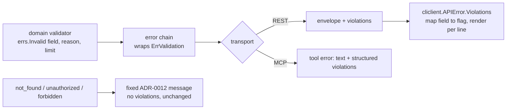

# ADR-0025: Validation Errors Say What Failed — Field, Reason, Limit

## Context and Problem Statement

ADR-0012 gave Cairn one error envelope, `{error: {code, message, details,
request_id}}`, and a deliberate rule: messages are fixed per code, so nothing
internal leaks. For `not_found` that rule is essential, because unknown,
unauthorized and expired ids must render identically. For `validation_failed`
it has become a defect. `internal/httpapi/errors.go` maps the code to one
string, "the request was invalid", and the domain error's own message is only
logged. The result:

* **A TTL over the cap says nothing.** `requestedTTL` builds "X-Cairn-Ttl-Seconds
  exceeds the maximum allowed TTL (720h0m0s)" and `createSingle` renders it with
  `details: nil`. The client learns neither the field nor the limit.
* **A bad tag says almost nothing.** `tagErrorDetails()` returns only
  `{"field": "tag"}`. It doesn't say which tag, or whether the problem was case,
  charset, length or count.
* **MCP says the same nothing.** `mcpToolErr` returns
  `"validation_failed: the request was invalid"`. An agent cannot correct its own
  call, so it retries blindly or gives up.
* **The CLI can only echo it.** `cliclient.APIError` carries `Details
  map[string]string` and prints the message.

This explains reports from our own agent notes. A
`cairn add … --tag … --ttl 60d` returned `validation_failed` with no detail,
and the same push without `--tag` and `--ttl` succeeded. The cause is `60d`
exceeding the 30-day cap (`MaxRequestedTTL`, `api.go`), and nothing in the
response said so. The agent guessed that both flags were broken. A second
recurring failure is an uppercase tag (`size:M`), which ADR-0018 rejects rather
than folds, and which fails a whole create with the same opaque message.

About 158 validation sites across the codebase feed this one string.

The question: what does a validation failure tell the caller, on every surface,
without giving up the leak-free property ADR-0012 exists to protect?

## Decision Drivers

* **Every caller can fix its own request.** Agents are the main callers, and they
  can only correct what they are told about.
* **Keep the leak-free envelope for everything else.** `not_found`,
  `unauthorized` and `forbidden` stay uniform. Only caller-caused validation
  failures gain detail.
* **Additive, with no compatibility shims.** Cairn is pre-1.0, so nothing is
  added only to serve old clients (design review, Joe, 2026-09-22). The detail
  goes in a new key rather than into `details`, whose flat string map every
  client decodes today; nesting there would break decoding for no gain.
* **One contract, three surfaces** (ADR-0003). REST, MCP and the CLI show the
  same violation.
* **Machine-readable first.** A stable reason code and a limit an agent can act
  on, plus a message a human can read.
* **Never echo a secret.** Violations produced by redaction (ADR-0023) must not
  carry the offending value.

## Considered Options

* **A. A new `violations` array beside the unchanged envelope fields.** Each
  entry has `field`, `location`, `reason` (a closed registry), `limit`, a bounded
  `value` where safe, and `message`. The top-level `message` becomes the first
  violation's message for `validation_failed` only.
* **B. RFC 9457 Problem Details** (`application/problem+json`, with `errors`
  extension members), replacing the envelope.
* **C. Put the reason and limit into the existing flat `details` map**
  (`details.reason`, `details.limit`).
* **D. Echo the domain error's own message** as the response message.

## Decision Outcome

Chosen option: **A**.

### The contract

```json
{
  "error": {
    "code": "validation_failed",
    "message": "X-Cairn-Ttl-Seconds: 5184000 seconds exceeds the maximum of 2592000 (30 days)",
    "violations": [
      {
        "field": "X-Cairn-Ttl-Seconds",
        "location": "header",
        "reason": "exceeds_max",
        "limit": 2592000,
        "unit": "seconds",
        "value": "5184000",
        "message": "5184000 seconds exceeds the maximum of 2592000 (30 days)"
      }
    ],
    "request_id": "…"
  }
}
```

The fields:

* **`field`** is the name the caller used: a header name, query parameter, form
  field or JSON path (`tags[2]`, `anchor_ref.line`, `members[3].content`,
  `spans[12].args`).
* **`location`** is one of `header`, `query`, `form`, `body`, `path`.
* **`reason`** comes from a closed, documented registry: `required`,
  `invalid_format`, `invalid_charset`, `uppercase`, `too_long`, `too_short`,
  `too_many`, `exceeds_max`, `not_positive`, `unknown_value`, `duplicate`,
  `mismatch`, `not_allowed`, `checksum_mismatch`, `too_large`,
  `too_large_to_scan`, `secret_detected`. A new reason is added to the registry
  first.
* **`limit`** is the bound that was violated, as a JSON number or string, with
  `unit` (`seconds`, `bytes`, `count`, `chars`).
* **`value`** echoes the offending input, capped at 64 bytes. It MUST be omitted
  for `secret_detected` and for any field that carries body content.
* **`message`** is a human sentence built from reason, field and limit. It is
  never the internal error string.

Order matters, and `violations` is cumulative where it is cheap. All tags are
validated and every bad tag reported, not just the first. The top-level
`message` for `validation_failed` becomes the first violation's `field: message`
(or "N problems: …"). Every other code keeps its fixed ADR-0012 message.

`details` is unchanged in type (a flat string map) and carries only what a
handler puts there. It does not mirror the violations: a field name lives in one
place, `violations`.

`payload_too_large` also carries one violation (`reason: too_large`, `limit` in
bytes), because the limit is the fix.

### Where it is built

The domain layer returns a typed violation. The transport never parses strings.
`errs` gains:

* `Violation`;
* `errs.Invalid(field, location, reason)` builder options for limit, value and
  message;
* `errs.ViolationsOf(err)`.

A `Violation` wraps `ErrValidation`, so `errs.CodeOf` and every existing
`errors.Is` check are unchanged.

A bare `errs.Validationf` still works, and renders a single violation with
reason `invalid` and the generic message. It is a visible marker of a site not
yet migrated. A test lists the client-reachable sites and fails if one returns
a bare `Validationf`.

### Surfaces

* **REST:** as above.
* **MCP:** a failing tool returns the same violations in the tool result's
  structured content, with the text content set to the top-level message. It
  stops returning the bare `validation_failed: the request was invalid`.
* **CLI:** `cliclient.APIError` gains `Violations`. The CLI renders one line per
  violation, mapping wire fields back to its own flags (`X-Cairn-Ttl-Seconds` is
  `--ttl`, `tag` is `--tag`) and printing the limit in the flag's units. For
  example: `cairn: --ttl 60d exceeds the server's maximum of 30d`.

### The CLI folds tag case, with a warning

The server stays strict (ADR-0018): an uppercase tag is rejected, because what a
consumer matches must be exactly what the creator sent. The CLI, as the
creator's own tool, lower-cases `--tag` values **before sending**, and prints
`cairn: warning: tag "size:M" sent as "size:m"`. The creator sees the change,
and the stored tag is what was sent, so ADR-0018's guarantee holds.

This narrowly amends SPEC-0008's "Data the CLI shows but never decides" for
**case only**. Charset, length and count bounds remain the server's, and are
reported through violations. MCP tools do not fold, because agents get the
actionable `uppercase` violation instead.

The CLI never clamps `--ttl`. The server is authoritative, and ADR-0007's "the
CLI never silently gets a different TTL than it asked for" stands.

### Security and tenancy

A violation describes only the caller's own request: the fields it sent and the
limits the server publishes. It never reveals another user's or team's resource.

Validation runs after authentication and authorization, so an unauthorized
caller still gets the uniform 401 or 404, never a violation that confirms an
artifact exists. Limits that become per-owner or per-team under Teams (Cairn
ADR-0029, in flight), for example a team's maximum TTL or quota, are reported
as the limit **for the caller's workspace**. They never disclose another
workspace's settings.

### How it composes with Switchboard and Harness

Harness agents are Cairn's heaviest callers, through the CLI and MCP. With a
stable reason code and a numeric limit, a Harness-run agent can correct and
retry its own `artifact_create` or `cairn add` without a human, instead of
guessing, as the reported TTL failure did.

Switchboard is unaffected on the wire (it receives events, not error
envelopes). It benefits indirectly: fewer failed handoff creates means fewer
work orders silently missing from its queues. Switchboard's own API error
shape is its own decision; this ADR does not constrain it, but the violation
entry is a reasonable model to adopt there.

### Consequences

* Good, because every validation failure tells the caller the field, the reason
  and the limit, on all three surfaces. The reported `--ttl 60d` failure would
  have read "--ttl 60d exceeds the server's maximum of 30d".
* Good, because agents can self-correct from a stable reason code and a numeric
  limit, with no prose to parse.
* Good, because the wire change is additive. A client that ignores unknown keys
  keeps decoding and sees a better top-level message, and no shim is kept for
  it.
* Good, because not-found, unauthorized and forbidden stay uniform. The
  leak-free property is kept exactly where it protects something.
* Bad, because about 158 validation sites migrate over several stories. Until
  each does, its failures render as reason `invalid` with the generic message.
  The migration test makes the remainder visible rather than silent.
* Bad, because echoing `value` is a new output path for user input. It is capped
  at 64 bytes, JSON-encoded, never rendered as HTML, and suppressed for body
  content and secrets.
* Neutral, because the tag-case fold makes the CLI make one decision the server
  does not. It is scoped, and announced every time it happens.

### Confirmation

* Handler tests assert the full violation for each migrated validator: TTL over
  the cap, a malformed TTL, an uppercase tag, a bad-charset tag, a 33rd tag, an
  unknown share type, a checksum mismatch and an oversize body.
* A test asserts a not-found response is byte-identical before and after this
  change.
* A decode test runs an old-shape `cliclient` against a new-shape response and
  asserts it still decodes.
* An MCP test asserts `artifact_create` with an uppercase tag returns the
  `uppercase` violation in structured content.
* A CLI test asserts `--tag Size:M` sends `size:m` and warns, and that `--ttl
  60d` against a 30-day server prints the flag-mapped message and exits with the
  usage code.

## Pros and Cons of the Options

### A. `violations` beside the envelope *(chosen)*

* Good, because it is additive, structured, and uniform across surfaces.
* Good, because it leaves the not-found uniformity untouched.
* Bad, because a client must read a new key to get the detail. One that reads
  only `details` sees just the improved top-level message.

### B. RFC 9457 Problem Details

* Good, because it is a standard shape, with tooling that understands it.
* Bad, because it replaces the ADR-0012 envelope every client decodes today, a
  breaking change for the CLI, the MCP adapter and Switchboard-side scripts.
* Neutral, because the violation entries could later be offered under
  `application/problem+json` by content negotiation. Nothing here precludes it.

### C. Reason and limit in the flat `details` map

* Good, because there is no new field.
* Bad, because a flat map holds one violation. Several bad tags, or a bundle with
  two bad members, cannot be expressed.
* Bad, because numeric limits become strings, and the keys collide with existing
  identifier keys (`id`, `anchor_type`).

### D. Echo the domain error message

* Good, because it is a one-line change.
* Bad, because domain messages were written for logs. Some interpolate internal
  state (actor ids, internal row ids, wrapped storage errors), which is exactly
  what ADR-0012's fixed messages keep out.
* Bad, because it is prose, not a contract: an agent would parse English.

## Architecture Diagram



## More Information

* **Extends ADR-0012.** This deliberately relaxes ADR-0012's "fixed message per
  code" for `validation_failed` and `payload_too_large` only, and keeps it for
  every other code.
* **Narrowly amends SPEC-0008** (CLI): case folding of `--tag` is now a CLI
  decision. Nothing else about "data the CLI shows but never decides" changes.
* **Parallel record, cited in prose until it merges:** Cairn ADR-0023 /
  SPEC-0017 (redaction), whose rejections use this contract with
  `secret_detected` and `too_large_to_scan`, and never echo the value.
* Spec: SPEC-0019 (`docs/openspec/specs/validation-errors/`).
