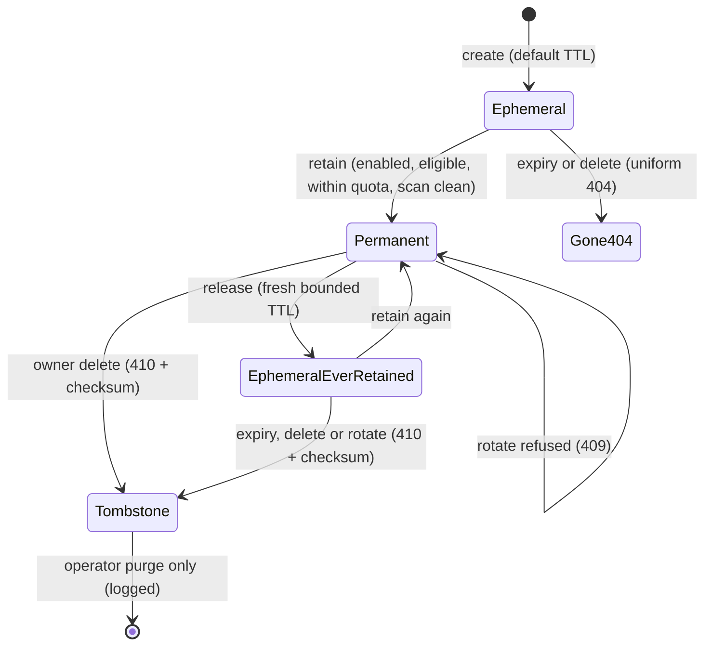

# ADR-0026: Opt-In Permanent Retention for Evidence Artifacts

## Context and Problem Statement

ADR-0007 made every artifact ephemeral by default: `expires_at = created_at + 7 days`,
owner-adjustable, and hard-deleted by the reaper when it passes. It rejected "Option C —
public-and-permanent (classic pastebin)". It also said an owner may "extend, shorten, or
set no-expiry (subject to any workspace cap)", but no-expiry was never built. What
shipped is narrower:

* `httpapi.Config.MaxRequestedTTL` defaults to 30 days (`internal/httpapi/api.go`), no
  environment variable overrides it, and both TTL surfaces reject anything longer:
  `X-Cairn-Ttl-Seconds` on create (`handlers.go`) and `PATCH /v1/artifacts/{id}/ttl`
  (`policy.go`).
* MCP creates carry no TTL field at all and always get the 7-day default.
* The reaper hard-deletes rows past `expires_at` (`internal/store/reap.go`), and the id
  then returns the same uniform 404 as an id that never existed.
* The owner can rotate the id at any time (`POST /v1/artifacts/{id}/rotate`), which
  invalidates the old link on purpose.
* The `artifact.created` event carries no checksum (`internal/outboundhook`).

Cairn already has half of what an evidence locker needs. Every body is addressed by its
SHA-256 (ADR-0008), and the API returns it as `checksum`. The other half is missing: a
link that keeps resolving.

A self-hosting customer's agent operating plan makes the gap concrete. When a human
approves a decision record, the plan requires the record to be "assigned an immutable
identity or checksum, linked from" their issue tracker. Their closure gate also expects
receipts and evidence to outlive the work they describe. Cairn cannot hold those records
today. The longest life anyone can ask for is 30 days, after which every tracker link
returns 404. The owner can also rotate the id, which breaks the link on purpose, and
nothing records that the record existed at all. So the customer keeps approval records
somewhere else, and Cairn's pitch as the place evidence lives stops at a month.

One naming note. Cairn already uses **pin** for an image-region annotation: ADR-0006's
`image.comments = { artifact, image_region } -- the "pin"`, counted in `pin_count` on
every artifact response. This feature is therefore called **permanent retention**. Its
verbs are *retain* and *release*, and nothing in it is named "pin".

How should an owner keep a specific artifact as durable, verifiable evidence without
giving up ephemeral-by-default for everything else?

## Decision Drivers

* **Ephemeral stays the default.** Permanence is an explicit act, per artifact, by
  whoever is allowed to change that artifact's policy. Joe decided this.
* **The operator controls the cost.** An instance serves users who are not the operator.
  Permanent storage has to be switchable, bounded per artifact, and bounded per user and
  per team, by count and by bytes.
* **The identity must not change.** A tracker links an id. If the id can change, the
  tracker link can break, and the record is not stable.
* **A reader can verify the content without trusting Cairn.** The checksum appears in the
  UI, in the API, and in every event about retention, and a reader can reproduce it for a
  bundle as well as for a single body.
* **Destruction is accountable, not forbidden.** An owner can still delete their own
  data. A permanent record that is deleted leaves a tombstone, so a tracker link says what
  happened instead of returning an unexplained 404.
* **Agents can never make evidence less durable.** ADR-0004 keeps delete and policy
  changes human-only. Retention must not open a path around that.
* **Tenancy.** Every resource belongs to a user or a team, never to the instance.
  Permanent artifacts, quotas, and tombstones follow ownership (Teams, ADR-0029, is being
  written in parallel).
* **Events change additively** (SPEC-0012 REQ "Event Payload"). The `artifact.created`
  bytes for an ordinary artifact must not change.

## Considered Options

* **Lift the TTL cap.** Let owners ask for a much longer TTL, or for "no expiry" as a TTL
  value.
* **Opt-in permanent retention as a separate mode.** It is operator-gated and
  quota-bounded, gives the artifact a stable id and a published checksum, and leaves
  tombstones.
* **Keep Cairn ephemeral and export evidence** to an external immutable store, such as a
  git repository or an object-lock bucket, then link there.
* **Retain by snapshot.** Retaining mints a new, immutable copy with its own permanent id
  and leaves the original ephemeral.

## Decision Outcome

Chosen option: **"Opt-in permanent retention as a separate mode"**. It is the only option
that meets every driver:

* the default stays ephemeral;
* the link a tracker already holds keeps working;
* the checksum Cairn already computes becomes a published promise;
* the operator can bound and switch off the cost;
* destruction stays possible but leaves a record.

### What changes in ADR-0007

This ADR amends ADR-0007. It does not supersede it. Link-capability access, server-derived
provenance, the 7-day default, and refcounted hard delete for ephemeral artifacts all stay
as they are. These are the exact changes:

| ADR-0007 said | This ADR changes it to |
|---|---|
| The owner may "set no-expiry (subject to any workspace cap)" as a TTL adjustment. | No-expiry is **not a TTL value**. It is a separate retention mode, `permanent`, reached only through the *retain* verb, only when the operator has enabled it, and only within quota. TTLs stay bounded by the maximum (30 days today). |
| Option C, "public-and-permanent", is rejected. | **Still rejected.** Permanent does not mean public or listed. Access is unchanged: the capability link grants read, the owner controls policy, and there is no enumeration. |
| "Expiry hard-deletes … the id thereafter returns the same uniform 404 as a never-existed id." | A permanent artifact never expires. When an artifact that has **ever** been permanent is removed (by owner delete, by rotation, or by expiring after a release), its old id resolves to a **tombstone** with `410 Gone`, not the uniform 404. Ephemeral artifacts that were never retained keep the uniform 404. |
| "Rotating the id … is the revoke-a-leaked-link operation." | Rotation is **refused while an artifact is permanent**. The leak response is to restrict it to owner-only, or to release it and then rotate, which is audited (see below). |
| The lifecycle backstop's TTL is "set longer than the maximum artifact TTL". | A permanent artifact has no maximum lifetime, so **no age-based lifecycle rule may ever apply to committed blobs**. Only the transient `staging/` prefix may carry an age rule. The code has already worked this way since the retention reaper landed (migration 0012); this ADR makes it a rule. |
| "Annotations and streams follow their artifact … expire with it." | Unchanged. That is how annotations are retained: comments and reactions on a permanent artifact live as long as it does. |

It also amends one line of ADR-0004 as specified in SPEC-0007 REQ "Exactly Three Consent
Scopes". A fourth scope, `retention:write`, is **opt-in**. Only a human can grant it, and
it lets an agent *retain* an artifact, never release or delete one. It is not part of the
default agent grant, and it is inert unless the operator enables agent retention.

### Retention modes

An artifact has one retention mode: `ephemeral` (the default) or `permanent`.

* **Retain** moves an eligible artifact from `ephemeral` to `permanent`. Doing so fixes the
  artifact's checksum, stops expiry, and counts the artifact against its owner's quota.
* **Release** moves it back to `ephemeral`, with a fresh bounded TTL. The artifact stays
  marked *ever-retained*, so its eventual removal still leaves a tombstone. Otherwise
  release-then-wait would be a quiet way to delete a record a tracker links to.
* **Eligibility.** Single-body share types (markdown, code, image, file, gz) and bundles
  can be retained. Traces and webhook endpoints are refused for now: a webhook endpoint
  keeps capturing requests after it is created, and a trace has no body checksum. Retaining
  a closed trace is deferred until trace export (Harness) needs it.
* **Immutability** comes almost for free. ADR-0008 already makes bodies immutable, and
  ADR-0018 makes tags immutable. No update surface for titles exists, and this ADR adds
  none for permanent artifacts. Visibility can still change, because restricting a leaked
  record must stay possible.

### The checksum

For a single-body artifact, the retained checksum is the body's SHA-256 (ADR-0008), the
value the API already returns. A bundle has no single body, so its retained checksum is
the SHA-256 of a manifest with one line per member, in ordinal order:

```
<member sha256 hex>  <member name>\n
```

That is exactly `sha256sum` output, so anyone who downloads the members can reproduce the
checksum with standard tools. The checksum is fixed at retain time. It is shown in the web
panel next to the retention badge, returned on every read as `retention.checksum`, and
carried as `data.checksum` on every retention event.

### Operator policy

Permanent retention is **off by default**. The operator enables it and bounds it:

* whether permanent retention is enabled at all;
* a maximum size per artifact (for a bundle, the sum of its members);
* default quotas per user and per team, each as a count and as a total of logical bytes;
* per-user and per-team quota overrides, set with an operator command on the host;
* whether agents may retain at all. This is a second gate, in addition to the human's
  per-token grant.

Turning retention off, or lowering a quota below current usage, **never releases anything
already permanent**. It only refuses new retains. A permanent record is a promise that the
operator can revoke only on purpose: the explicit, audited operator release command that
SPEC-0020 defines.

### Id rotation is refused while an artifact is permanent

A permanent record exists so that a link held elsewhere keeps working. Rotation mints a new
id and makes the old one resolve to nothing. For everyone who holds the link, that is
indistinguishable from deletion. Rotation therefore goes through the same accountable path
as deletion instead of being a one-click side door:

* **Restricting to owner-only** stops link reads without changing the id. The tracker
  link then resolves for the owner (or team) and nobody else. This depends on cairn#182,
  which makes `private` visibility actually enforced on every read path. Until that lands,
  this option does not exist in practice.
* **Release, then rotate** is available when the owner really needs a new capability. Both
  steps are audited, and the old id resolves to a tombstone of kind `rotated`. The
  tombstone never points at the new id.

### Deletion leaves a tombstone

The owner, or for a team-owned artifact the team role ADR-0029 authorizes to change its
policy, may delete a permanent artifact. Agents still cannot delete (ADR-0004). Deletion
removes the body reference, the metadata, and the annotations, because a right to delete
that keeps the content would not be one.

In their place Cairn writes a tombstone. It records:

* the id and the share type;
* the retained checksum;
* when the artifact was created, retained, and deleted;
* the deleting actor and channel;
* the tombstone's kind: `deleted`, `rotated`, or `expired`;
* an optional reason the owner gives, up to 280 characters.

The tombstone deliberately leaves out the title, the tags, and the body. The owner may have
deleted the record because of what those said.

Anyone presenting the id gets `410 Gone` with the tombstone, on the REST API, over MCP, and
on the web. That discloses existence only to someone who already holds the link, which was
the capability all along. It adds nothing for an attacker who is probing ids (ADR-0005).
The id is never reused. Tombstones do not expire. The operator alone can purge one, to
comply with a legal takedown, and that purge is logged.

### Annotations are retained

Comments and reactions on a permanent artifact are kept for as long as the artifact is,
because they cascade with it (SPEC-0006). SPEC-0006's edit and soft-delete rules stay as
they are, so a thread keeps its shape. Annotations on a retained record become more
valuable once ADR-0022 (annotation events, being written in parallel) lands its human-only
reaction class: an approval an agent cannot forge, on a record that cannot expire, is the
combination the customer's plan asks for.

### Verbs

| Surface | Retain | Release | Delete | Read state |
|---|---|---|---|---|
| REST | `POST /v1/artifacts/{id}/retain` | `POST /v1/artifacts/{id}/release` | `DELETE /v1/artifacts/{id}` (tombstones when ever-retained) | `retention` on every artifact read; `GET /v1/retention/usage` |
| MCP | `artifact_retain` (requires `retention:write`) | — (human-only) | — (human-only, as today) | `retention` in `artifact_read` output |
| CLI | `cairn retain <id>` | `cairn release <id> [--ttl 7d]` | — (web today) | `cairn retention` (usage), `--json` on all |
| Web | Retain control in the owner panel | Release control | Delete control, with a reason field | Badge `∞ permanent`, with the checksum and a copy button |

### Events

Three new kinds ride the envelope that ADR-0017 defined and that ADR-0022 extends:

* `artifact.retained`
* `artifact.released`
* `artifact.deleted`, emitted only for an artifact that was ever retained

Each is opt-in through ADR-0022's kind allowlist, so existing consumers are not surprised.
Each carries `data.checksum` and `data.retention`, and the actor fields ADR-0022 makes
common to every kind. `artifact.created` is unchanged: a new artifact is always ephemeral,
so its bytes do not change (SPEC-0012).

### Consequences

* Good, because an approval record can be linked from a tracker and still resolve years
  later, with a checksum the reader can recompute. Cairn becomes somewhere evidence can
  live rather than only somewhere it passes through.
* Good, because the default is untouched. Nobody's paste becomes permanent unless someone
  entitled to decide says so.
* Good, because the operator can switch the cost off and bound it per user and per team,
  and those bounds never delete data.
* Good, because a deleted record explains itself. The tracker link turns into "deleted by
  its owner on this date; the checksum was …", not a bare 404.
* Bad, because "hard delete leaves no trace" is no longer universal. An ever-retained
  artifact leaves a tombstone, and that is a small, deliberate disclosure to link holders.
* Bad, because a leaked permanent link does not age out. Until cairn#182 enforces
  `private`, the only remedy is release-then-rotate. That is correct, but it takes two
  steps.
* Bad, because storage now contains data with no end date. Growth is bounded only by
  quotas, and SPEC-0014's metrics need permanent-storage gauges to keep it visible.
* Bad, because it adds a fourth consent scope to a model that SPEC-0007 promised had
  exactly three. The scope is opt-in and can only make data more durable, but it is still
  one more thing a human can grant.
* Neutral, because traces and webhook endpoints cannot be retained yet. That keeps the
  checksum story honest, and a later ADR can extend it.

### Confirmation

SPEC-0020 carries the scenarios. The load-bearing ones:

* a retained artifact survives a reaper sweep that runs past its original `expires_at`;
* rotation of a permanent artifact returns 409 and leaves the id unchanged;
* deleting an ever-retained artifact makes its id return `410` with a tombstone whose
  checksum equals the retained one, while a never-retained id stays a uniform 404;
* a bundle's retained checksum equals `sha256sum` over the published manifest lines;
* a retain over quota, over the size limit, on a disabled instance, or by an agent without
  `retention:write` is refused and changes nothing;
* the `artifact.created` golden bytes are unchanged.

## Pros and Cons of the Options

### Lift the TTL cap

* Good, because it is a one-line config change and a validation tweak.
* Bad, because a ten-year TTL is still a TTL. The record expires silently on a date nobody
  remembers, which is the failure this ADR exists to prevent.
* Bad, because the operator has no per-owner bound: any user could ask for the maximum on
  everything.
* Bad, because it does nothing about rotation, tombstones, or the checksum in events.

### Opt-in permanent retention as a separate mode (chosen)

* Good, because it meets every driver and reuses what exists: content addressing, the
  reaper's liveness predicate, and the owner policy surface.
* Good, because the states are few and explicit (`ephemeral`, `permanent`, plus
  ever-retained), so every surface can render them without ambiguity.
* Bad, because it adds schema (a retention mode, the checksum, audit rows, tombstones,
  quota overrides), a new scope, and three event kinds.
* Bad, because tombstones break the uniform-404 rule for one well-defined class of id.

### Keep Cairn ephemeral and export evidence elsewhere

* Good, because Cairn stays simple, and object-lock buckets and git are very good at
  immutability.
* Bad, because the link in the tracker then points somewhere other than the artifact's
  comments, reactions, and provenance, so the approval context is lost.
* Bad, because every self-hoster must run and secure a second store to get a feature
  their users experience as part of Cairn.
* Neutral, because `cairn export` (ADR-0028) still gives anyone who wants a git copy a way
  to take one.

### Retain by snapshot

* Good, because the original keeps its ephemeral lifecycle and rotation rights untouched.
* Bad, because the snapshot has a new id, so the link the tracker already holds still dies
  on schedule, and the new link has to be distributed by hand.
* Bad, because the snapshot's annotations start empty, which strands the approval
  reactions on the original.

## Architecture Diagram



## Security and Tenancy

* **Permanent is not public.** Link-capability reads, uniform 404 for everything that was
  never retained, and no listing all stay in place. Search (ADR-0028) returns only what
  the caller owns or shares through a team.
* **A secret must not become permanent.** Retaining re-runs the ingest scanner from
  ADR-0023 (redaction, being written in parallel) on the retained bodies, and refuses on a
  finding. An artifact created before redaction shipped therefore cannot be made permanent
  with a token inside it.
* **Quota is the denial-of-service bound.** It is per owner, and a team-owned artifact
  counts against the team, not the member who retained it. The operator's per-artifact
  size ceiling stops one retain from consuming a quota's worth of storage.
* **Agents cannot destroy evidence.** Release and delete stay human-only. Agent retention
  needs both the operator's gate and a human's explicit `retention:write` grant.
* **Tombstones disclose little.** A link holder sees the id, the share type, the checksum,
  the dates, and the deleting actor, but never the title, tags, or body.
* **Events disclose the checksum to the operator's targets.** Until ADR-0029 routes events
  per owner or team (cairn#185), outbound targets are instance-wide. The new kinds are
  therefore opt-in through ADR-0022's allowlist, and off unless the operator lists them.
* **Team-owned records.** Under ADR-0029, retaining, releasing, and deleting a team-owned
  artifact need the team role authorized to change that artifact's policy. A permanent
  artifact owned by a user lasts only as long as that user's account. For records an
  organization depends on, team ownership is the recommended shape.

## Composition with Switchboard and Harness

* **Switchboard** already projects Cairn events onto `.artifact` for routing rules. For a
  rule to act on `artifact.retained` (for example, "mark the tracker issue as having
  locked evidence"), that projection must also carry `checksum` and `retention`. This is a
  small change on the Switchboard side, tracked there. Switchboard's own teams and tenancy
  work (Switchboard ADR-0038) mirrors the same owner-or-team rule.
* **Harness** never retains anything on its own. A receipt a run produces (ADR-0027,
  linked by `produced_artifact_id`) can be retained by the human. It can also be retained
  by a Harness token only if a human granted that token `retention:write` and the operator
  allowed agent retention. The notes relay attempts carry between runs (Harness ADR-0025)
  stay ephemeral. They are working state, not evidence.
* **Receipts (ADR-0027) and search (ADR-0028)**, written alongside this ADR: a receipt is
  the most natural thing to retain, and permanent artifacts are the corpus search is most
  useful over.

## More Information

* Amends ADR-0007 (the table above). Amends SPEC-0009's Requirements "Id Rotation as
  Revoke-a-Leaked-Link", "Default 7-Day TTL, Owner-Adjustable, Visible Countdown",
  "Uniform 404 / No Enumeration" and "Object-Storage Lifecycle Backstop", and SPEC-0007's
  Requirement "Exactly Three Consent Scopes". SPEC-0020 states each change.
* Builds on ADR-0008 (content addressing; the checksum is the existing `body_sha256`).
* Parallel records cited here only in prose, because the record generator rejects
  front-matter edges to records not yet merged: ADR-0022 (annotation and lifecycle events),
  ADR-0023 (redaction at ingest), ADR-0027 (receipts), ADR-0028 (search), and ADR-0029
  (teams and tenancy). Add them as front-matter edges once they land.
* Prerequisite for the leak story: cairn#182 ("you only" visibility is not enforced on any
  read path).
