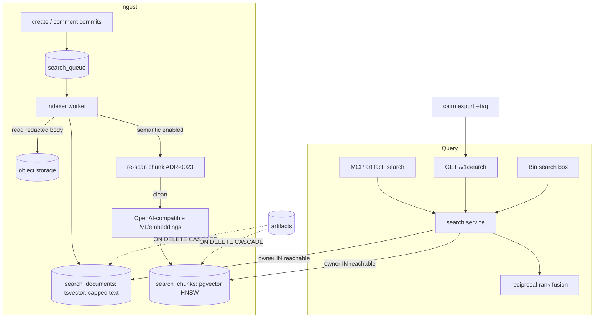

# ADR-0028: Owner-Scoped Search — Postgres Full-Text, Optional pgvector Semantic Search, and Export by Tag

## Context and Problem Statement

Cairn cannot find anything for you. The only way to see more than one artifact is the Bin
(`GET /v1/bin`, `store.ListBin`). The Bin lists the caller's own live artifacts newest
first, keyset-paginated, with an optional tag-containment filter (ADR-0018). It has no text
query. The MCP surface has no list or search tool at all: the registered tools are
`artifact_read`, `artifact_create`, `bundle_create`, `artifact_comment`, `artifact_react`,
`run_create`, `run_append_spans`, `a2ui_action` and `a2ui_error`. An agent can therefore read
an artifact only when someone hands it the id. The CLI has no listing command either:
`cairn ls` is specified but unbuilt (cairn#154).

That was fine while Cairn held throwaway pastes. It is not fine once Cairn holds
institutional memory:

* receipts with a "what the system now knows" field (ADR-0027);
* approval records kept permanently (ADR-0026);
* learning records that agents are supposed to consult before they act.

A self-hosting customer's operating plan makes retrieval a prerequisite, not an extra.
Approved decisions, receipts, and "learning records" filed at each task's close must be
indexed and retrieved automatically before planning, and the plan gates rollout on
"retrieval surfaces the planted contradiction". They index that corpus with a separate
local search tool (QMD) over markdown files, which Cairn cannot feed today. Joe wants
lexical search, semantic search, and an export path for that corpus.

How should Cairn let a person, and an agent acting for them, find artifacts by content and
meaning, without letting anyone discover what they could not already reach?

## Decision Drivers

* **Tenancy is the hard rule.** A result MUST be something the caller owns, or shares
  through a team (ADR-0029). Search must never turn a
  link-capability into a discovery path: someone else's artifact that you were handed a
  link to is not yours to find.
* **Self-host friendly.** No new mandatory service. Lexical search has to work on the
  Postgres Cairn already requires. Semantic search must be able to run against a local
  model and must be off by default.
* **Secrets never leave through the index.** Text is redacted before it is indexed or sent
  to an embeddings endpoint (ADR-0023).
* **The index is as ephemeral as the data.** An expired or deleted artifact's text and
  vectors go with it, in the same transaction.
* **Parity** (ADR-0003): MCP, REST, CLI, and the web Bin.
* **An export path to plain markdown**, so the same records can be indexed by external
  tools or proposed to a repository as a PR.

## Considered Options

* **Postgres full-text search, plus optional pgvector with an operator-configured,
  OpenAI-compatible embeddings endpoint, fused by reciprocal rank. Owner-scoped in SQL.**
* **An external search engine** (Meilisearch, OpenSearch, Typesense) fed by Cairn.
* **Lexical only** (Postgres full-text search), with no semantic search.
* **Semantic only**, with embeddings and no keyword index.
* **No server search; export only.** Let QMD or another tool do all retrieval over exported
  markdown.

## Decision Outcome

Chosen option: **"Postgres FTS plus optional pgvector, owner-scoped in SQL"**. It is the only
option that adds no mandatory service, keeps the tenancy filter inside the same query that
ranks the results, and deletes the index with the data by foreign key. Export by tag ships
alongside it for the external-index case, rather than instead of it.

### What is indexed

A per-artifact **search document** holds:

* the title;
* the tags;
* text bodies, capped at an operator-set size;
* text members of a bundle;
* receipt metadata fields (ADR-0027);
* the text of live comments (lexical only; comments are never sent to an embeddings
  endpoint).

A **text body** is markdown, code, or a `text/*` file. Binary files, images, and webhook
captures are **not** indexed: captured requests are the likeliest place for secrets, and
they are nobody's institutional memory. A trace contributes its title and tags only.

Indexing runs **asynchronously** after the create commits, in a bounded worker with the same
lifecycle as the reaper. It reads the stored body, which the ADR-0023 scanner has already
redacted. A comment create or delete re-indexes that artifact's comment text.

### Lexical

A `tsvector` over the document, weighted title > tags and metadata > body > comments, is
queried with `websearch_to_tsquery`. Ranking uses `ts_rank_cd`, and the snippet uses
`ts_headline`. The text-search configuration is an operator setting (default `english`).
No extension is needed.

### Semantic (off by default)

When the operator enables it, Cairn chunks each document, embeds the chunks through an
**OpenAI-compatible `/v1/embeddings` endpoint** the operator configures (URL, model,
dimensions, key), and stores the vectors in `pgvector` with an HNSW index. That endpoint
can be Ollama, llama.cpp, vLLM, text-embeddings-inference, LiteLLM, or a hosted API. Cairn
does not care which.

* The dimension is fixed per instance. Changing the model means an explicit
  `cairnd search reindex --semantic`.
* The `vector` extension and the chunk table live in an **optional migration set** that is
  applied only when semantic search is enabled. An instance that never enables it never
  needs pgvector installed. Enabling it on a Postgres without the extension fails startup
  with a message that names the missing extension.
* Before any text leaves for the embeddings endpoint, each chunk is **re-scanned** with the
  ADR-0023 scanner, as defense in depth on an egress path. A chunk with a finding is not
  sent, and it is counted in a metric.
* If the endpoint is unavailable, lexical search keeps working. Chunks wait with backoff,
  and a lag gauge shows the backlog.

### Hybrid ranking

Search has three modes:

* `lexical`, the default when semantic search is off;
* `semantic`;
* `hybrid`, the default when semantic search is on.

`hybrid` merges the two ranked lists by **reciprocal rank fusion**, which needs no score
normalization between `ts_rank_cd` and cosine distance.

### Scope is a SQL predicate, not a post-filter

Every search query carries `owner IN (<the caller's reachable owners>)` in the same
statement that ranks the results. The reachable owners are the caller's personal workspace
and, once ADR-0029 lands, every team the caller belongs to in any role. Every returned row
is then also checked against ADR-0029's `authorizeRead`, as defense in depth. Semantic search applies the same predicate inside the
approximate-nearest-neighbour query (with pgvector's iterative index scan), so a filtered
search can lose recall but can never gain rows. An agent token reaches exactly what its
human reaches (ADR-0004). Visibility does not widen reach: a `link` artifact owned by
someone else is never a result, whoever holds its link.

### Empty query means list

`artifact_search` with filters and no text lists artifacts newest first. That gives agents
the listing capability MCP has never had, through one tool rather than two, on instances
whose operator has enabled agent search.

### Surfaces

| Surface | Search | Export |
|---|---|---|
| MCP | `artifact_search {query?, tags?, share_type?, since?, until?, retention?, schema?, mode?, limit?, cursor?}` (requires `artifacts:read`) | — |
| REST | `GET /v1/search?q=…&tag=…&share_type=…&since=…&until=…&mode=…&limit=…&cursor=…` | (the CLI composes search and body reads) |
| CLI | `cairn search <query> [--tag] [--type] [--since] [--mode] [--json]` | `cairn export --tag <t> [--since] [--out <dir>]` |
| Web | a search box on the Bin, rendering the same results | — |

### Export by tag

`cairn export --tag learning --out docs/learnings/` writes one Markdown file per matching
artifact. Each file has YAML front-matter (id, URL, title, tags, dates, provenance,
checksum, retention, and for a receipt its full metadata) followed by the body: markdown
as-is, code fenced, bundle text members as sections, binaries as links.

File names are stable (`<date>-<slug>-<id>.md`), so a re-run overwrites rather than
duplicates, and `--since` makes it incremental. The output is exactly what an external
markdown indexer (QMD in the customer's case) consumes. It is also exactly what an agent
commits on a branch to propose learning records to a repository through a normal PR.
Cairn never pushes to a repository itself.

The export is client-side composition over `GET /v1/search` and the existing body reads.
It applies the same scope and needs no new server endpoint.

### Consequences

* Good, because agents can finally retrieve prior receipts and decisions by meaning.
  "Have we decided this before?" becomes a tool call rather than a hope.
* Good, because lexical search costs nothing new to run, and semantic search is one
  configuration block plus an embeddings server the operator already controls.
* Good, because the scope rule is enforced where the rows are chosen, and deletion is a
  foreign-key cascade. There is no second system to keep in sync with expiry.
* Good, because `cairn export` gives the customer's external indexer a feed without Cairn
  having to become that indexer.
* Bad, because search changes the agent threat model. Before, an agent could read only what
  it was handed. Now it can discover everything its human owns. A prompt-injected agent
  can search for "token" or "password" across its human's artifacts. Redaction at ingest is
  the real mitigation. Agent search is therefore off by default: the operator turns it on
  with `CAIRN_SEARCH_AGENTS=true`, which logs a WARN, and only then does the consent copy for
  `artifacts:read` say "read and search".
* Bad, because the index duplicates up to the configured cap of each text body inside
  Postgres. Database size grows with the corpus, bounded by the per-body cap.
* Bad, because semantic search sends artifact text to whatever endpoint the operator
  configures. For a hosted endpoint, that is a data-processing decision the operator is
  making for their users, and the docs have to say so plainly.
* Neutral, because a filtered approximate-nearest-neighbour search can return fewer than
  `limit` results for a small owner inside a large instance. That is recall, not
  correctness, and it is tunable (`ef_search`, iterative scans).

### Confirmation

SPEC-0022 carries the scenarios. The load-bearing ones:

* a search by user A never returns user B's artifact, including one A holds a link to and
  including through semantic mode;
* an artifact's search document and vectors are gone in the same transaction the reaper
  deletes it in;
* a planted secret in a body never appears in a snippet and is never sent to a stub
  embeddings endpoint;
* an instance without pgvector starts and serves lexical search, while enabling semantic
  search on it fails startup with a clear message;
* `cairn export --tag learning` produces byte-stable files across two runs.

## Pros and Cons of the Options

### Postgres FTS plus optional pgvector (chosen)

* Good, because it uses the one database Cairn already requires, and semantic search is
  opt-in.
* Good, because scope and deletion are enforced relationally.
* Bad, because Postgres FTS is weaker than a dedicated engine at typo tolerance and
  faceting.
* Bad, because pgvector's filtered approximate-nearest-neighbour search needs care
  (iterative scans) to keep recall up.

### An external search engine

* Good, because it has better relevance tooling, typo tolerance, and facets.
* Bad, because it is a new mandatory service for every self-hoster.
* Bad, because tenancy becomes a filter on a second copy of the data. Expiry becomes a
  sync problem: an artifact deleted in Postgres but not yet in the engine is a leak.

### Lexical only

* Good, because it is simplest, with no egress and no extension.
* Bad, because "what did we learn about thread replies?" does not match a record that says
  "Slack parent event carries thread_ts". Joe asked for semantic search explicitly.

### Semantic only

* Good, because meaning-based retrieval handles paraphrase.
* Bad, because ids, error strings, and exact names are keyword problems, and a model-less
  instance would have no search at all.

### No server search; export only

* Good, because Cairn stays out of the search business.
* Bad, because agents over MCP still cannot find anything without leaving Cairn, and
  exported copies outlive the artifact's TTL wherever they land.
* Neutral, because export ships anyway for the cases where an external index is the right
  tool.

## Architecture Diagram

## Security and Tenancy

* **Scope.** Owner-or-team only, as a SQL predicate, on every mode. Link capability never
  confers discoverability. This keeps ADR-0005's no-enumeration property intact across
  users.
* **Agents.** Agent search is a risky capability, so it is **off by default**
  (`CAIRN_SEARCH_AGENTS=false`) and agents keep the "read what you are handed" model. An
  operator who enables it gets a startup WARN and a loud callout in the self-hosting guide.
  When on, reach equals the human's (ADR-0004): the search tool requires `artifacts:read`,
  and the consent line gains "and search".
* **Redaction.** Indexed text is the stored, already-redacted text (ADR-0023). Chunks are
  re-scanned before egress to the embeddings endpoint. Webhook captures and binaries are
  never indexed.
* **Egress.** The embeddings endpoint is operator configuration, never user input, so there
  is no SSRF from users. The HTTP client follows no redirects, has timeouts, and does not
  log request bodies. The API key is read from the environment or a file, never logged.
* **Deletion.** Documents and chunks are keyed by the internal artifact id with
  `ON DELETE CASCADE`. Expiry, delete, and the tombstoning paths of ADR-0026 all remove
  them in the reaper's or the delete's own transaction. Whatever the embeddings provider
  retains is outside Cairn's control, and the operator docs say so.
* **Abuse.** Search is the most expensive read Cairn serves. It gets its own per-principal
  rate limit on top of the per-IP limiter, a bounded `limit` (at most 50), and a bounded
  result depth.

## Composition with Switchboard and Harness

* **Harness** can put an `artifact_search` step in front of a run. For example, a templated
  prompt (Harness ADR-0023) that retrieves prior receipts with `schema:cairn.receipt/v1`
  and a topic, so a one-shot starts with the relevant history. Harness run history
  (Harness ADR-0028) and receipts (ADR-0027) make those records worth finding.
* **Switchboard** needs nothing new. Its digest (Switchboard ADR-0034) can link to a Cairn
  search URL for "receipts needing a human this week".
* **Retention** (ADR-0026): permanent artifacts are the corpus that grows. `retention` is a
  search filter, so "permanent decision records" is one query.
* **Teams** (ADR-0029): when teams land, the reachable-owner set grows from "me" to "me and
  my teams". No search code changes beyond the set.

## More Information

* Extends ADR-0012's API shape with a ranked, cursor-paginated search resource beside the
  keyset-paginated Bin.
* Related records (front-matter edges): ADR-0023 (redaction), ADR-0026
  (retention filter), ADR-0027 (receipt metadata indexed and exported), and ADR-0029 (team
  scope).
* Design review, 2026-09-22: agent search is configurable and **off by default**
  (`CAIRN_SEARCH_AGENTS=false`), because it widens what a prompt-injected agent can discover.
  When enabled, it is scoped to what the human can read. This reverses the first draft's
  default of on. Comments stay lexical only, and the instance switch for semantic search is
  enough at launch.
* `cairn ls` (cairn#154) remains the interactive Bin browser. `cairn search` is the
  non-interactive, scriptable query. They share the scope rule.
