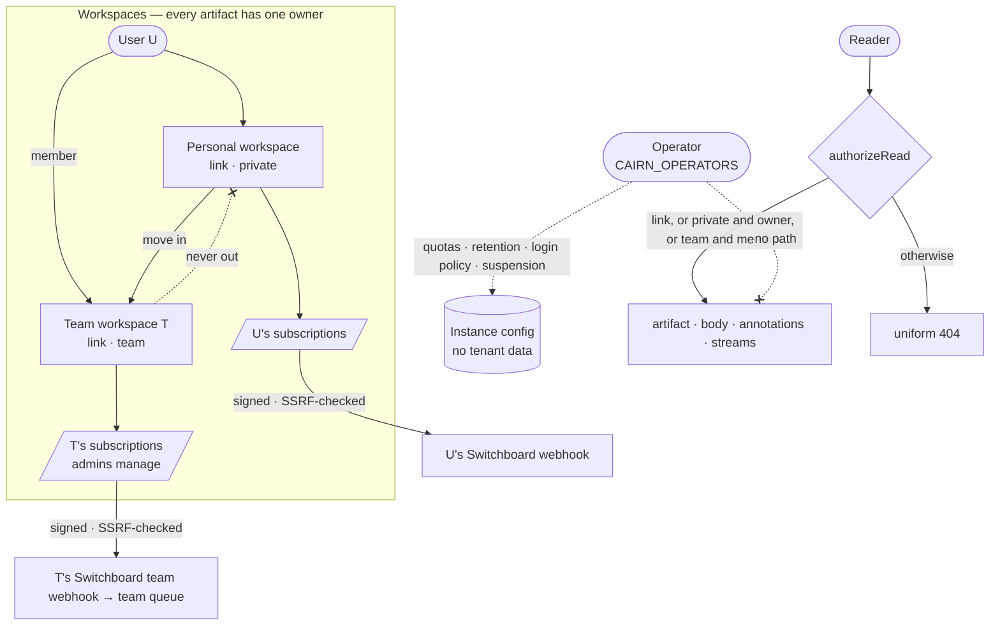

# ADR-0029: Teams and Tenancy — Artifacts Belong to a User or a Team, and the Operator Owns None

## Context and Problem Statement

ADR-0001 named the **workspace** as Cairn's boundary for ownership, identity and access — "a
person's or team's space of artifacts" — and deliberately left its team semantics thin, because v1
centred one human and their agent. That is no longer the deployment. The hosted instance is run by
one person and used by others (family and friends, signing in with Pocket ID or GitHub), and
self-hosters run their own. Cairn has become multi-tenant without deciding what that means, and an
audit of `main` at `dea1f0b` found 25 places where it shows. The worst:

* **"You only" does not restrict anything (#182).** `GetByPublicID` filters on `public_id` and
  expiry only; the visibility column is read and never checked. Every read path — web shell, `/v1`,
  MCP `artifact_read`, the A2UI resources, run and hook streams, annotation lists — serves a private
  artifact to anyone holding its link, and a test (`policy_integration_test.go:178`) asserts that it
  does. The share dialog tells the owner "🔒 you only".
* **Every user's artifacts announce to the operator (#185).** `CAIRN_OUTBOUND_WEBHOOK_URLS` sends
  each `artifact.created` event — title, capability URL, the creator's email, model and tags — for
  every user to targets the operator chose. Because Switchboard routes on tags (ADR-0018), any
  signed-in user can put a `handoff` work order into the operator's agent pipeline. And no user can
  point Cairn at their own automation.
* **The operator can act as any user.** `CAIRN_API_TOKENS` entries are `secret:actor[:role]`; the
  actor is any string the operator types, never checked against a real identity, and the `human` role
  carries `sharing:manage` and delete. The user cannot see or revoke the token.
* **Identity is an email string.** There is no users table. The OIDC callback takes the `email`
  claim without checking `email_verified` or normalising case, so a Pocket ID login and a GitHub login
  are the same owner by string equality — and an IdP that lets a user set an unverified email lets
  them become someone else.
* **There is no way to share with a group.** A link is all-or-nothing: anyone who has it, or only
  the owner. People who work together pass links around, and a link that reaches the wrong channel
  is readable by everyone there.

Switchboard has the same question in its ADR-0038, written alongside this one. **Who owns an
artifact, how does a group of people share one without sharing it with everyone, and what may the
person who runs the instance do that a user may not?**

## Decision Drivers

* **Two profiles, one rule (Joe, 2026-09-22).** The **operator** deploys and runs the instance.
  **Users** sign in and use it. Everything a user creates is owned by that user **or by a team**, and
  is never global. Nothing is designed as if the instance were one team's install.
* **A label that lies is worse than no label.** Visibility has to be enforced on every surface that
  can return an artifact's bytes, metadata or annotations, or it must not be offered.
* **Operator config may bound tenant data, never route it.** Limits, retention and login policy are
  instance concerns. A URL that receives every user's events is not.
* **Pre-1.0 means clean breaks (Joe, 2026-09-22).** Cairn has no 1.0 compatibility promise yet. A
  setting that is wrong is removed in the change that replaces it: no deprecation window, no
  transition warning, no dual path.
* **Risky options are opt-in.** A setting that widens exposure may exist when it is configurable and
  off by default (Joe, 2026-09-22).
* **Links stay the default.** ADR-0007's capability link is what makes Cairn useful between agents:
  a link handed to another agent just works. Teams must add a tighter option, not take the link away.
* **Identity must be something a user cannot claim.** Ownership keyed on an unverified, unnormalised
  email string cannot carry team membership, quotas or subscriptions safely.
* **Consistent with Switchboard, separate stores.** The same profiles, role names, invite semantics
  and group mapping as Switchboard's ADR-0038, so a person on the same team in both products meets
  one model twice. Neither service reads the other's database.

## Considered Options

* **(A) Keep one owner per artifact and fix the leaks.** Enforce `private`, per-user outbound
  subscriptions, map tokens to users; no teams.
* **(B) Teams as workspaces.** Make ADR-0001's workspace concrete: every user has a personal
  workspace and every team is one. An artifact is owned by exactly one user or one team; visibility is
  `link`, `team` or `private`; outbound subscriptions, quotas and the Bin are per workspace.
  *(chosen)*
* **(C) Per-artifact share lists.** Keep user ownership and let the owner add named users (or
  groups) as readers on each artifact.
* **(D) The instance is the workspace.** Treat a deployment as one organisation with the operator as
  its admin; add a visibility value meaning "any signed-in user".

## Decision Outcome

Chosen option: **"(B) Teams as workspaces"**, because it realises the boundary ADR-0001 already
drew, gives a group a private space without a per-artifact ACL, and gives the outbound webhooks,
quotas and Bin an owner that is never "everyone".

> **An artifact belongs to a user or to a team. The operator runs the instance and owns nothing in it.**

### 1. Two profiles

The **operator** is whoever runs the instance, named by `CAIRN_OPERATORS` (provider-qualified
subjects, `<issuer>|<subject>`, matched against the session's recorded provenance) and optionally
`CAIRN_OPERATOR_GROUP`. An operator is also a user, and owns their own artifacts as one.

Operator surfaces are instance configuration and governance only: login policy (the enrollment mode
and allowlist of ADR-0024, `CAIRN_ENROLLMENT_MODE`, cited by number while it is in flight), per-user and per-team quotas, retention bounds,
suspending a user or team (which revokes their sessions, personal access tokens and OAuth grants in
one step), the metrics scrape credential ADR-0021 assumed but never defined, and a directory of users
and teams with **counts**. No operator surface returns an artifact's body, title, link, annotations
or captured requests. Operator actions that touch a tenant write an audit row the affected user or
team owners can read.

The rule for every environment variable, now and later: **operator configuration may bound tenant
data — size, retention, rate, who may sign in — and may never route, copy or reveal it.**
`CAIRN_OUTBOUND_WEBHOOK_URLS` fails that test and is removed outright (section 6). `CAIRN_API_TOKENS`
fails it as written and is restricted to operator users (section 7).

### 2. Users become rows

A `users` table replaces the email string as the principal, with one row per person and one
`user_identities` row per `(issuer, subject)` that has signed in. A login finds its identity by
`(issuer, subject)`; a new identity links to an existing user only by a **verified**, lower-cased
email; otherwise it creates a user. GitHub identities key on the numeric account id, not the
renameable login. The dev password stops working the moment any real provider is configured.

Every owner column becomes `owner_user_id` XOR `owner_team_id`, the pair Switchboard uses, with a
database constraint that exactly one is set and a `created_by_user_id` kept for display and audit.
Artifacts' existing `owner_id` strings are backfilled into users (section 10).

### 3. Teams, roles and invites

Any user may create a team, within the operator's ceiling, and becomes its first **owner**. Roles
and invites are the same as Switchboard's ADR-0038, word for word where the products overlap:

| Role | In Cairn |
|---|---|
| **member** | create artifacts in the team; read and annotate every team artifact; see the team Bin; change sharing, expiry or delete **their own** team artifacts |
| **admin** | everything a member can, plus change sharing, expiry, rotation or delete on **any** team artifact; moderate comments on them; mark team artifacts permanent within the team quota; manage team outbound subscriptions; invite and remove members and admins |
| **owner** | everything an admin can, plus grant `owner`, rename, delete the team |

*Members use, admins configure, owners govern.* A team always has an owner. Invites are addressed to
an email, carry a role no higher than the inviter's, are single-use, hashed at rest and valid for 7
days, and accepting one requires a signed-in user whose verified email matches. Team existence is
invisible to non-members.

**Artifacts move into a team, never out.** A member may move their own personal artifact into a
team they belong to; nobody moves a team artifact to a personal workspace. A member who leaves keeps
their personal artifacts and loses the team's — including the ones they created there.

### 4. Visibility: `link`, `team`, `private`

| Owner | Allowed | Default | Who can read |
|---|---|---|---|
| a user | `link`, `private` | `link` (ADR-0007, unchanged) | `link`: anyone with the link. `private`: the owner only |
| a team | `link`, `team` | `team` | `link`: anyone with the link. `team`: signed-in members of the team |

`private` on a team artifact and `team` on a personal one are refused: each value means one thing.
A team's space is private to the team until someone chooses to share a link, which is why its
default differs from a personal workspace's.

**Enforced on every read path.** One `authorizeRead(principal, artifact)` in the store decides, and
every surface calls it: the web shell and bundle panes, downloads, `/v1` reads including bodies,
members, annotations and span outputs, MCP `artifact_read` and every A2UI resource, run and hook SSE
streams and their MCP subscriptions, produced-artifact links on runs, the Bin, search (ADR-0028) and
receipts (ADR-0027). A caller who fails it gets the same uniform `404` as an expired id, so a
private artifact's existence leaks nothing. Annotations follow: you cannot comment on, react to, or
list comments of an artifact you cannot read. This closes #182, and the test that asserts the gap is
inverted.

### 5. The Bin gets a team view

The Bin gains a workspace switcher: *Personal* and each team the user belongs to. A team view lists
that team's artifacts; `cairn ls --team <slug>` and `GET /v1/bin?workspace=team:<slug>` return the
same projection; MCP `artifact_create`, `bundle_create` and `run_create` accept a `team` argument so
an agent can create into a team its human belongs to.

### 6. Outbound webhooks become owned subscriptions (F-C8, #185)

Outbound targets move from the environment into an `outbound_subscriptions` table, each owned by a
user or a team. A user manages their own in Settings; team admins manage the team's. Each has a
target URL, a per-subscription secret, optional filters (event types, share types, tags) and health:
last status, consecutive failures, auto-disable after repeated failure. The secret is either
supplied by its creator, for a receiver that issues its own signing secret (a Switchboard `cairn`
webhook does), or minted by Cairn; either way it is shown once and stored encrypted.

**A workspace's events go only to that workspace's subscriptions.** `artifact.created` for a
personal artifact reaches its owner's subscriptions; for a team artifact, the team's. Annotation and
trace events (ADR-0022, SPEC-0016, cited by number while in flight) follow the **artifact's**
workspace, not the commenter's, so a friend's comment on your artifact reaches your automation and
never theirs. Nothing reaches the operator unless the operator owns the artifact.

Because a subscription is a user-chosen URL that Cairn will POST to, it is an SSRF primitive. Targets
are validated at creation and re-resolved at every dial: HTTPS only unless the operator opts in,
private, loopback and link-local addresses refused, redirects treated as failures — the rules
Switchboard's notify hooks apply (its ADR-0029).

**`CAIRN_OUTBOUND_WEBHOOK_URLS` and `CAIRN_OUTBOUND_WEBHOOK_SECRET` are removed, not retired.** The
change that ships owned subscriptions also deletes both variables: their parsing in
`internal/config`, the delivery path that reads them, and every place they are documented
(`.env.example`, the compose files, `DEPLOY.md`, the self-hosting and outbound-webhooks guides). The
CHANGELOG carries one upgrade line in their place. There is no narrowed stage, no deprecation
warning, no import command and no release in which both paths deliver (Joe, 2026-09-22: "retire it,
but nuke it 100%"). A deployment that still sets them after upgrading sends nothing to those URLs;
the variables mean nothing to Cairn any more.

**This supersedes ADR-0017's instance-wide delivery.** ADR-0017's event envelope, signing and
bounded retry stay; its operator-configured target list, and SPEC-0012 REQ "Delivery Targets from
Configuration", do not. An operator who fed a Switchboard through the env vars recreates that target
as a subscription they own, supplying the Switchboard webhook's existing signing secret, so the
receiver needs no change. The privacy fix and the replacement land in the same change, so no release
sends one user's events to another's target.

### 7. Static API tokens act as a user, and only as the operator

`CAIRN_API_TOKENS` entries become `secret:<user>[:agent]`, where `<user>` must resolve at boot to an
existing user who is an operator identity. An entry naming anyone else is refused at boot. Tokens get
agent scopes unless marked otherwise, never `sharing:manage`, and appear on their user's Settings
page as "operator-provisioned". Everyone else uses personal access tokens, which they mint and revoke
themselves. The old free-form `secret:actor` form is refused at boot from the release that ships
this, with no grace period; the error names the entry's position and the new form, and the CHANGELOG
says so.

### 8. Quotas for permanent retention

Permanent storage is opt-in per artifact and off for the whole instance until the operator enables
it (ADR-0026, SPEC-0020, cited by number while in flight). Permanent artifacts count against their
**owner's** quota. Quotas are configurable, not mandatory: the operator may set one per user and one
per team, and may override either for one owner (audited). **Where no quota is set, none applies.**
Team admins decide which team artifacts are permanent. Moving an artifact into a team re-charges it
to the team and fails if the team has a quota and is over it.

### 9. OIDC groups (optional)

If the operator sets `CAIRN_OIDC_GROUPS_CLAIM`, Cairn requests and reads that claim. A team owner may
link the team to one group they themselves carry, conferring `member` or `admin` (never `owner`). At
each OIDC login, group-sourced memberships are added or removed to match the claim; manual
memberships are never touched; GitHub logins never change group-sourced memberships. Identical to
Switchboard.

### 10. Migration

* Every distinct `owner_id` becomes a user (its string as the unverified legacy email), and each
  artifact gets `owner_user_id`. A user's first login with a verified matching email claims that
  row; nothing is reassigned by guesswork.
* No teams exist until someone creates one. Existing visibility values are kept: `link` stays
  `link`; `private` becomes **actually** private, which the release notes and the getting-started
  guide's current warning both call out.
* `CAIRN_OUTBOUND_WEBHOOK_URLS` and `_SECRET` are gone in the release that adds subscriptions;
  `CAIRN_API_TOKENS` entries are checked at boot and legacy `secret:actor` entries fail it. The
  CHANGELOG's upgrade notes say both.

### 11. The rest of the audit

Section 4 fixes eight read paths at once; sections 6 and 7 fix two operator paths. The remaining
findings the spec turns into requirements: runs and hooks accept writes from read-only tokens; a
webhook's ingress URL is also its read URL, so every sender reads every other sender's requests;
produced-artifact links resolve to an artifact's current id after rotation; `on_behalf_of` is taken
from the client on REST; comments cannot be moderated or deleted by the artifact's owner; there is no
way to offboard a user; OAuth dynamic client registration is anonymous and global; hook capture has
no owner ceiling; public reads show the creator's email; MCP session bookkeeping is keyed by id
alone; and OTLP `trace_id`s (ADR-0015) must key by owner when that lands.

### Consequences

* Good, because "you only" finally means it, on every surface, with the gap-asserting test inverted.
* Good, because a group gets a private space without per-artifact ACLs, and ADR-0001's workspace
  stops being a word in a glossary.
* Good, because outbound webhooks become self-service: a user wires Cairn to their own Switchboard
  without the operator, and the operator stops receiving everyone's links.
* Good, because the operator gets a real, bounded role instead of powers smuggled through env vars.
* Good, because a person on a team in both products meets the same roles, invites and group rule.
* Bad, because a `users` table and owner backfill is the largest migration Cairn has run, and every
  query that compared `owner_id` strings changes.
* Bad, because `private` changing from a label to a lock will break any flow that relied on sending a
  "you only" link. That flow was relying on a bug; the release notes say so.
* Bad, because per-subscription outbound delivery multiplies requests and adds an SSRF surface that
  the env list, being operator-chosen, never had.
* Bad, because an instance that fed a receiver through `CAIRN_OUTBOUND_WEBHOOK_URLS`, or used a
  legacy `secret:actor` token, needs an operator step on upgrade: recreate the target as a
  subscription, rewrite the token entry. Pre-1.0, one clean break is cheaper than three staged
  releases of code written to be deleted.
* Bad, because a team member can read every team artifact, including ones marked permanent. That is
  what a team is; the invite screen says so.
* Neutral, because the operator still controls the database and the object store. The product removes
  the easy paths and records the operator's actions; it does not pretend to more.

### Confirmation

* A cross-tenant suite: a personal owner, a team member, a team admin, an ex-member, a stranger, an
  anonymous caller and the operator each attempt every read and write on a personal `link`, personal
  `private`, team `team` and team `link` artifact, on every surface in section 4, and every attempt
  outside the table returns `404`.
* `policy_integration_test.go:178` asserts `404` for an anonymous read of a private artifact.
* With `CAIRN_OUTBOUND_WEBHOOK_URLS` still set in the environment, no artifact, the operator's
  included, produces a request to it, and a test asserts that neither variable name is read anywhere
  in the Go source.
* A static token naming a non-operator user fails boot, and so does a legacy `secret:actor` entry.
* Removing a team member ends their read of `team` artifacts on the next request.

## Pros and Cons of the Options

### (A) Keep one owner per artifact and fix the leaks

* Good, because it is the smallest change and fixes #182, #185 and the token hole.
* Bad, because it leaves groups with the choice they have today: everyone with the link, or one
  person.
* Bad, because quotas and subscriptions would be designed per user now and redesigned per team later.

### (B) Teams as workspaces

* Good, because ownership, visibility, subscriptions, quotas and the Bin all key on one thing.
* Good, because it matches Switchboard's ADR-0038 and ADR-0001's stated intent.
* Bad, because it is the largest option: users table, owner backfill, a third visibility value, team
  UI and invites.

### (C) Per-artifact share lists

* Good, because it is flexible: share one artifact with two named people.
* Bad, because a reader list per artifact is the audit ambiguity ADR-0007 avoided by making the link
  the capability; "who can read this" becomes a query instead of a label.
* Bad, because subscriptions and quotas still need an owner above the artifact, which this does not
  provide.

### (D) The instance is the workspace

* Good, because it fits a single self-hosted team exactly.
* Bad, because it is the design Joe's rule forbids: every user's work becomes visible to every other
  user, and the operator becomes an admin over tenant data.

## Architecture Diagram

## More Information

* Switchboard's matching record is its ADR-0038 and SPEC-0033 ("Teams and tenancy"). The two stores
  are separate: a person who is a `member` of `stump` in both products has two memberships with the
  same slug and role, invited twice or synced from the same IdP group. The handoff path between them
  is owned end to end: a Cairn team subscription posts to a Switchboard webhook owned by the
  Switchboard team, which lands todos on that team's queue.
* Records in flight that compose with this one, cited by number: ADR-0022 and SPEC-0016 (annotation
  and trace events), ADR-0023 (redaction at ingest), ADR-0024 (GitHub allowlist), ADR-0026 and
  SPEC-0020 (permanent retention), ADR-0027 (receipts), ADR-0028 (search). Front-matter edges to them
  are added once they merge.
* Issues folded in: #182 ("you only" not enforced) and #185 (instance-wide outbound webhooks).
* **Supersedes ADR-0017's instance-wide delivery** (section 6). ADR-0017 stays the record for the
  event envelope, signing and retry; the env-configured target list is removed by this ADR.
* Design review, Joe, 2026-09-22: remove the env targets in the same change as their replacement,
  with no deprecation window or back-compat shim; quotas are configurable and unset means none;
  risky options are configurable and off by default.
