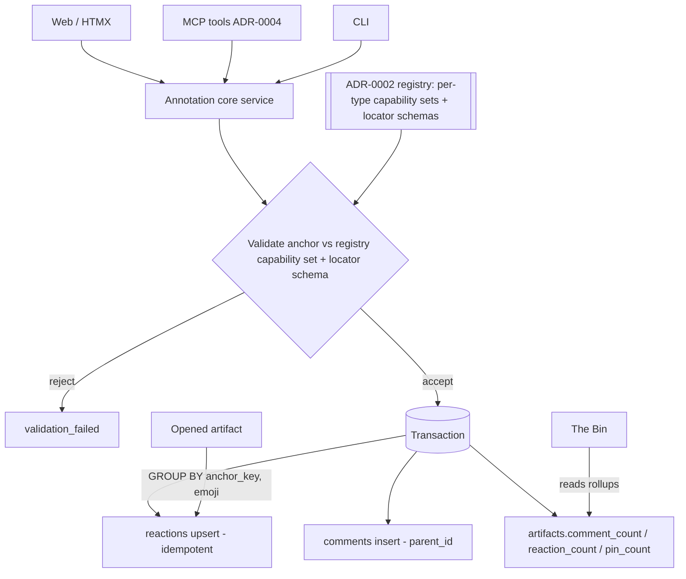
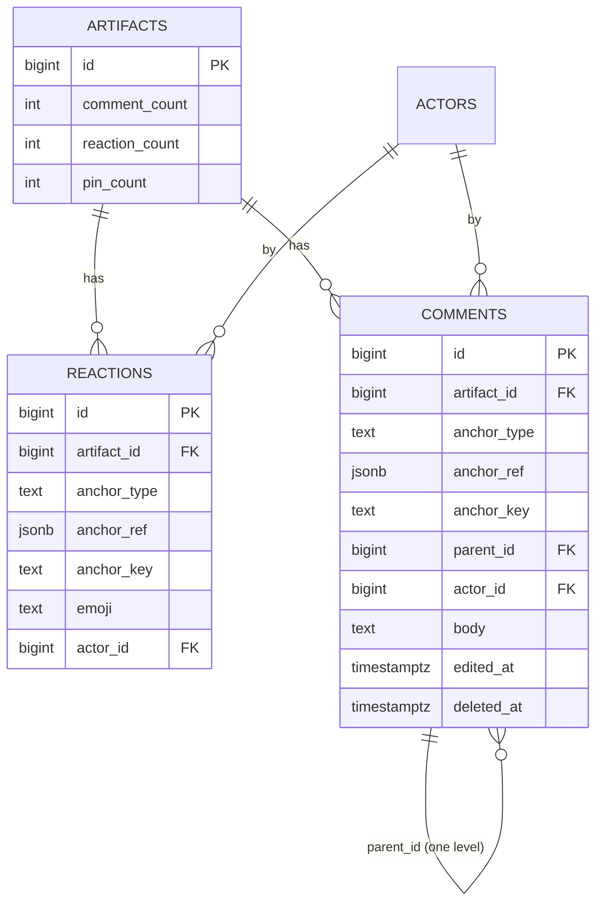

# Design: Annotations — Reactions & Comments

## Context

Cairn needs the *same* reactions and comments on every share type, anchored to
type-specific locations — a markdown block, a code line, an image region, a webhook
request, a trajectory span, or the whole artifact — and identical whether created from
the web, the CLI, or an agent over MCP. This capability designs that one subsystem.

It realizes **ADR-0006**, which decides a **polymorphic anchor**
`{artifact_id, anchor_type, anchor_ref}` embedded directly in two tables (`reactions`,
`comments`), with the legal anchor set and per-type capabilities owned by the ADR-0002
viewer registry, idempotent reactions via a unique constraint, one-level threaded
comments with soft delete, and two-tier count aggregation. It depends on **SPEC-0002**
for the artifact core, the registry, and content-addressed immutable bodies, and it
consumes the ADR-0012 backend contract (REST shape, error envelope, parameterized
queries, context propagation).

The per-viewer *affordances* (how each viewer surfaces and locates an anchor) belong to
the viewer specs (SPEC-0003/0004/0005). This design owns the anchor model, validation,
storage, idempotency, threading, aggregation, and the API — the pieces every surface
shares.

## Goals / Non-Goals

### Goals

- One reactions path and one comments path for all current and future share types.
- New share types add their full annotation surface as **registry data** (a locator
  schema + two capability sets), with no migration to this subsystem.
- Idempotent reactions (react = upsert no-op, un-react = delete) and shallow threaded
  comments with soft delete.
- The webhook "reactable, not commentable" rule enforced structurally as registry data.
- Cheap counts: denormalized artifact rollups for the Bin/header; per-anchor tallies
  scoped to one artifact at view time.
- Durable anchors on an immutable, content-addressed substrate — no re-anchoring engine.
- Auth-by-default API: posting requires auth; reading follows the artifact's
  link-capability.

### Non-Goals

- Per-viewer anchor affordances and locator emission (SPEC-0003/0004/0005).
- Deep forum-style comment trees (deliberately one level of nesting).
- Notifications/mentions on comments (future).
- The share-type registry itself and its capability declarations (SPEC-0002 / ADR-0002).
- Live streaming of new annotations over SSE (annotations post via HTMX/REST; live
  bodies are the webhook/trajectory specs' concern).

## Decisions

### Polymorphic anchor embedded in two tables

**Choice**: One `reactions` table and one `comments` table, each embedding
`artifact_id`, `anchor_type`, `anchor_ref` (JSONB), and a canonical `anchor_key`.
**Rationale**: Exactly one write path and API handler per annotation kind for all
types; a new type's anchors are registry data, not a new table/column; every query
scopes to one `artifact_id`, keeping aggregation cheap (ADR-0006 Option A).
**Alternatives considered**:
- Per-type tables (`markdown_comments`, `image_pins`, …): multiplies write paths, API
  handlers, and MCP tools by the number of types; "add a type" becomes a migration
  (ADR-0006 Option B, rejected).
- A normalized `anchors` entity annotations foreign-key into: an extra join on every
  read and an upsert dance on every write for dedup we don't need (Option C, rejected).

### Registry owns the anchor capability matrix

**Choice**: Each share type's ADR-0002 registry entry declares `reactions` and
`comments` capability sets over `anchor_type` values plus each locator's schema; the
service validates every write against the artifact's entry.
**Rationale**: The webhook asymmetry (`comments = {}`) and image pins and trajectory
span anchoring are all data, not code branches — so anchors cannot drift between viewer
and validator, and a new type defines its surface for free.
**Alternatives considered**:
- Hard-coded `switch` on type in the annotation service: the exact drift ADR-0002 and
  ADR-0006 forbid.

### Idempotency by unique constraint, not read-modify-write

**Choice**: `UNIQUE (artifact_id, anchor_type, anchor_key, emoji, actor_id)`; react is
an upsert (`ON CONFLICT DO NOTHING`), un-react is a delete of that row.
**Rationale**: Concurrency-safe by construction — two simultaneous identical reactions
collapse to one row without an application lock (ADR-0006).
**Alternatives considered**:
- Check-then-insert in app code: races produce duplicate rows under concurrent posts.

### Canonical `anchor_key` for stable identity and grouping

**Choice**: The service computes `anchor_key` = sorted-key, whitespace-free
serialization of `anchor_ref`; the unique index and the `GROUP BY` use it.
**Rationale**: JSON field ordering must not affect identity or the emoji tally; a stable
text key indexes cleanly and dedups reliably.
**Alternatives considered**:
- Indexing raw JSONB: ordering-sensitive and awkward to group/uniquely-constrain on.

### Two-tier counts: denormalized rollups + view-time tallies

**Choice**: Maintain `comment_count`, `reaction_count`, `pin_count` on the artifact,
updated in the **same transaction** as the annotation write; compute per-anchor emoji
tallies and "did I react" with a `GROUP BY (anchor_key, emoji)` scoped to one artifact.
**Rationale**: The Bin lists many artifacts and must not per-row subquery; a single
opened artifact's tallies are bounded and index-backed, so no per-anchor counters are
needed (ADR-0006).
**Alternatives considered**:
- Live `COUNT(*)` per Bin row: O(rows) subqueries on every listing.
- Per-anchor materialized counters: more write amplification and drift surface than the
  bounded view-time `GROUP BY` warrants.

### Durable anchors via immutability + deterministic ids

**Choice**: Rely on immutable content-addressed bodies (ADR-0008) plus deterministic
render ids (hashed markdown `block_id`, intrinsic code `line`, normalized image coords,
capture-time webhook/trajectory ids) and self-describing `text_selection` (offsets +
quote).
**Rationale**: The substrate never moves, so anchors stay valid with no re-anchoring
engine; the stored quote lets the client flag "context changed" as a safeguard.
**Alternatives considered**:
- Mutable bodies + a re-anchoring/diff engine: large complexity the immutability
  decision makes unnecessary.

## Architecture

One core annotation service backs three thin adapters (REST, MCP, HTMX). Writes
validate against the registry, persist to the two anchor tables, and update the
artifact's denormalized counters in the same transaction.

Data model (ADR-0006), one embedded anchor shared by both tables:

Anchor capability matrix (registry data; the webhook row is the deliberate asymmetry):

| Share type | reactions on | comments on |
|------------|--------------|-------------|
| markdown | `artifact`, `md_block`, `md_bullet` | `artifact`, `text_selection` |
| code | `artifact`, `code_line`, `code_range` | `artifact`, `code_line`, `text_selection` |
| image | `artifact`, `image_region` | `artifact`, `image_region` (the pin) |
| file | `artifact` | `artifact` |
| webhook | `artifact`, `webhook_request` | — (none) |
| trajectory | `artifact`, `trajectory_turn`, `trajectory_toolcall` | `artifact`, `trajectory_span`, `text_selection` |

## Risks / Trade-offs

- **JSONB `anchor_ref` sacrifices column typing** → validate against the registry
  locator schema and canonicalize on write; round-trip tests guard shape.
- **Denormalized counters can drift** if a write path forgets them → funnel all
  annotation writes through the core service inside one transaction (or a DB trigger),
  plus a periodic consistency check reconciling counters against fresh aggregates.
- **Registry bug persists a malformed/illegal anchor** → capability-matrix and
  locator-schema tests per type; the whole matrix is exercised, including the invariant
  that a comment on any webhook anchor is refused while a `webhook_request` reaction is
  accepted.
- **Spam/flooding of reactions and comments** → per-identity/per-IP rate limits (429 +
  `Retry-After`), body-size caps (413), and idempotent reactions that make repeat
  toggles cheap no-ops.
- **Stale-render anchors** → `text_selection` stores the quoted substring and
  `code_line` may carry a line-text hash, so mismatches surface as "context changed"
  rather than mis-anchoring; immutability makes this the rare case.

## Open Questions

- Should `pin_count` count image-region reactions, pinned comments, or both — and how is
  it kept consistent with the two source tables under soft delete?
- Comment edit/delete authorization beyond author: what workspace roles (if any) may
  moderate others' comments in v1?
- Do we expose annotation events over SSE for a live-updating comments panel, or is
  HTMX post-and-swap sufficient for v1?
- Reaction emoji policy: allow any Unicode grapheme, or restrict to a curated set to
  keep tallies and accessible names tractable?
