# Design: Artifact Core and Share Types

## Context

Cairn's entire model rests on one aggregate. ADR-0001 fixes the **Artifact** as the single
shared unit — id, share type, body, metadata, provenance, access policy, expiry, annotation
stream — so provenance, access, expiry, and annotations are written once and reused by every
kind. ADR-0002 makes the *kind* pluggable: a compile-time `ShareType` registry, open for
extension and closed for modification, that resolves totally (unknown → generic file).
ADR-0008 splits storage — SHA-256-addressed blobs in S3-compatible object storage, relational
metadata in Postgres, bundles with N members, streaming upload with in-flight hashing and
dedup, reference-counted GC. ADR-0005 gives each artifact a short opaque base62 public id,
deliberately decoupled from the content hash and the internal key, with a per-surface URL
scheme.

This design realizes SPEC-0002, the backbone every other spec `requires`. It is the one place
the create/read/list/delete operations and their rules live (ADR-0003), exposed as the `/v1`
REST/JSON API (ADR-0012) that the web/CLI project and the MCP server adapts. It is
WEB(API)-facing and BACKEND, so it carries Security and backend-quality (error handling,
concurrency for streaming uploads, database) requirements; it renders no UI, so there is no
accessibility surface here.

## Goals / Non-Goals

### Goals

- One Artifact aggregate carrying every cross-cutting concern, with create/read/list/delete
  defined once and reused by all surfaces.
- A `ShareType` interface + compile-time registry with total resolution to the generic file
  handler; no `switch shareType` in the core or shell.
- Content-addressed blobs (SHA-256) giving integrity, the visible checksum, and free dedup;
  metadata in Postgres as the queryable source of truth.
- Streaming upload through the API that hashes incrementally, verifies on finalize, enforces
  size/quota, and dedups — never persisting a partial artifact.
- Bundles as one artifact with N ordered, content-addressed members addressable but not
  independently shareable.
- Previewability decided and stored at ingest.
- Random base62 public ids decoupled from content hash and internal key, with collision
  retry, reserved-prefix exclusion, and the ADR-0005 path scheme.
- Backend quality: structured error wrapping, context propagation, transactional multi-step
  mutations, parameterized SQL.

### Non-Goals

- Per-type body rendering / viewers — SPEC-0003 (this spec owns the registry seam and anchor
  affordance declarations, not the templates).
- Annotation storage and threading — SPEC-0006 (this spec declares which anchors each type
  permits; SPEC-0006 stores and validates them).
- Provenance/access/expiry policy internals and the reaper — ADR-0007 / SPEC-0009 (this spec
  sets provenance/policy/TTL at create and honors expiry semantics).
- MCP OAuth and the CLI — SPEC-0007 / SPEC-0008.
- The web shell and Bin rendering — SPEC-0001.

## Decisions

### One Artifact aggregate with a pluggable share type

**Choice**: A single `Artifact` type owns id, share type, body reference (or bundle
manifest), metadata, provenance, access policy, expiry, and the annotation stream. Bundle and
the Bin are expressed in terms of it, not as parallel aggregates.

**Rationale**: ADR-0001 — making the cross-cutting concerns structural properties of one
object is the only way they stay uniform across current and future types, and it gives humans
and agents a single mental model.

**Alternatives considered**:
- Separate entities per kind (`Paste`, `Image`, `Webhook`, `Trajectory`): duplicates
  sharing/expiry/annotation logic N times and guarantees drift — ADR-0001 Option B, rejected.
- Generic object-store-with-metadata: throws away typed viewers/anchors the product needs —
  ADR-0001 Option C, rejected.

### `ShareType` interface + compile-time registry, total resolution

**Choice**: Each type is a Go value implementing `ShareType` (badge, viewer, metadata-panel
fields, allowed anchors, body decode/validate) and registering itself at `init`. The core and
shell resolve handlers through the registry and never `switch` on type; an
unregistered/uninterpretable type resolves to the built-in generic file handler.

**Rationale**: ADR-0002 — registration is the only integration point, so adding a type is
additive (implement + register + one template) and total resolution guarantees forward/
backward compatibility. Fits the single-static-binary ethos (no runtime plugin loader).

**Alternatives considered**:
- `switch`/enum over a fixed set: spreads type knowledge across call sites — ADR-0002 Option
  B, rejected.
- Out-of-process/WASM plugins: security and operational fragility Cairn does not need —
  ADR-0002 Option C, rejected.
- Data-driven descriptors: cannot express semantic anchor rules (reaction-only webhooks, pin
  geometry) — ADR-0002 Option D, rejected.

### Split store: SHA-256 blobs in object storage, metadata in Postgres

**Choice**: Bodies are blobs named by lowercase hex SHA-256, stored under a sharded object key
in S3-compatible storage; Postgres owns `artifacts`, `blobs`, `bundle_members`, and the
annotation tables and is the sole queryable source of truth. Dedup is automatic (a body whose
hash exists is not re-uploaded); the SHA-256 is the visible checksum.

**Rationale**: ADR-0008 — each substrate does what it is built for; content addressing yields
integrity, dedup, and the checksum from one property; Postgres stays lean and queryable for
the Bin.

**Alternatives considered**:
- Everything in Postgres (`bytea`/Large Objects): bloats the DB, ruins cache locality, makes
  tens-of-MB uploads a liability — ADR-0008 Option B, rejected.
- Content-addressed local filesystem: forfeits horizontal scale and the S3 API the stack
  already speaks — ADR-0008 Option C, rejected.

### Streaming upload through the API with in-flight hashing

**Choice**: The client streams bytes to the core; the service streams them to object storage
(S3 multipart for large bodies) while computing SHA-256 incrementally and enforcing size/quota
as it goes, then finalizes atomically — verify hash, upsert `blobs` (or discard the object on
a dedup hit), insert `artifacts` / `bundle_members` in one transaction.

**Rationale**: ADR-0008 — streaming through the API keeps one ingress endpoint, lets the
server verify the hash and enforce quotas, and works when the object store is private (the
common self-host topology). Presigned direct upload is a future optimization gated on
post-upload verification.

**Alternatives considered**:
- Presigned direct-to-store PUTs: cannot verify hash or enforce quota at the app tier and
  breaks with a private store — deferred by ADR-0008.

### Random base62 public ids, decoupled from the content hash

**Choice**: Public ids are cryptographically random base62, default 8 chars (~47.6 bits),
minted independently of the SHA-256 and the internal key; generate → atomic unique insert →
retry on conflict; reserved route words excluded; retired ids not reused within TTL-plus-grace.
Resolution walks `public_id → artifact row → content hash → blob`.

**Rationale**: ADR-0005 — only random-opaque ids satisfy the capability-URL unguessability
requirement while staying short; decoupling from the content hash keeps dedup private (two
byte-identical shares never share a URL) and keeps ids leaking no order/count/content.

**Alternatives considered**:
- Obfuscated sequential ids (Hashids/Sqids): reversible/enumerable, leak counts/order — fatal
  for capability URLs — ADR-0005 Option B, rejected.
- Truncated content hash: ties the URL to the body, enabling confirmation-of-file attacks —
  ADR-0005 Option D, rejected.

## Architecture

The core service package holds the aggregate and all rules; adapters (REST/web/MCP) are thin.
Metadata lives in Postgres (the queryable truth); bodies are content-addressed blobs in object
storage. The registry maps a stored share type to its handler with a generic-file floor.

```mermaid
erDiagram
  ARTIFACTS ||--o{ BUNDLE_MEMBERS : "manifest (bundle only)"
  ARTIFACTS }o--|| BLOBS : "body_sha256 (single-body types)"
  BUNDLE_MEMBERS }o--|| BLOBS : "blob_sha256"
  ARTIFACTS {
    bigint   id PK "internal key, never exposed"
    char64   public_id UK "random base62, ADR-0005"
    text     share_type "registry key; unknown -> generic file"
    text     title
    char64   body_sha256 FK "null for bundles"
    bool     previewable "decided at ingest"
    jsonb    provenance "actor, channel (server-derived), captured_at"
    jsonb    access_policy "you + anyone with link (default)"
    timestamptz created_at "Bin sort key (never id)"
    timestamptz expires_at "created_at + 7d default"
  }
  BLOBS {
    char64   sha256 PK "checksum affordance; dedup key"
    bigint   size_bytes
    text     media_type "sniffed + declared"
    text     storage_key "sharded: blobs/aa/bb/<sha256>"
  }
  BUNDLE_MEMBERS {
    bigint   bundle_id FK "-> artifacts.id, ON DELETE CASCADE"
    int      ordinal "tab order"
    text     name "addressable <bundle_id>/<name>; no public id"
    char64   blob_sha256 FK
    text     media_type
    bigint   size_bytes
  }
```



Streaming create — hash in-flight, verify + finalize atomically, dedup:

```mermaid
sequenceDiagram
  participant Cl as Client (CLI/agent/web)
  participant Co as Core service (ctx-scoped)
  participant OS as Object storage (S3-compatible)
  participant PG as Postgres
  Cl->>Co: POST /v1/artifacts (streamed body, server-derived channel)
  loop each chunk
    Co->>Co: update SHA-256; enforce size/quota
    Co->>OS: stream chunk (S3 multipart for large bodies)
  end
  Note over Co: on cancel/disconnect (ctx) -> abort object write, no row committed
  alt oversize / hash mismatch on finalize
    Co-->>Cl: 413 / validation_failed (no partial persisted)
  else finalize (single transaction)
    Co->>PG: SELECT blobs WHERE sha256 = computed
    alt dedup hit
      Co->>OS: discard just-uploaded object
    else new blob
      Co->>PG: INSERT blobs (sha256, size, media_type, storage_key)
    end
    Co->>PG: mint public_id (retry on unique conflict); INSERT artifacts (+ bundle_members)
    PG-->>Co: committed
    Co-->>Cl: 201 { public_id, cairn.stump.wtf/<id> }
  end
```

## Risks / Trade-offs

- **Two stores to keep consistent** → a crash between "object written" and "row committed"
  can orphan an object; mitigated by making Postgres the authority and letting the
  reference-counted GC reaper sweep unreferenced objects (ADR-0008/ADR-0007), so orphans are
  harmless.
- **One aggregate spanning a 40 MB blob to a live stream to a span tree** → risks a leaky
  abstraction; mitigated by the narrow `ShareType` seam (a type sees only its artifact and
  body) and the content-addressed body layer everyone shares (ADR-0002/ADR-0008).
- **8-char id entropy vs. capability-URL secrecy** → ~47.6 bits is a compromise; backstopped
  by rate-limited id resolution, uniform 404s, and the short default TTL, with length as a
  tunable policy (ADR-0005).
- **Streaming ingest on the app tier** → puts upload bandwidth on the app rather than
  presigned PUTs; accepted for v1 in exchange for hash verification, quota enforcement, and a
  private object store (ADR-0008).
- **Compile-time registry** → a third-party type needs a rebuild; accepted given the
  single-binary ethos (ADR-0002).
- **In-process callers could bypass an edge-only rule** → business rules (size limits, authz,
  provenance capture, anchor legality) MUST live in or below the core, never only in the REST
  handler (ADR-0003).

## Open Questions

- What is the exact preview size bound (and per-media overrides) that flips `previewable` at
  ingest, and is it operator-configurable?
- What are the default per-workspace quota and per-upload size limits, and how are they
  surfaced to the CLI progress UI?
- How is the id length policy re-tuned in practice if keyspace occupancy grows — a config
  bump for new ids only, and how is the transition observed?
- Where does the reference-count for GC live precisely (a materialized count vs. derived
  `COUNT(*)` over live references), given it is read on every delete/expiry (coordinated with
  SPEC-0009)?
