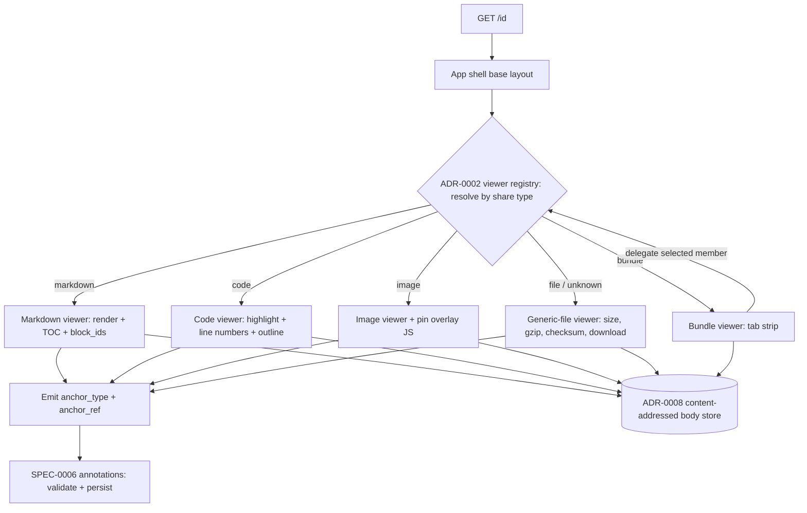
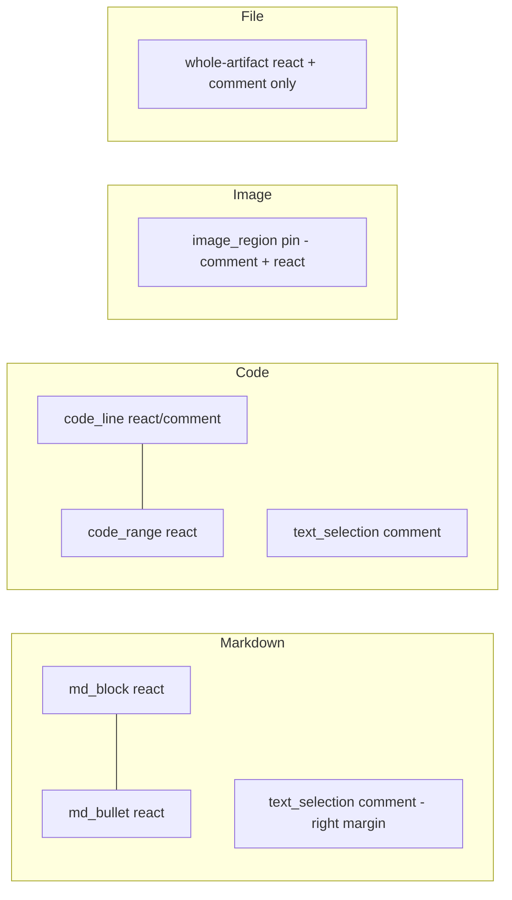

# Design: Artifact Viewers

## Context

Cairn presents every artifact in one app shell (SPEC-0001) with a header, a
collapsible metadata + comments panel, and a **body** slot whose contents depend on
the artifact's share type. This capability designs the five **static** body viewers —
markdown, code, image, file/generic, and bundle — that fill that slot.

It realizes two ADRs. **ADR-0002** decides that a share type is a Go value satisfying
a `ShareType` interface registered at compile time; the interface owns the badge, the
viewer fragment, the metadata-panel fields, and the legal annotation anchors, and an
unregistered type resolves to the generic-file handler. **ADR-0011** decides that the
frontend is server-rendered Go `html/template` + HTMX + Alpine, with bespoke
vanilla-JS/SVG only where HTML cannot draw (here: the image-pin overlay), all embedded
in the single ADR-0012 binary. This spec depends on **SPEC-0002** for the artifact
core, the registry, and content-addressed body storage.

Two live viewers — webhook inspector (SPEC-0005) and trajectory (SPEC-0004) — are out
of scope. Annotation storage/validation/tallying is SPEC-0006; this spec designs only
how each viewer *surfaces* and *locates* annotation anchors.

## Goals / Non-Goals

### Goals

- One registered viewer per static share type, each a server-rendered body partial
  selected via the ADR-0002 registry — never a `switch` in the shell.
- Total resolution: any unknown/opaque type falls back to the generic-file viewer and
  stays viewable, downloadable, and annotatable at the whole-artifact level.
- Each viewer surfaces exactly its type's declared anchor affordances and emits
  deterministic, stable anchor locators for SPEC-0006 to persist.
- Progressive enhancement: reading works with HTML alone; JS enriches (pins,
  selection) and fails to accessible fallbacks.
- WCAG 2.1 AA and a strict CSP that renders untrusted bodies inert in the app origin.

### Non-Goals

- The live webhook and trajectory viewers (SPEC-0005 / SPEC-0004).
- Annotation persistence, idempotency, threading, counts, and the annotation REST API
  (SPEC-0006).
- The shell chrome itself — header, URL control, Share dialog, panel container
  (SPEC-0001).
- Client-side routing or a SPA runtime (explicitly rejected by ADR-0011).
- Editing artifact bodies (bodies are immutable and content-addressed, ADR-0008).

## Decisions

### One registered body partial per share type

**Choice**: Each static type registers a viewer that returns a server-rendered body
`html/template` fragment; the shell resolves it by type through the ADR-0002 registry
and fills only the body slot.
**Rationale**: Keeps the shell closed to modification (ADR-0011's "adding a type is
adding a partial") and colocates a type's rendering with its anchor affordances so the
two cannot drift.
**Alternatives considered**:
- A `switch shareType` in the shell: spreads type knowledge across call sites; ADR-0002
  explicitly forbids it and lints for it.
- Client-side components per type: re-derives server-owned state, adds a build/bundle,
  fights the terminal-minimal, single-binary ethos (ADR-0011 Option B, rejected).

### Anchors are located at render time, not stored by the viewer

**Choice**: A viewer's only annotation responsibility is to (a) show the affordances in
its type's capability set and (b) emit a deterministic locator (`anchor_type` +
`anchor_ref`) when the reader acts. Persistence, validation, and counts are SPEC-0006.
**Rationale**: One annotation subsystem for all types (ADR-0006). Viewers stay thin;
the webhook "reactable-not-commentable" rule and all validation live centrally as
registry data, not per-viewer code.
**Alternatives considered**:
- Each viewer owning its own annotation store: multiplies write paths per type — the
  anti-pattern ADR-0006 Option B rejects.

### Deterministic render identifiers make anchors durable

**Choice**: Markdown blocks get `block_id`s hashed from structural position + content
at ingest; code lines are intrinsic to the immutable body (a `line` is a permanent
coordinate, optionally carrying a line-text hash for staleness detection); image pins
use normalized fractional coordinates; text selections store offsets + the quoted
substring.
**Rationale**: Bodies are immutable and content-addressed (ADR-0008), so the substrate
never moves; deterministic render ids make the same body produce the same anchors on
every surface and request — no re-anchoring engine (ADR-0006).
**Alternatives considered**:
- DOM-position or CSS-selector anchors: brittle across renderers and themes; break the
  moment markup changes.

### Bundle delegates back through the registry

**Choice**: The bundle viewer renders a tab strip and, for the selected member file,
delegates rendering to that file's registered viewer; member anchors resolve to the
specific member file.
**Rationale**: Reuses every existing viewer and its anchor affordances instead of
re-implementing them; matches ADR-0002's note that bundle is "the one type aware of
others' viewers."
**Alternatives considered**:
- A dedicated bundle renderer per media kind: duplicates the markdown/code/image
  viewers.

### Only the image pin is bespoke JS; everything else is HTML + Alpine/HTMX

**Choice**: Syntax highlighting, TOC, and markdown rendering are done server-side and
shipped as inert HTML. Local UI state (pickers, selection popovers, tab state) is
Alpine; posting is HTMX. Only the image-pin overlay (place a pin at a coordinate,
hit-test a region) is a small vanilla-JS/SVG widget.
**Rationale**: Directly follows ADR-0011's decision to scope bespoke drawing to the
genuinely app-like bits and render everything else on the server.
**Alternatives considered**:
- Client-side highlighting (highlight.js): ships a bundle and runs untrusted-adjacent
  code paths in the app origin; server-side keeps output inert.

## Architecture

The shell owns the frame and delegates the body slot to a registry-resolved viewer.
The viewer emits anchor locators that SPEC-0006 persists; it reads bytes from the
ADR-0008 content-addressed store via the core service.

Anchor affordances by viewer (locators defined in ADR-0006; validated by SPEC-0006):

## Risks / Trade-offs

- **Untrusted markdown/HTML executing in the app origin** → server-side sanitize on
  render, strict CSP, `nosniff`, and serve raw bodies with attachment disposition /
  isolated origin so no body runs as active content in Cairn's origin.
- **Image pins are JS-only** → the viewer degrades to a static image with whole-
  artifact annotation when the overlay script fails, preserving core reading and a
  keyboard path to region annotation.
- **Stale-render anchors** (client rendered an older view) → `code_line` carries a line-
  text hash and `text_selection` carries the quoted substring, so SPEC-0006 can flag
  "context changed" rather than mis-anchor; immutability makes this rare.
- **Bundle delegation loops or heavy members** → member rendering is lazy per selected
  tab, and delegation resolves through the same registry with the generic-file floor,
  so a huge or unknown member degrades instead of blocking the whole bundle.
- **Split interactivity (HTMX vs Alpine vs pin JS)** → per ADR-0011 this is an accepted
  cost; the seam is documented (Alpine owns local state, HTMX owns the post).

## Open Questions

- Symbol-outline extraction: server-side per-language parsing vs. a lightweight
  heuristic for unsupported languages — how deep should v1 go before falling back to
  "no outline"?
- Very large code bodies: at what size does the viewer switch to windowed/virtualized
  line rendering, and how do line anchors stay stable across virtualization?
- TOC for markdown with no headings: suppress the TOC entirely, or synthesize one from
  top-level blocks?
- Should the generic-file viewer attempt any lightweight text preview for small
  text/* bodies, or stay strictly non-previewable as the design specifies?
