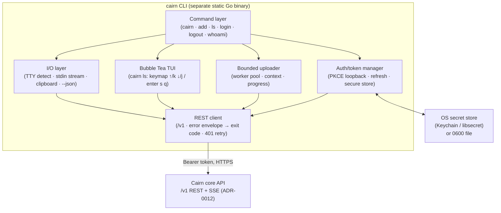
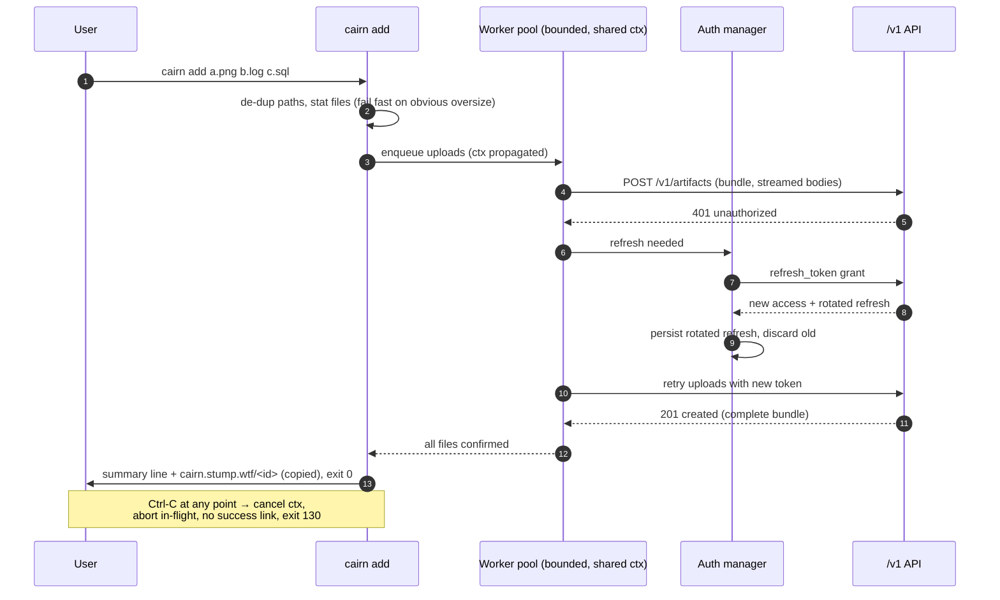

# Design: The `cairn` Command-Line Interface

## Context

The CLI is the third of Cairn's three surfaces (web, MCP, CLI). Per **ADR-0003**
(triple-surface parity), it is the one surface that is a **network REST client** of the
core `/v1` API rather than an in-process adapter: web handlers and the MCP server call
the core package directly in the server binary, while the CLI ships as a **separate
static Go binary** and reaches the same operations over HTTP. This realizes the "same
auth as your agent" promise literally — the CLI presents the **same OAuth 2.1
authorization-code + PKCE** credentials to the same `/authorize` and `/token` endpoints
the agent uses (ADR-0004, formalized in **SPEC-0007**); only the server-assigned channel
differs (`via CLI` vs `via MCP`).

This design realizes **SPEC-0008** and depends on the API shape, error contract, and
pagination model of **ADR-0012**, the identifier/URL scheme of **ADR-0005**
(`cairn.stump.wtf/<id>`), and the provenance/access/expiry policy of **ADR-0007** (which the
CLI displays but never decides). It is not web-facing and renders no HTML/UI in a
browser, so it carries no Security-headers or WCAG obligations; instead it must be an
excellent, scriptable, correctly-failing UNIX citizen, which is why this design leans
hard on exit codes, `--json`, TTY detection, and disciplined error/concurrency handling.

## Goals / Non-Goals

### Goals

- Be *pbcopy for cairn*: `cat file | cairn` → a `cairn.stump.wtf/<id>` link on stdout and on
  the clipboard, with the terminal/dev-minimal aesthetic.
- Push many files at once as one **bundle** (`cairn add`) with per-file progress and a
  summary line, uploaded concurrently but reported atomically.
- Browse the Bin as a keyboard-driven Bubble Tea TUI (`cairn ls`).
- Share exactly the agent's OAuth flow, storing tokens securely and refreshing silently.
- Compose in pipelines and scripts: deterministic exit codes, a `--json` mode, and
  clean non-TTY behavior.
- Carry **zero** domain rules — the server is authoritative for type, provenance,
  access, and expiry.

### Non-Goals

- No local domain logic (no client-side expiry math, access decisions, or anchor
  validation).
- No offline mode or local artifact cache — the CLI requires a reachable, authenticated
  server (an accepted cost in ADR-0003).
- No sharing-management or delete scopes for the token (agents and the CLI create with
  the default policy only; changing sharing/expiry is a deliberate act via `share`).
- No second auth mechanism (no API keys) — one flow, per ADR-0004.
- Not a web/UI surface: no browser-rendered pages, so no Security/Accessibility spec
  sections.

## Decisions

### Separate binary, pure REST client

**Choice**: Ship the CLI as its own static Go binary that speaks only the documented
`/v1` REST/JSON contract; put no domain logic in it.

**Rationale**: ADR-0003 makes the CLI the "first consumer of the public contract,"
keeping the boundary honest. A drifted rule cannot hide in the CLI because the CLI has
no rules to drift. It also means the CLI works against any conformant deployment.

**Alternatives considered**:
- *Link the core package into the CLI*: rejected — it would let domain logic live in a
  surface adapter, the exact drift ADR-0003 forbids, and couple the CLI to server
  internals and the database.
- *Thin wrapper over `curl`*: rejected — no TUI, no secure token handling, no typed
  error mapping.

### Same OAuth flow as the agent; loopback + PKCE

**Choice**: `cairn login` runs OAuth 2.1 authorization-code + PKCE as a public client
with a loopback (`127.0.0.1`) redirect, hitting the same endpoints as the MCP agent
(SPEC-0007). Store a short-lived access token plus a rotating refresh token.

**Rationale**: One authorization server, one flow, two client profiles (ADR-0004). PKCE
is mandatory for a public client with no client secret; the loopback redirect captures
the code without a hosted callback.

**Alternatives considered**:
- *Personal access tokens pasted into config*: rejected by ADR-0004 (no interactive
  consent, copy-pasted secrets leak, coarse scopes).
- *Device-code flow*: reasonable for headless boxes and a possible future addition, but
  loopback matches the agent's client profile and is the primary path.

### Secure token storage with a permissioned fallback

**Choice**: Prefer the OS secret store (macOS Keychain, libsecret/Secret Service);
otherwise a `0600` file under the user config dir. Never log or print tokens.

**Rationale**: Tokens are bearer credentials to the human's workspace. The OS keychain
is the safest at-rest location; the permissioned-file fallback keeps headless Linux and
CI usable without weakening the default.

**Implementation note (cairn#21, a scoped takeover of upstream cairn#37)**: `cairn
login`/`logout`/`whoami` first ship against the token seam described above ("Personal
access tokens pasted into config") rather than the OAuth 2.1 + PKCE browser flow — the
"rejected" alternative in this decision is, for v0.0.2, the interim path: the human
mints a personal access token (issue #74) or uses a `CAIRN_API_TOKENS` entry, `cairn
login` verifies it with a `GET /v1/whoami` round trip and stores it exactly as described
here (OS keyring preferred, `0600` file fallback, never both). The loopback + PKCE flow
this section otherwise describes follows in cairn#22 and on (SPEC-0007), layering onto
the same `login`/`logout`/`whoami` command surface without changing storage semantics.

### Structured error envelope → stable exit codes

**Choice**: Parse `{"error":{"code",...}}` and map each stable `code` (plus
transport-only failures) to a fixed exit-code taxonomy (`0` success … `130`
interrupted), reprinting the server `message` and `request_id`.

**Rationale**: ADR-0012 gives us a machine-stable code enum precisely so clients branch
on codes, not prose. A fixed exit-code table makes the CLI scriptable and lets `--json`
emit the raw envelope for programmatic callers. Transport failures (unreachable server)
are deliberately a **distinct** exit code (8) from application errors, because "the
network is down" and "the artifact is gone" are different operational facts.

### Concurrent, bounded, atomic bundle upload

**Choice**: `cairn add` uploads files through a bounded worker pool sharing one
`context.Context`; the bundle is reported successful only when the server confirms the
complete set; Ctrl-C cancels the context and aborts cleanly (exit 130).

**Rationale**: Bundles are "mixed media, many files"; concurrency is the difference
between snappy and slow. Boundedness protects the server and the local network. Atomic
reporting prevents a half-uploaded bundle from being handed onward as if complete —
partial-artifact prevention ultimately rests with the core (ADR-0007/0008), and the CLI
must not paper over a partial with a success link.

## Architecture

The CLI is a thin, typed HTTP client with a small command layer, an auth/token manager,
a bounded uploader, and a Bubble Tea TUI. All commands funnel through one REST client
that owns retry-on-401, error-envelope decoding, and code→exit mapping.

### `cairn add` — concurrent upload with transparent refresh

The interesting flow is a multi-file bundle where the access token has expired: the
client refreshes once, retries, and only reports success when the whole bundle lands.

### Data the CLI shows but never decides

Provenance channel (`via CLI`), access policy (`🔒 you + anyone with link`), expiry
(`⧗ expires 7d`), share type, and the `cairn.stump.wtf/<id>` identifier all originate
server-side (ADR-0005, ADR-0007). The CLI's job is faithful display and correct
exit-code mapping — never recomputation.

## Risks / Trade-offs

- **Requires a reachable, authenticated server** (no offline mode) → accepted per
  ADR-0003; mitigated by a clear, distinct exit code (8) for transport failures and a
  helpful "run `cairn login`" nudge on auth expiry.
- **Loopback OAuth is awkward on headless/SSH hosts** (no local browser) → mitigated by
  best-effort clipboard/URL printing today and a possible device-code flow later; the
  loopback path stays primary to mirror the agent client profile.
- **Concurrency bugs (races, leaked goroutines, orphaned connections)** → mitigated by a
  single shared `context.Context`, bounded worker pool, graceful cancellation on
  SIGINT, and a mandatory race-detector gate in CI.
- **Partial-bundle-reported-as-success** would hand a broken artifact onward → mitigated
  by reporting success only on full server confirmation; the core enforces real
  atomicity (ADR-0007/0008).
- **Terminal control sequences leaking into pipes** corrupt scripted output → mitigated
  by strict TTY detection and `--json`/plain fallbacks.
- **Token leakage in logs** → mitigated by redaction in all verbose/debug output and by
  never printing tokens.

## Open Questions

- Should headless environments get a first-class **device-code** login (`cairn login
  --device`) in v1, or is best-effort loopback + manual URL paste sufficient?
- What is the default bundle-upload **concurrency limit**, and should it be adaptive to
  the server's advertised limits or a fixed small constant?
- Should the CLI **pre-check** file sizes against a server-advertised max (fail fast) or
  always let the server return `413` — and how is that limit discovered (a `/v1`
  capabilities endpoint vs. a static default)?
- Does `cairn ls` open an item by launching the web viewer in a browser, rendering a
  terminal preview, or both (configurable)?
- Should `--json` stream **NDJSON** progress events for `cairn add` so wrapping tools can
  show progress, or is a single terminal JSON object enough?
