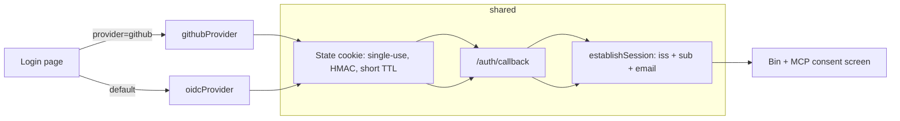

# Design: GitHub Login for the Web App Shell

## Context

Cairn authenticates humans against Pocket ID via a native OIDC relying-party
flow (ADR-0013, `internal/httpapi/oidc.go`): `GET /auth/login` stashes a state
cookie carrying state/nonce/PKCE verifier and redirects; `GET /auth/callback`
verifies the ID token and calls the shell's session-establishment path. The
web shell, the Bin, and the MCP consent screen (SPEC-0007) all read that
single ambient session. GitHub does not speak OIDC for user login — no ID
token, no discovery document — so a second provider cannot reuse the
verification step, only the surrounding machinery.

See SPEC-0013 (`spec.md`) for the normative requirements; this document covers
how and why.

## Goals / Non-Goals

### Goals

- GitHub login produces the same session object as Pocket ID login.
- Third providers are config + one file.
- The Pocket ID flow's behavior and its test suite are untouched.
- GitHub tokens never leave the callback.
- Only people the operator intends can sign in with GitHub, and enabling the
  provider without saying who fails closed (ADR-0024).

### Non-Goals

- Replacing Pocket ID or `dev_login_password` policy (ADR-0013 stands).
- Changes to the MCP OAuth 2.1 authorization server (ADR-0004) — agents still
  authenticate via client credentials / the consent screen, not GitHub.
- GitHub identity for the CLI or MCP surfaces; this is human web login only.
- Assurance-level plumbing (`amr`/`acr`): Cairn has no single-IdP
  issuer-trust assumption to unwind (unlike switchboard, see its ADR-0024);
  GitHub sessions are simply lower-assurance and that is recorded, not acted on.

## Decisions

### One provider interface, not two route trees

**Choice**: A minimal `AuthProvider` interface (start/finish a login, plus
provider id and display name) implemented by `oidcProvider` (wrapping today's
code) and `githubProvider`. Routes stay `/auth/login` and `/auth/callback`
with a `provider` query parameter.
**Rationale**: Option B (parallel `/auth/github/*` routes) duplicates state
handling and session establishment, and every future security fix lands twice.
With the interface, the handler branch is `switch provider` and everything
below it is shared.
**Alternatives considered**:
- Parallel GitHub-specific routes: rejected — code duplication, drift risk.
- OIDC-only, no GitHub: rejected — leaves the actual users (external
  collaborators, un-enrolled browsers) unserved.

### GitHub verification = code exchange + REST profile

**Choice**: Exchange the code for an access token, then `GET /user` and
`GET /user/emails`; identity = (login, primary verified email). Scope
`read:user user:email`. Reject login when no verified primary email exists.
**Rationale**: It is the only mechanism GitHub offers for user login. The
verified-email check is the anchor that makes the identity meaningful (any
GitHub user can set arbitrary emails; only verified ones prove control).
**Alternatives considered**:
- GitHub App instead of OAuth App: rejected for now — more setup, its extra
  permissions (repo access) are irrelevant to login; revisit if we ever want
  org-gated login.
- Accepting unverified emails: rejected — trivially spoofable identity.

### State cookie reuse, not a parallel mechanism

**Choice**: The GitHub flow reuses the OIDC state cookie (random value,
HMAC-bound, single-use, short TTL) for its `state` parameter, with
provider-specific fields opaque in the cookie payload.
**Rationale**: Login CSRF protection is identical for both flows and the
anti-replay machinery is already tested. A second state mechanism is a second
thing to get wrong.

### Session carries `iss`/`sub`; token is dropped

**Choice**: On success, the shared `establishSession` records the issuing
provider and subject alongside the existing fields; the access token is
dropped when the callback returns.
**Rationale**: Provenance stays auditable without changing what downstream
code sees; zero GitHub API traffic in steady state avoids rate limits.

### Allowlist by organisation and user, failing closed (ADR-0024)

**Choice**: Three operator settings, parsed in `internal/config`:

```go
GitHubAllowedOrgs  []string // CAIRN_GITHUB_ALLOWED_ORGS, lower-cased
GitHubAllowedUsers []string // CAIRN_GITHUB_ALLOWED_USERS: logins (lower-cased) or "id:<n>"
GitHubOpenSignup   bool     // CAIRN_GITHUB_OPEN_SIGNUP, default false
```

`Server.EnableGitHub` registers the provider only when credentials are set
**and** (an allowlist is non-empty **or** open signup is true). Otherwise it
logs:

```
WARN github login disabled: CAIRN_GITHUB_CLIENT_ID/SECRET are set but no
     CAIRN_GITHUB_ALLOWED_ORGS, CAIRN_GITHUB_ALLOWED_USERS or
     CAIRN_GITHUB_OPEN_SIGNUP=true — nobody could sign in
```

It leaves `s.gh` nil, so the existing 404 behaviour covers the route.
`config.Load` rejects open signup combined with an allowlist, and malformed `id:`
entries.

The provider gains an admission step after identity verification:

```go
type Admission struct {
	OpenSignup bool
	Users      map[string]bool  // lower-cased logins
	UserIDs    map[int64]bool
	Orgs       []string
}

// In FinishLogin, after the verified-email check and before returning:
//   GET /user now also decodes "id" (int64).
//   if !admit(ctx, client, user) -> return Identity{}, ErrNotAllowlisted{Reason}
func (g *GitHubProvider) admit(ctx context.Context, c *http.Client, u githubUser) (reason string, ok bool)
```

The membership call is `GET {APIBase}/user/memberships/orgs/{org}` with the
same `Accept: application/vnd.github+json` header `getJSON` already sets. The
response is decoded into `{state string}`, and mapped as follows:

| GitHub answer | Result |
|---|---|
| 200, `state: active` | admit |
| 200, `state: pending` | not admitted by this org; try the next |
| 404 | not admitted by this org; try the next |
| 403 | not admitted by this org (the org restricts the OAuth app); try the next, reason `org_restricted_oauth_app` |
| anything else, or a transport error | deny now, reason `membership_check_failed` |

`handleGitHubCallback` distinguishes `ErrNotAllowlisted` from other
`FinishLogin` errors: it renders a 403 "not permitted" page, where other errors
get today's 502 "github login failed". The state cookie is cleared first on both
paths, as today.

`NewGitHubProvider` appends `read:org` to `oauth2.Config.Scopes` only when `Orgs`
is non-empty (AL-4).

**Rationale**: Organisations are how GitHub users are already grouped, and
numeric ids are the only rename-proof user key. Treating an allowlist-less
provider as unconfigured reuses the existing, tested 404 path rather than adding
a new "configured but closed" state.

**Alternatives considered**:

- Email-domain allowlist: rejected, because a verified email proves control of an
  address, not membership.
- Invitations: rejected for now, because that is a new admin surface overlapping
  Teams (Cairn ADR-0029).
- `GET /user/orgs` listing: rejected, because it omits organisations that
  restrict OAuth apps without saying so. The per-organisation membership call
  returns a distinguishable 403.

## Architecture



Package layout: `internal/httpapi/authprovider/` (interface, registry,
githubProvider); `internal/httpapi/oidc.go` stays where it is and grows an
adapter implementing the interface. Login page template gains one
conditionally rendered button.

## Risks / Trade-offs

- **Organisation OAuth app restrictions (ADR-0024)** → an organisation that
  restricts third-party apps returns 403 on the membership check until an owner
  approves Cairn's OAuth app. It is logged as `org_restricted_oauth_app` and
  documented, and fails closed.
- **Membership changes lag sessions (ADR-0024)** → a removed member keeps their
  session until TTL or revocation. This is documented, and bounded by the
  session TTL.
- **Phishable login vs Pocket ID passkey** → accepted and recorded: the
  session stores provider provenance so a future assurance policy can
  distinguish them; no capability in Cairn currently requires step-up.
- **GitHub outage blocks logins** → acceptable: Pocket ID remains available
  and existing sessions survive; no failover needed for a household deployment.
- **Two client secrets to rotate** → stored like the OIDC secret today
  (config/env, never committed); rotation is an ops task, not code.
- **Shared interface temptation to lowest-common-denominator** → the OIDC
  state struct is kept intact; provider-specific state is opaque bytes to the
  handler.

## Migration Plan

1. Merge provider interface + GitHub provider + login-page button (feature
   flag: absent unless GitHub credentials configured).
2. Configure credentials on the deployed instance; verify a real login.
3. Rollback: clear the GitHub credentials — the button disappears and the
   route 404s; Pocket ID flow is unaffected at every step.
4. (ADR-0024) Ship the allowlist. An instance that set only the credentials
   stops offering GitHub login and logs why. The operator adds
   `CAIRN_GITHUB_ALLOWED_ORGS` / `CAIRN_GITHUB_ALLOWED_USERS`, or knowingly sets
   `CAIRN_GITHUB_OPEN_SIGNUP=true`.
5. (ADR-0024) Publish the operator docs, which were blocked until step 4:
   - add all five `CAIRN_GITHUB_*` variables to `.env.example` and to the
     environment passthrough in `docker-compose.yml` and
     `docker-compose.prod.yml`;
   - add a "GitHub login" section to the self-hosting guide: creating the GitHub
     OAuth app, the callback URL `CAIRN_BASE_URL + /auth/callback`, the
     allowlist variables, why `read:org` appears only with organisations, the
     organisation-approval step for organisations that restrict OAuth apps, and
     the login-time-only membership window;
   - add troubleshooting entries for the startup warning and each denial reason.
   Also correct the code comments that cite the wrong design IDs (`github.go`,
   `authprovider.go` and `config.go` name SPEC-0012 / ADR-0017; the records are
   SPEC-0013 / ADR-0019). Stop hard-coding "Pocket ID" in the login page's note,
   which is wrong when GitHub is also offered.

## Open Questions

- ~~Should GitHub logins be allow-listed rather than open to any GitHub
  account?~~ **Resolved by ADR-0024 (2026-09-22):** yes, by organisation and
  user, failing closed, with open signup only behind an explicit flag.
- Does the CLI (`cairn login`) ever want GitHub as a device-flow option?
  Deferred — out of scope for this spec.
