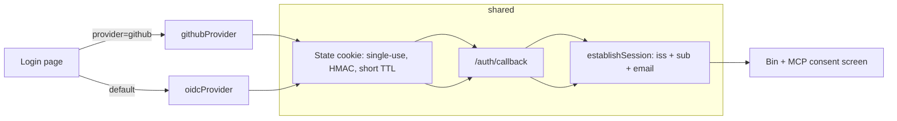

# Design: GitHub Login for the Web App Shell

## Context

Cairn authenticates humans against Pocket ID via a native OIDC relying-party
flow (ADR-0013, `internal/httpapi/oidc.go`): `GET /auth/login` stashes a state
cookie carrying state/nonce/PKCE verifier and redirects; `GET /auth/callback`
verifies the ID token and calls the shell's session-establishment path. The
web shell, the Bin, and the MCP consent screen (SPEC-0007) all read that
single ambient session. GitHub does not speak OIDC for user login — no ID
token, no discovery document — so a second provider cannot reuse the
verification step, only the surrounding machinery.

See SPEC-0013 (`spec.md`) for the normative requirements; this document covers
how and why.

## Goals / Non-Goals

### Goals

- GitHub login produces the same session object as Pocket ID login.
- Third providers are config + one file.
- The Pocket ID flow's behavior and its test suite are untouched.
- GitHub tokens never leave the callback.

### Non-Goals

- Replacing Pocket ID or `dev_login_password` policy (ADR-0013 stands).
- Changes to the MCP OAuth 2.1 authorization server (ADR-0004) — agents still
  authenticate via client credentials / the consent screen, not GitHub.
- GitHub identity for the CLI or MCP surfaces; this is human web login only.
- Assurance-level plumbing (`amr`/`acr`): Cairn has no single-IdP
  issuer-trust assumption to unwind (unlike switchboard, see its ADR-0024);
  GitHub sessions are simply lower-assurance and that is recorded, not acted on.

## Decisions

### One provider interface, not two route trees

**Choice**: A minimal `AuthProvider` interface (start/finish a login, plus
provider id and display name) implemented by `oidcProvider` (wrapping today's
code) and `githubProvider`. Routes stay `/auth/login` and `/auth/callback`
with a `provider` query parameter.
**Rationale**: Option B (parallel `/auth/github/*` routes) duplicates state
handling and session establishment, and every future security fix lands twice.
With the interface, the handler branch is `switch provider` and everything
below it is shared.
**Alternatives considered**:
- Parallel GitHub-specific routes: rejected — code duplication, drift risk.
- OIDC-only, no GitHub: rejected — leaves the actual users (external
  collaborators, un-enrolled browsers) unserved.

### GitHub verification = code exchange + REST profile

**Choice**: Exchange the code for an access token, then `GET /user` and
`GET /user/emails`; identity = (login, primary verified email). Scope
`read:user user:email`. Reject login when no verified primary email exists.
**Rationale**: It is the only mechanism GitHub offers for user login. The
verified-email check is the anchor that makes the identity meaningful (any
GitHub user can set arbitrary emails; only verified ones prove control).
**Alternatives considered**:
- GitHub App instead of OAuth App: rejected for now — more setup, its extra
  permissions (repo access) are irrelevant to login; revisit if we ever want
  org-gated login.
- Accepting unverified emails: rejected — trivially spoofable identity.

### State cookie reuse, not a parallel mechanism

**Choice**: The GitHub flow reuses the OIDC state cookie (random value,
HMAC-bound, single-use, short TTL) for its `state` parameter, with
provider-specific fields opaque in the cookie payload.
**Rationale**: Login CSRF protection is identical for both flows and the
anti-replay machinery is already tested. A second state mechanism is a second
thing to get wrong.

### Session carries `iss`/`sub`; token is dropped

**Choice**: On success, the shared `establishSession` records the issuing
provider and subject alongside the existing fields; the access token is
dropped when the callback returns.
**Rationale**: Provenance stays auditable without changing what downstream
code sees; zero GitHub API traffic in steady state avoids rate limits.

## Architecture

Package layout: `internal/httpapi/authprovider/` (interface, registry,
githubProvider); `internal/httpapi/oidc.go` stays where it is and grows an
adapter implementing the interface. Login page template gains one
conditionally rendered button.

## Risks / Trade-offs

- **Phishable login vs Pocket ID passkey** → accepted and recorded: the
  session stores provider provenance so a future assurance policy can
  distinguish them; no capability in Cairn currently requires step-up.
- **GitHub outage blocks logins** → acceptable: Pocket ID remains available
  and existing sessions survive; no failover needed for a household deployment.
- **Two client secrets to rotate** → stored like the OIDC secret today
  (config/env, never committed); rotation is an ops task, not code.
- **Shared interface temptation to lowest-common-denominator** → the OIDC
  state struct is kept intact; provider-specific state is opaque bytes to the
  handler.

## Migration Plan

1. Merge provider interface + GitHub provider + login-page button (feature
   flag: absent unless GitHub credentials configured).
2. Configure credentials on the deployed instance; verify a real login.
3. Rollback: clear the GitHub credentials — the button disappears and the
   route 404s; Pocket ID flow is unaffected at every step.

## Open Questions

- Should GitHub logins be allow-listed (e.g., org membership or an explicit
  email allow-list) rather than open to any GitHub account? Default plan:
  any verified-email GitHub account may log in, with the same
  actor-identity rules as today; revisit if the deployment becomes a
  spam target.
- Does the CLI (`cairn login`) ever want GitHub as a device-flow option?
  Deferred — out of scope for this spec.
