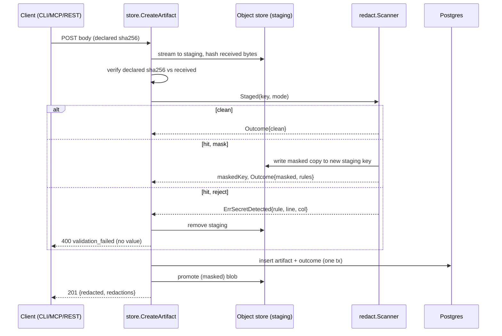

# Design: Secret Detection and Redaction at Ingest

## Context

Ingest today has four write paths, and none of them inspects content:

- `store.streamBlob` streams a body into a staging object while hashing it, and
  `CommitBlob` promotes it to its content-addressed key;
- `annotation.Service.AddComment` inserts a comment body;
- `trajectory.Service` persists span `Args` inline, and `Output` inline or spilled
  to object storage;
- `internal/webhook` captures inbound requests.

Harness masks credentials in its own output with `internal/redact`, a
conservative regex set whose mask is `[REDACTED]`. That masking is being extended
to durable logs (Harness PR #345) and to telemetry egress (Harness ADR-0022 /
SPEC-0015).

See SPEC-0017 (`spec.md`) for the normative requirements and ADR-0023 for the
decision.

## Goals / Non-Goals

### Goals

- No stored, served, emitted or indexed byte contains a detectable credential.
- Rejections are actionable, and masks are announced.
- One mask vocabulary and one set of contextual shapes across Harness and Cairn.
- Bounded, observable CPU cost.

### Non-Goals

- Scanning inside archives, images or other binary formats.
- Retroactively scanning artifacts stored before this capability. They expire
  under their TTL. A one-off backfill tool can reuse the scanner later if Joe
  wants one.
- Harness adopting gitleaks.
- Detecting secrets a human would recognise but no rule matches.

## Decisions

### A `redact` package owning the detector

**Choice**: A new `internal/redact` package wraps gitleaks behind a small API:

```go
package redact

type Mode string // "reject" | "mask"

type Finding struct {
	Rule   string // gitleaks rule ID
	Line   int
	Column int
	// No secret, match or fingerprint field, by construction.
}

type Outcome struct {
	Status   Status         // clean|masked|not_scanned_binary|not_scanned_oversize
	Count    int
	Rules    map[string]int // rule ID -> count
	Findings []Finding      // for rejection errors only; never persisted
}

type Scanner struct{ /* *detect.Detector, config */ }

func New(cfg Config) (*Scanner, error)

// Text scans s and, in mask mode, returns it with every secret replaced.
func (s *Scanner) Text(ctx context.Context, field string, in string, mode Mode) (string, Outcome, error)

// Staged scans a staged object in overlapping windows. In mask mode it writes
// a masked copy to a new staging key and returns that key.
func (s *Scanner) Staged(ctx context.Context, obj objectstore.ObjectStore, key string, size int64, mode Mode) (maskedKey string, o Outcome, err error)
```

In reject mode, `ErrSecretDetected` and `ErrTooLargeToScan` are returned wrapped
in the SPEC-0019 violation type, so the transport renders them without knowing
about gitleaks.

The name `internal/redact` matches Harness's package deliberately, so a reader
moving between the repositories finds the same concept in the same place.

**Rationale**: Every surface calls the same two functions, and gitleaks types
never leak past the package. The `Finding` struct has no field that could carry
a secret, which makes RD-9 a compile-time property rather than a code-review
hope.

### Detector construction

**Choice**:

```go
//go:embed cairn-gitleaks.toml   // [extend] useDefault=true + Harness-shape rules
var baseConfig []byte

func New(c Config) (*Scanner, error) {
	v := viper.New()
	v.SetConfigType("toml")
	_ = v.ReadConfig(bytes.NewReader(merge(baseConfig, c.OperatorAllowlist)))
	var vc config.ViperConfig
	if err := v.Unmarshal(&vc); err != nil { return nil, err }
	cfg, err := vc.Translate()
	if err != nil { return nil, err }
	d := detect.NewDetector(cfg)
	d.IgnoreGitleaksAllow = true // the uploader must not self-exempt
	d.MaxTargetMegaBytes = 0     // Cairn's cap applies; gitleaks never skips silently
	d.MaxArchiveDepth = 0
	d.MaxDecodeDepth = 2
	return &Scanner{det: d, ...}, nil
}
```

The zerolog logger gitleaks writes to is set to `Disabled` at startup, so
scanner debug lines, which can quote matched content, never reach Cairn's logs.

Operator allowlist entries are validated before the merge. `paths` and
`commits` keys are refused (RD-8).

The detector is shared across requests. `Detect` returns findings without
mutating the detector's findings slice, and the implementation story adds a
`-race` test of concurrent `DetectString` calls. If that test ever fails, a
`sync.Pool` of detectors replaces the shared one.

### Masking by secret substring, with a fail-closed fallback

**Choice**: For each finding, replace every occurrence of `Finding.Secret` in the
scanned text with `[REDACTED]`. Longest secrets are replaced first, so an
overlapping shorter one is not left half-masked. Replacing the secret, not the
match, keeps the label (`Authorization: Bearer [REDACTED]`), which is Harness's
behaviour.

A finding from a decoded segment (gitleaks tags these `decoded:*`) masks the
whole encoded segment that `Finding.Match` or the reported column range points
at. If a finding cannot be located in the original text at all, the field is
**rejected**, even in mask mode. An unlocatable secret must not be stored.

**Rationale**: Substring replacement is robust to gitleaks' line and column
conventions. The fallback keeps the invariant "a detected secret is never stored"
unconditional.

### Where each surface calls the scanner

| Surface | Call site | Mechanism |
|---|---|---|
| single-body create | `store.CreateArtifact`, after `streamBlob`, before `CommitBlob` | `Staged` (read-back windows); a masked copy replaces the staging key |
| bundle | `store.CreateBundle`, per member, before any member is promoted | `Staged`; any rejection aborts the whole bundle |
| title, prompt | the create paths' `validate()` | `Text` |
| comment | `annotation.AddComment` (and `EditComment` for #158) before the insert | `Text` |
| spans | `trajectory.CreateBatchRun` / `AppendSpans` before `persistSpans`; spilled outputs before promotion | `Text` for name and args; `Text` or `Staged` for output |
| webhook capture | `internal/webhook` capture before the ring-buffer insert | `Text` over serialized headers and body |

Small bodies (1 MiB or less) are scanned from memory before staging, which
avoids a read-back. Larger bodies use `Staged`.

### Mode resolution

```
mode(surface, shareType, req) =
    reject  if shareType ∈ CAIRN_REDACTION_REJECT_TYPES (default code,bundle)
            and req.redaction != "mask"
    mask    otherwise
```

`req.redaction` comes from `X-Cairn-Redaction`, from the MCP `redaction`
argument, or from the CLI's `--redact`. The only accepted value is `mask`.

### Configuration

| Variable | Default | Meaning |
|---|---|---|
| `CAIRN_REDACTION_MAX_SCAN_BYTES` | `16777216` | per-field scan cap (RD-7) |
| `CAIRN_REDACTION_OVERSIZE` | `reject` | `reject` or `store_unscanned` (WARN at startup and on each unscanned store) |
| `CAIRN_REDACTION_REJECT_TYPES` | `code,bundle` | share types that reject by default |
| `CAIRN_REDACTION_ALLOWLIST_FILE` | *(empty)* | operator allowlist TOML, by value only |

There is deliberately no `CAIRN_REDACTION=off`. An operator who wants no
scanning must patch the code, and that is intended.

### Schema

Migration `NNNN_redaction_outcome.sql` (the next free number at merge time):

```sql
-- Governing: ADR-0023, SPEC-0017 RD-9
ALTER TABLE artifacts ADD COLUMN redaction_status TEXT NOT NULL DEFAULT 'unscanned'
    CHECK (redaction_status IN ('unscanned','clean','masked','not_scanned_binary','not_scanned_oversize'));
ALTER TABLE artifacts ADD COLUMN redaction_count INT NOT NULL DEFAULT 0;
ALTER TABLE artifacts ADD COLUMN redaction_rules JSONB NOT NULL DEFAULT '{}'::jsonb; -- {"rule-id": n}

-- Bundle members, comments and runs get the same three columns.
-- Nothing here can hold a secret: statuses, counts and rule IDs only.
```

New rows are written as `clean` or better in the same transaction as the
content.

### Wire additions

Create responses (REST and MCP) gain:

```json
{ "redacted": true, "redactions": { "count": 2, "rules": { "github-pat": 2 } } }
```

A rejection (SPEC-0019 shape):

```json
{
  "error": {
    "code": "validation_failed",
    "message": "members[3].content: a credential was detected (rule github-pat, line 42); remove it or resend with --redact=mask",
    "details": { "field": "members[3].content" },
    "violations": [
      { "field": "members[3].content", "location": "body", "reason": "secret_detected",
        "rule": "github-pat", "line": 42, "column": 17,
        "message": "a credential was detected (rule github-pat, line 42); remove it or resend with --redact=mask" }
    ],
    "request_id": "…"
  }
}
```

## Architecture



## Risks / Trade-offs

- **Dependency weight and CVE surface.** Mitigation: import only `config` and
  `detect`, record `go mod why` output in the dependency PR, and let the image
  job's Trivy scan gate it like any other dependency.
- **False positives masking prose.** Mitigation: the owner-visible summary, the
  operator's value allowlist, and a `redacted: true` response the writer can act
  on.
- **Behaviour change for code and bundle writers.** Mitigation: an actionable
  error with a one-flag downgrade, and release notes plus the self-hosting guide
  section. The operator can widen or narrow `CAIRN_REDACTION_REJECT_TYPES`.
- **CPU on large logs.** Mitigation: a 16 MiB cap, windowed scanning, gitleaks'
  keyword prefilter, and a benchmark in the implementation story with the metric
  in production.
- **Raw bytes briefly in staging.** Mitigation: never promoted, removed on every
  path, and swept by the existing staging GC. Staging keys are random, and are
  never served.
- **gitleaks CLI-oriented defaults change upstream.** Mitigation: each setting is
  pinned explicitly, with a test (RD-2), so an upgrade that changes a default
  cannot silently reopen `gitleaks:allow` or the size skip.

## Migration Plan

1. Land the dependency and `internal/redact` with the corpus and settings tests
   (no call sites yet).
2. Wire comments and trace spans (mask-only surfaces, lowest behaviour risk).
3. Wire single-body and bundle creates (the reject surfaces), with the SPEC-0019
   violation rendering and the CLI message.
4. Wire webhook captures.
5. Rollback: revert the call-site wiring. The schema columns are additive and
   harmless.

## Open Questions

- Should `CAIRN_REDACTION_REJECT_TYPES` include `markdown` for handoff artifacts
  (tagged `handoff`), since a handoff is a work order an agent will act on? The
  default here says no, because masking is safe for prose. Joe may prefer strict.
  **Resolved (design review 2026-09-22):** no. Markdown masks, and only code
  and bundles reject. An operator who wants handoffs strict adds `markdown` to
  `CAIRN_REDACTION_REJECT_TYPES`.
- Should a one-off backfill scan run over artifacts that are still live when
  this ships? Their TTLs (at most 30 days today, before opt-in permanent
  retention) bound the exposure. Deferred. **Resolved (design review 2026-09-22):** deferred, as
  proposed. The TTL cap bounds the exposure, and ADR-0026 re-scans on retain, so
  an old artifact cannot become permanent with a secret inside it.
