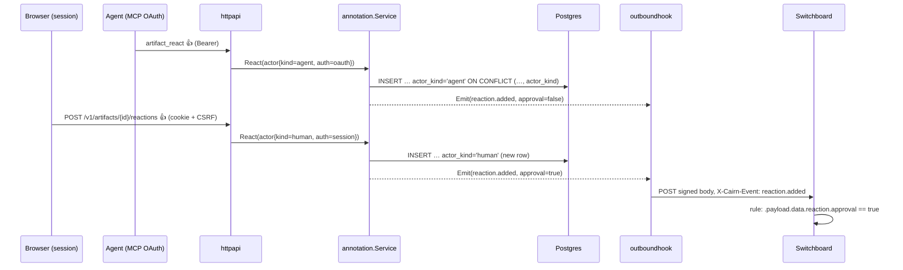

# Design: Annotation and Trace Lifecycle Events

## Context

SPEC-0012's emitter (`internal/outboundhook`) knows one kind, and its only
producer is `store.emitCreated`. Annotations (`internal/annotation.Service`) and
traces (`internal/trajectory.Service`) are peer services constructed in
`httpapi.New` (`api.go`). They see only an `actorID` string. The facts that
distinguish a human from an agent live on `httpapi.Principal`:

- `Ambient` is true only for the cookie session;
- `IsAgent` is true for MCP OAuth tokens and for agent-flagged personal access
  tokens and `CAIRN_API_TOKENS` entries.

That information never reaches the services, so today no event could carry it.

See SPEC-0016 (`spec.md`) for the normative requirements and ADR-0022 for the
decision.

## Goals / Non-Goals

### Goals

- Announce comments, reactions and run closure on the existing envelope, signer
  and queue.
- Make `approval` a server-computed bit that the human's own agents cannot mint,
  occupy or withdraw.
- Keep every existing consumer byte-compatible unless its operator opts in.
- Carry the artifact owner internally, so Teams (Cairn ADR-0029) can route per
  owner or team without another emitter change.

### Non-Goals

- Per-owner or per-team subscriptions themselves (ADR-0029, which folds in #185).
- Durable delivery or redelivery. ADR-0017's best-effort stance stands.
- Comment edit and delete routes (#158). This spec only reserves their kinds and
  constrains their authorization.
- Detecting an agent that drives the human's own logged-in browser.

## Decisions

### A transport-agnostic event type replaces `store.CreationEvent`

**Choice**: A new leaf package `internal/event` defines the fact every producer
hands over:

```go
package event

type Kind string

const (
	ArtifactCreated  Kind = "artifact.created"
	CommentCreated   Kind = "comment.created"
	ReactionAdded    Kind = "reaction.added"
	ReactionRemoved  Kind = "reaction.removed"
	RunClosed        Kind = "run.closed"
	// Registered by SPEC-0020 REQ-14 (permanent retention).
	ArtifactRetained Kind = "artifact.retained"
	ArtifactReleased Kind = "artifact.released"
	ArtifactDeleted  Kind = "artifact.deleted"
	// Reserved for #158; the emitter refuses to encode them until then.
	CommentEdited    Kind = "comment.edited"
	CommentDeleted   Kind = "comment.deleted"
)

// Actor is who caused the event, derived from the authenticated principal.
type Actor struct {
	ID         string
	Channel    artifact.Channel
	OnBehalfOf string
	Kind       ActorKind // "human" | "agent"
	Auth       AuthMethod // "session" | "oauth" | "pat" | "api_token"
}

// Subject is the artifact the event is about.
type Subject struct {
	PublicID  string
	ShareType artifact.ShareType
	Title     string
	WebPath   string
	Tags      []string
	ExpiresAt time.Time
	OwnerID   string // routing only (ADR-0029); never encoded on the wire
}

type Event struct {
	Kind     Kind
	Subject  Subject
	Actor    Actor
	Model    string    // artifact.created only
	Comment  *Comment  // comment.* only
	Reaction *Reaction // reaction.* only
	Run      *Run      // run.closed only
}

type Emitter interface{ Emit(Event) } // MUST NOT block or panic
```

`store.CreationEmitter` becomes a thin adapter over `event.Emitter`, so
`CreateArtifact` and `CreateBundle` are unchanged in shape.
`annotation.Service` and `trajectory.Service` gain an optional `Emitter` in
their options, installed by `httpapi.New`. They emit after `tx.Commit` returns,
mirroring `emitCreated`.

**Rationale**: One fact type and one interface keep the "single choke point per
owning service" property of ADR-0017. `OwnerID` travels with the fact, so
ADR-0029 can route without a lookup on the hot path.

**Alternatives considered**:

- One `Emit<Kind>` method per kind on the existing interface: rejected, because
  every new kind would change an interface three packages implement or mock.
- Emitting from `httpapi` handlers: rejected, because MCP and REST would each
  need their own call, which is exactly the drift ADR-0017 designed out.

### The principal's credential class reaches the services as `event.Actor`

**Choice**: `Principal` gains `Auth event.AuthMethod`, set by each authenticator:

| Authenticator | `Auth` | `Ambient` | `actor_kind` |
|---|---|---|---|
| session (`session.go`) | `session` | true | `human` |
| `OAuthAuthenticator` | `oauth` | false | `agent` |
| `PATAuthenticator` | `pat` | false | `agent` |
| `TokenAuthenticator` | `api_token` | false | `agent` |
| `DevActorAuthenticator` | `api_token` | false | `agent` |

A helper `principal.EventActor()` builds `event.Actor{Kind: human iff Ambient}`.
The service write methods (`React`, `Unreact`, `UnreactByID`, `AddComment`,
`CloseRun`) take an `event.Actor` in place of the bare `actorID`. The actor is
stored (EV-6) and put on the event.

**Rationale**: `Ambient` is the one property a cross-site request cannot forge
(CSRF guards it) and a token on disk cannot have. `IsAgent` alone would call a
human PAT "human", and a PAT is readable by any agent sharing the human's shell.

### Storage: `actor_kind` on annotations, per-kind reaction uniqueness

**Choice**: Migration `NNNN_annotation_actor_kind.sql`, using the next free
number at merge time:

```sql
-- Governing: ADR-0022, SPEC-0016 EV-6
ALTER TABLE reactions ADD COLUMN actor_kind   TEXT NOT NULL DEFAULT '';
ALTER TABLE reactions ADD COLUMN on_behalf_of TEXT NOT NULL DEFAULT '';  -- #159
ALTER TABLE comments  ADD COLUMN actor_kind   TEXT NOT NULL DEFAULT '';

ALTER TABLE reactions ADD CONSTRAINT reactions_actor_kind_chk
    CHECK (actor_kind IN ('', 'human', 'agent'));
ALTER TABLE comments ADD CONSTRAINT comments_actor_kind_chk
    CHECK (actor_kind IN ('', 'human', 'agent'));

-- Swap the idempotency key to include actor_kind.
CREATE UNIQUE INDEX CONCURRENTLY reactions_idem_kind_uidx
    ON reactions (artifact_id, anchor_type, anchor_key, emoji, actor_id, actor_kind);
ALTER TABLE reactions DROP CONSTRAINT reactions_artifact_id_anchor_type_anchor_key_emoji_actor_id_key;
```

If the migration runner wraps files in a transaction, the concurrent index build
goes in its own non-transactional file. The existing constraint name MUST be
read from the catalog in the migration test, not assumed.
`React` changes its `ON CONFLICT` target to the new column list. `Unreact` and
`UnreactByID` add `AND actor_kind = $n` to their `DELETE` statements. The
"belongs to another actor" branch in `UnreactByID` answers 403 for a
kind mismatch too, preserving the no-leak scoping to the one artifact.

Legacy rows (`actor_kind = ''`) keep the old key, because no second `''` row can
exist for the same tuple. They never yield `approval: true`, and only a caller
with the same `actor_id` removes them: an empty kind matches either caller kind
on removal. This is a one-time grace for rows whose kind was never recorded.

**Rationale**: Without the column in the key, the agent's row *is* the human's
row. Flagging events alone would leave the occupy and withdraw hijacks open.

**Alternatives considered**:

- Put `on_behalf_of` in the key instead: rejected, because it is self-reported
  and empty for PAT callers, so it cannot separate a human from their PAT-driven
  agent.
- A separate `approvals` table: rejected, because it would be a second source of
  truth for one click.

### Wire encoding

**Choice**: `outboundhook.encode` becomes a switch over `event.Kind` that renders
the SPEC-0012 envelope. The `data` struct appends new fields after the existing
ones:

```go
type eventData struct {
	ID         string     `json:"id"`
	ShareType  string     `json:"share_type"`
	Title      string     `json:"title,omitempty"`
	URL        string     `json:"url"`
	Channel    string     `json:"channel,omitempty"`
	Model      string     `json:"model,omitempty"`
	ActorID    string     `json:"actor_id,omitempty"`
	ExpiresAt  *time.Time `json:"expires_at,omitempty"`
	OnBehalfOf string     `json:"on_behalf_of,omitempty"`
	Tags       []string   `json:"tags,omitempty"`
	// ADR-0022 additions, appended.
	ActorKind string        `json:"actor_kind,omitempty"`
	Auth      string        `json:"auth,omitempty"`
	Comment   *commentData  `json:"comment,omitempty"`
	Reaction  *reactionData `json:"reaction,omitempty"`
	Run       *runData      `json:"run,omitempty"`
}

type reactionData struct {
	ID            int64  `json:"id"`
	AnchorType    string `json:"anchor_type"`
	AnchorKey     string `json:"anchor_key"`
	Emoji         string `json:"emoji"`
	ApprovalClass bool   `json:"approval_class"` // always present
	Approval      bool   `json:"approval"`       // always present
}
```

Example `reaction.added`:

```json
{
  "source": "cairn",
  "kind": "reaction.added",
  "event_id": "5f0c2e1a-…",
  "created_at": "2026-09-22T14:03:11Z",
  "data": {
    "id": "k3v9qz",
    "share_type": "markdown",
    "title": "Work order: rotate the runner image",
    "url": "https://cairn.example/k3v9qz",
    "channel": "via web",
    "actor_id": "alice@example.com",
    "tags": ["handoff", "lane:m"],
    "actor_kind": "human",
    "auth": "session",
    "reaction": {
      "id": 812,
      "anchor_type": "artifact",
      "anchor_key": "{}",
      "emoji": "👍",
      "approval_class": true,
      "approval": true
    }
  }
}
```

Golden fixtures are added for each kind. `testdata/artifact_created_rest.golden.json`
is regenerated once, and the diff reviewed as two appended keys.

### Per-subscription kind filter and creation priority

**Choice**: There is no instance-level kind setting. ADR-0029's
`outbound_subscriptions.event_types` is the filter, validated against the
registry when a subscription is created or edited. `Emitter.Emit` resolves the
subject workspace's enabled subscriptions whose filter admits the kind before
enqueueing, so an event nobody asked for costs nothing. New kinds are never
enqueued for the instance env targets; ADR-0029 deletes those in the change that
ships subscriptions. Until then, a new-kind event with no subscriber is counted
in `cairn_outbound_events_dropped_total{kind}` and dropped.

The queue keeps its single channel, cap 256. A non-creation event is enqueued
only while `len(ch) < cap/2`. Otherwise it is dropped with
`outboundhook: queue above half, dropping non-creation event` and counted in
`cairn_outbound_events_dropped_total{kind}`. That series joins ADR-0021's
metrics; `kind` is a closed set.

**Rationale**: One channel preserves ADR-0017's single-worker ordering. The
half-full rule is a one-line check that guarantees creation headroom, with no
second queue.

### Approval class

**Choice**: `CAIRN_APPROVAL_REACTIONS` is parsed at startup into a set of
normalized base emoji. Normalization strips U+FE0F and U+1F3FB..U+1F3FF. The
annotation service computes `approval_class` and `approval` at write time and
puts them on the event. Nothing about approval is stored beyond `actor_kind` and
the emoji, so an operator changing the class changes future events, not history.

### `run.closed` payload

**Choice**: `data.run` carries `status` (`closed`), `span_count`, `started_at`,
`ended_at` and `duration_ms`, computed inside `CloseRun`'s transaction. For a
batch run they are computed inside `CreateBatchRun`'s. The actor is the closer:
the run owner, since only the owner may close (SPEC-0004).

## Architecture



## Risks / Trade-offs

- **CLI approvals don't count.** A human reacting with their own PAT is `agent`.
  Mitigation: the viewer's approval control is the documented path, and the CLI
  prints a one-line note when it posts an approval-class reaction.
- **Browser automation over the human's profile looks human.** Server-side typing
  can't see it. Recorded as a residual risk in ADR-0022. A future step-up (a
  passkey assertion on approval) would close it.
- **Annotation events wait for subscriptions.** With no env-target path, the new
  kinds are undelivered until ADR-0029's owned subscriptions ship (#185, P0 since
  the 2026-09-22 design review). Accepted: the alternative was widening the operator firehose that ADR-0029
  removes, which the design review ruled out (2026-09-22).
- **Unique-index swap on a live table.** Mitigation: `CREATE UNIQUE INDEX
  CONCURRENTLY` before dropping the old constraint, and a migration test over
  pre-existing rows.
- **Golden change to `artifact.created`.** Mitigation: the diff is exactly two
  appended keys, and SPEC-0012's additive rule is satisfied. The Switchboard
  story adds fixtures for the new shape.

## Migration Plan

1. Ship the migration and the per-kind storage (EV-6). There are no new events
   yet, and behaviour only tightens.
2. Ship `internal/event`, the principal `Auth`, and emission (EV-1..EV-5, EV-7,
   EV-8). New kinds are counted and not delivered until subscriptions exist;
   creations gain two new keys.
3. With ADR-0029's owned subscriptions (#185), deliver the new kinds to the
   subject workspace's subscriptions whose filter admits them.
4. Switchboard accepts and projects the new kinds (cross-repo story). A user
   subscribes their own Switchboard webhook to `reaction.added` and `run.closed`.
5. Rollback: deploy the previous build. The storage change is forward-only but
   harmless to older code paths, which ignore the columns.

## Open Questions

- Should approval-class reactions from agents render with a distinct marker in
  tallies, or split into separate human and agent counts? The spec says SHOULD
  distinguish, and the viewer story decides the form. **Resolved (design review 2026-09-22):** an
  agent's reaction is recorded and marked `agent`, and approvals count only from
  browser sessions. The viewer story (#315) picks the visual form.
- Should `run.closed` fire for a run that expires while still open? No reaper
  closes abandoned runs today. If one is added, it should emit `run.closed` with
  `auth` of the system actor. Deferred until that reaper exists. **Resolved (design review 2026-09-22):**
  deferred, as proposed; the reaper's own change adds the emission.
