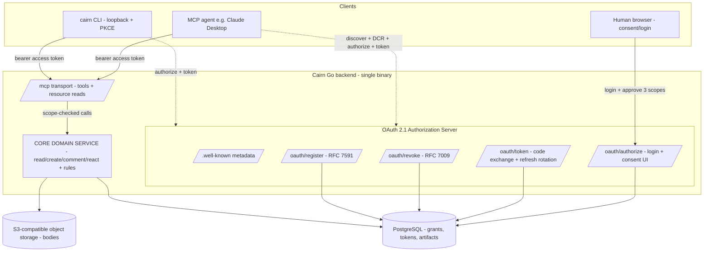

# Design: MCP Server and OAuth Authorization

## Context

Cairn's core promise is that agents read, create, comment, and react on the *same*
artifacts humans do — "same auth as your agent." This spec (SPEC-0007) realizes
**ADR-0004** (MCP as a first-class surface authorized by OAuth 2.1) and depends on
**ADR-0003** (triple-surface parity: web, CLI, and MCP are thin adapters over one
core domain service). It requires **SPEC-0002** for the artifact core and share
types, and hands provenance/access/expiry rules to **SPEC-0009** (ADR-0007).

The design constraints are fixed by the ADRs and the house stack:

- A **Go MCP server** exposes core operations as MCP tools/resources, in-process
  over the same core package the web handlers call (ADR-0003). No self-HTTP.
- Authorization is **MCP-native OAuth 2.1**: authorization-code + PKCE, RFC 8414
  metadata discovery, RFC 7591 Dynamic Client Registration, RFC 8707 audience
  binding, rotating refresh, and RFC 7009 revocation — all served by Cairn's own
  authorization server inside the Go backend.
- The consent screen is prescriptive: an exact three-line grant the design's canvas
  specifies, revocable from settings.
- The **CLI is just another OAuth client** on the identical flow (SPEC-0008 depends
  on this spec).

## Goals / Non-Goals

### Goals

- Expose read / create+push / comment+react as MCP tools, and webhook + trajectory
  streams as read-only MCP resources, at parity with the human surfaces.
- Implement the full MCP OAuth 2.1 authorization flow with exactly three scopes that
  map one-to-one to the consent screen.
- Bind every token's subject to the human and stamp every action's actor with the
  model + `via MCP` channel, so agents inherit — never exceed — the human's reach.
- Mint per-connection, independently revocable grants (short access + rotating
  refresh, audience-bound).
- Let the CLI reuse the identical `/oauth/authorize` + `/oauth/token` path.
- Render an accessible, safe consent/login UI.

### Non-Goals

- No `sharing:manage` or `artifacts:delete` scope for agents in v1 (ADR-0004,
  ADR-0007) — changing sharing/expiry and deletion stay explicit human actions.
- No agent **write** path into webhook/trajectory streams in v1 (read-only).
- No per-artifact delegation — the three-scope model is coarse by decision; the
  capability link (ADR-0005/0007) is the real per-artifact boundary.
- The identity provider for the human-login step is out of scope here (the AS may
  delegate upstream); this spec only issues Cairn-scoped tokens.
- Provenance/access/retention semantics themselves are specified in SPEC-0009; this
  spec consumes them.

## Decisions

### MCP OAuth 2.1 (authorization-code + PKCE), not API keys

**Choice**: Cairn hosts its own OAuth 2.1 authorization server; clients use the
authorization-code grant with mandatory PKCE, discover endpoints via RFC 8414
metadata, and self-register via RFC 7591 DCR.

**Rationale**: It is the flow MCP clients (Claude Desktop) already implement, it
renders the exact three-scope consent the design mandates, and it produces
per-connection revocable tokens bound to the human. The CLI collapses onto the same
flow (one code path for "same auth as your agent").

**Alternatives considered**:

- **Static API keys / PATs**: no interactive per-scope consent, copy-pasted secrets
  leak, coarse scopes, and not what MCP clients expect. Rejected (ADR-0004 Option B).
- **Reuse the web session/cookie**: MCP clients are not browsers; no delegation
  boundary between the human and the agent; not scopable or revocable per-agent.
  Rejected (ADR-0004 Option C).
- **mTLS client certs**: heavy issuance/rotation burden, no consent UX, poor fit for
  consumer clients. Rejected (ADR-0004 Option D).

### Exactly three scopes, stream reads folded under `artifacts:read`

**Choice**: `artifacts:read`, `artifacts:write`, `annotations:write` — nothing else.
A webhook/trajectory stream is an artifact-shaped resource, so reading it needs no
fourth scope; the consent screen stays at three checkboxes.

**Rationale**: One-to-one mapping to the consent lines keeps the grant legible and
matches the design canvas literally. Withholding delete/sharing scopes enforces
least privilege by construction.

**Alternatives considered**:

- **A dedicated `streams:read` scope**: would push the consent screen to four lines,
  contradicting the design. Rejected.
- **A `sharing:manage` scope for agents**: contradicts ADR-0007 (sharing is an
  explicit human action). Rejected.

### Subject = human, actor = model

**Choice**: The OAuth grant authenticates the human and binds tokens to that
workspace identity (the owner/principal); each action is additionally stamped with
the acting model actor and `via MCP`.

**Rationale**: Access control resolves to the human (agents inherit, never exceed);
provenance foregrounds the agent for auditability (ADR-0004 subject-vs-actor,
recorded per SPEC-0009).

### Per-connection grants: short access + rotating refresh, audience-bound

**Choice**: Each client connection is one grant issuing a ~1h access token
(audience-bound via RFC 8707) plus a rotating refresh token; reuse of a rotated-out
refresh token revokes the family; RFC 7009 revocation kills one grant without
touching siblings or the CLI.

**Rationale**: Delivers "revoke anytime in settings" literally, limits blast radius
of a leaked token, and prevents cross-service replay.

### In-process adapter over the core, not a separate service

**Choice**: The MCP server lives in the same Go binary as the web handlers and calls
the core domain package directly (ADR-0003 Option A).

**Rationale**: Parity becomes a matter of layering — the core owns create/read/
comment/react and all rules (expiry, access, provenance, anchor legality), so no
surface can fork them. Rules enforced only at the REST edge would be bypassed by the
in-process caller, so size limits/authz that must bind all callers live in/below the
core.

## Architecture

The MCP server and the OAuth authorization server are two concerns in the same Go
backend. The MCP transport authenticates each request with a bearer access token,
resolves the human principal + granted scopes, and dispatches to core operations
(shared with the web/CLI surfaces). The authorization server handles discovery, DCR,
the browser consent flow, and token issuance/rotation/revocation, persisting grants
and tokens in PostgreSQL.



The authorization-code + PKCE flow, with the consent screen and the subject/actor
mapping, runs as follows:

```mermaid
sequenceDiagram
  autonumber
  participant C as MCP client / CLI
  participant B as Human browser
  participant AS as Cairn Auth Server
  participant M as MCP transport
  participant Core as Core service

  C->>AS: GET /.well-known/oauth-authorization-server
  AS-->>C: endpoints + metadata
  C->>AS: POST /oauth/register (DCR, redirect URI)
  AS-->>C: client_id (+ credentials)
  C->>B: open /oauth/authorize?client_id&PKCE challenge&scope
  B->>AS: authenticate human (session)
  AS-->>B: consent screen (3 scope lines, revoke-in-settings)
  B->>AS: approve scopes (+ CSRF)
  AS-->>C: redirect with single-use authorization code
  C->>AS: POST /oauth/token (code + PKCE verifier)
  AS-->>C: audience-bound access (~1h) + rotating refresh
  C->>M: tool/resource call (Bearer access token)
  M->>M: verify audience + scope; resolve subject=human, actor=model
  M->>Core: read/create/comment/react (channel via MCP/CLI)
  Core-->>M: result (owned by human, provenance stamped)
  M-->>C: result
  Note over C,AS: later — refresh rotates; revoke kills one grant only
```

## Risks / Trade-offs

- **Operating an OAuth 2.1 AS is substantial** (DCR, rotation, audience binding,
  revocation, metadata) versus static keys → mitigate with well-tested libraries,
  the conformance test suite in ADR-0004, and keeping the surface minimal (three
  scopes, one grant type).
- **Coarse three-scope model can't express per-artifact delegation** — an agent with
  `artifacts:read` reads everything the human can → mitigated by the capability model
  (ADR-0007): the agent only inherits the human's reach and the link is the real
  boundary.
- **DCR accepts unregistered clients** (open registration) → rate-limit
  `/oauth/register`, validate redirect URIs by exact match, and escape client-supplied
  strings on the consent page so a hostile registration can't inject content.
- **Refresh-token theft** → rotation + reuse-detection revokes the family; short
  access-token lifetime limits the window; audience binding blocks cross-service
  replay.
- **In-process adapter could bypass an edge-only rule** → keep size limits/authz in or
  below the core so both the REST edge and the in-process MCP caller enforce them.
- **Tracking the evolving MCP authorization spec** → isolate protocol specifics behind
  the AS package and cover them with conformance tests.

## Open Questions

- Whether an annotator must belong to the artifact's workspace or may be any
  authenticated Cairn user is a policy knob deferred to SPEC-0009/ADR-0007; the MCP
  surface only requires that `annotations:write` is present.
- Exact access-token lifetime and refresh-token max age (starting point ~1h / multi-day)
  pending operational tuning.
- Whether to support token introspection (RFC 7662) for internal resource-server
  validation, or validate audience-bound JWTs locally without a round trip.
- Whether the human-login step delegates to a specific upstream IdP per workspace, and
  how that maps onto the Cairn workspace identity.
