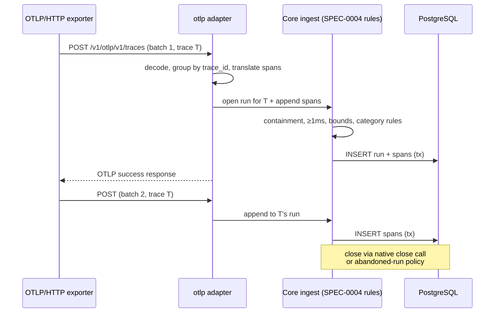

# Design: OTLP Trace Ingestion

## Context

**ADR-0015** decided that Cairn accepts OTLP/HTTP trace exports and translates them into
the native SPEC-0004 run/span tree at ingest. The forcing evidence was the July 2026
stress test: a harness sharing its run reached for OpenTelemetry unprompted, then
garbled the hand-translation into Cairn's shape (placeholder durations, children hours
outside their parents). The ecosystem's instrumentation — agent frameworks, `gen_ai.*`
semantic conventions — already speaks OTel; ADR-0015 moves the risky translation step
from every agent into one tested adapter. ADR-0009's refusal to *store* OTLP verbatim
stands; this spec is the border crossing, not a second model.

Constraints inherited:

- **ADR-0012 / ADR-0003** — one core service; the adapter is a thin translation layer
  over the same ingest methods REST uses, which is what guarantees validation parity.
- **SPEC-0004** — containment, timing validity, bounds, output spill, and the
  incremental open→append→close lifecycle the trace_id mapping rides on.
- **ADR-0004** — bearer auth, which stock OTLP exporters can supply via headers.
- **ADR-0007** — provenance; an OTLP-ingested run records how it arrived and the
  `service.name` that sent it.

## Goals / Non-Goals

### Goals

- A stock OTLP/HTTP exporter with an endpoint URL and bearer header produces a
  shareable, valid Cairn run — live (batched appends) or after the fact.
- One category-mapping table, server-side, deterministic, never vocabulary-rejecting.
- Absolute validation parity with native ingest — no laxer side door.

### Non-Goals

- OTLP/gRPC (HTTP's two encodings cover the exporters that matter; gRPC is additive
  later if demanded).
- Metrics and logs signals; span events/links; span status (joins ADR-0009's
  errored-run "try next").
- Round-tripping a run back out as OTLP; the translation is lossy by design.
- Trace-context propagation, sampling, or any APM/query ambition — unchanged from
  ADR-0009.

## Decisions

### SpanKind-lowercased fallback category

**Choice**: When no explicit `cairn.category`, no `gen_ai.*` mapping, and no
protocol-attribute rule matches, the category is the span's `SpanKind` lowercased
(`internal`, `client`, …), landing in SPEC-0004's open set and its hashed-color path.

**Rationale**: Deterministic, honest (it encodes "OTel span with no richer signal"),
and visually coherent — the five kinds get five stable colors instead of one grey
lump, and a reader learns them once.

**Alternatives considered**:
- Fallback to `tool`: lies about non-tool spans and pollutes the tool-call count's
  natural companion category.
- Fallback to `meta`: buries real work in the overhead color.
- Reject unmapped spans: violates ADR-0009's open-set principle and would make the
  adapter stricter about vocabulary than native ingest, inverting the actual risk.

### trace_id keys the incremental lifecycle

**Choice**: First sight of a `trace_id` opens a run; later exports append; close is the
native close or the abandoned-run policy. Multi-trace batches fan out to one run per
trace.

**Rationale**: OTLP exporters batch and stream; the native incremental path already has
exactly those semantics, so the mapping buys live OTLP capture without new lifecycle
machinery. Fan-out (rather than rejecting multi-trace batches) matches what stock
batch processors actually emit.

**Alternatives considered**:
- One run per export request: shatters a streamed trace into fragments.
- Rejecting multi-trace requests: fights the OTLP batch processor's default behavior.

### Started-at is first-seen-earliest; earlier arrivals reject

**Choice**: `started_at` = earliest span start in the first batch; a later append
carrying an earlier span rejects.

**Rationale**: Offsets are persisted run-relative (SPEC-0004); rebasing them on a late
root span would rewrite history under annotations. Exporters emit roots late (a root
closes last) — but its *start* is carried in the first batch's child spans in practice;
where it is not, the rejection message tells the exporter to send the root first (the
CLI import path sorts, so this bites only exotic live streams).

### Both OTLP/HTTP encodings, no gRPC

**Choice**: `application/x-protobuf` and `application/json` on one endpoint.

**Rationale**: Protobuf is what SDK exporters default to; JSON is what agents and
scripts hand-produce. gRPC adds a server dependency for no observed client.

## Architecture

## Risks / Trade-offs

- **Semantic-convention drift** → the `gen_ai.*` conventions are young and moving; the
  mapping table will need curation. Mitigated by rule 1 (`cairn.category` wins, a
  stable escape hatch) and rule 4 (a deterministic fallback that never rejects).
- **Abandoned-run dependency** → live OTLP export has no close call, so OTLP runs
  lean on the abandoned-run auto-close policy that SPEC-0004's design already lists as
  open. This spec makes answering it urgent rather than optional.
- **Protobuf decode surface** → a new parser on an authenticated but hostile-input
  boundary. Mitigated by body-size limits before buffering, decode-error sentinels,
  and fuzzing the decode path in CI.
- **Lossy translation disappoints OTel purists** → events, links, status, resource
  topology dropped. Deliberate: documented in the ADR, and the alternative (verbatim
  storage) was re-rejected there.
- **trace_id collision across principals** → trace_ids are client-chosen; the mapping
  is scoped per owning principal so one tenant's trace_id can never append into
  another's run.

## Migration Plan

Additive: a new endpoint and adapter package; no schema change (translated spans are
ordinary spans). Ship behind the same feature review as any new surface; no rollback
concern beyond removing the route.

## Open Questions

- What is the abandoned-run auto-close timeout, and is it OTLP-specific or global
  (inherited SPEC-0004 open question, now load-bearing)?
- Should `gen_ai` token-usage attributes populate the run's token count when present?
- Is a `partial_success` OTLP response ever appropriate (e.g. multi-trace fan-out where
  one trace validates and another does not), or does Cairn's atomicity always reject
  the whole request?
