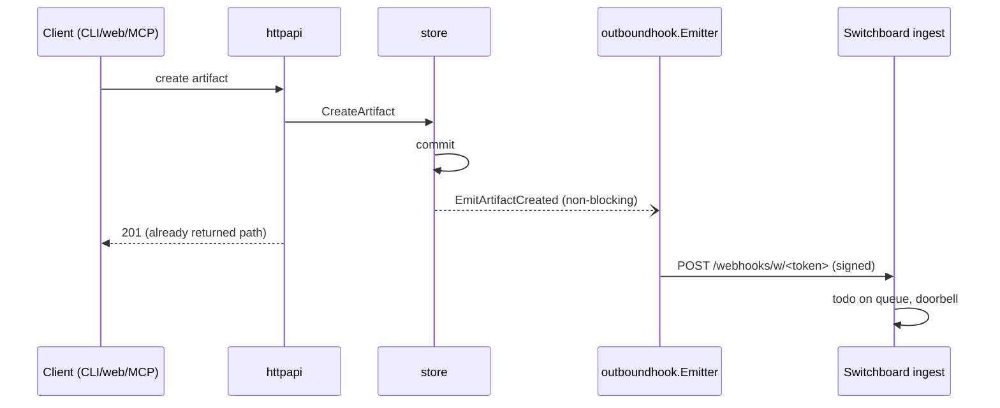

# Design: Outbound Webhooks

## Context

Cairn artifacts are created via REST, web, CLI, and MCP, all funneling through
`store.CreateArtifact` / `store.CreateBundle` (`internal/store/create.go:69`,
`bundle.go`). Nothing downstream is notified today. The goal: posting a Cairn rings
a doorbell in Switchboard so humans/agents pick it up as a review todo. ADR-0017
chose in-process async fan-out from the store choke point; this spec's design
realizes it. The inbound Webhook Inspector (`internal/webhook`, SPEC-0005) is a
different feature; the new package is `internal/outboundhook` to avoid the collision.

## Goals / Non-Goals

### Goals
- One emission point covering every creation surface
- Signed, self-describing JSON events consumable by Switchboard generic ingest
- Bounded async delivery with short retry; inert when unconfigured
- Testable with httptest receivers at unit and integration level

### Non-Goals
- Durable/at-least-once-across-restart delivery (outbox table — future if needed)
- Consumer-side verification in Switchboard (generic token trust is sufficient)
- A webhook management UI or per-artifact target selection
- Emitting events for annotations, comments, or runs (extension point only)

## Decisions

### Emit from the store via an optional emitter

**Choice**: `Store` gains an optional `Emitter` (small interface:
`EmitArtifactCreated(ctx, event)`) set through a `store` option, called post-commit
in `CreateArtifact` and `CreateBundle`.
**Rationale**: the store is the single choke point behind all adapters (ADR-0012's
thin-adapter stance), so REST/MCP/CLI/web and future surfaces are covered once; the
peer-service pattern (annotation, trajectory) already passes collaborators into
store construction.
**Alternatives considered**:
- Emitting in each httpapi handler: three call sites today, more later; drifts.
- A Postgres LISTEN/NOTIFY trigger: adds DB coupling for an in-process need.

### Bounded queue + single worker, reaper-style lifecycle

**Choice**: `outboundhook.New(urls, secret, logger)` returns an emitter with a
buffered channel (cap ~256) and `Run(ctx)` started as a goroutine by cairnd, mirroring
the retention reaper (`cmd/cairnd/main.go:89-96`): done channel, graceful shutdown.
Non-blocking enqueue (select/default) drops on overflow with a warning log.
**Rationale**: matches existing operational patterns; drops instead of blocking
aligns with "doorbell is a hint" semantics.
**Alternatives considered**:
- Goroutine-per-event with no queue: unbounded concurrency, no backpressure.
- Outbox table: rejected at MVP per ADR-0017.

### Event envelope and headers

**Choice**: JSON envelope `{source, kind, event_id, created_at, data{...}}`; headers
`X-Cairn-Event`, `X-Cairn-Event-Id`, `X-Cairn-Signature: sha256=<hex>`
(HMAC-SHA256 over raw body) when a secret is configured. `event_id` is a UUID so
consumers can dedupe.
**Rationale**: self-describing for any consumer; signature header future-proofs
verified trust (a "cairn" signed source type in Switchboard can be added later with
no producer change).
**Alternatives considered**:
- Reusing GitHub's `X-Hub-Signature-256` scheme verbatim: rejected — impersonating
  a forge event invites consumers to mis-route; our own header is unambiguous.

### HTTP client hygiene

**Choice**: shared `http.Client` with a total timeout (5s per attempt),
`CheckRedirect: ErrUseLastResponse` (never follow redirects), retry backoff
1s/4s. Secrets and URLs never logged; failures log target index and error only.
**Rationale**: capability-URL secrecy and signed-body non-leakage per the spec's
security requirements.

## Architecture

## Risks / Trade-offs

- **Event loss on crash** → accepted per ADR-0017; artifact URL remains the record.
- **Queue overflow under burst** → drop with warning; cap sized far above expected
  creation rates.
- **Secret leakage via logs** → no URL/secret logging; redact by construction.
- **Switchboard generic trust is unverified** → URL is unguessable and
  endpoint-scoped; signature header allows later upgrade.

## Migration Plan

Additive only: new env vars (`CAIRN_OUTBOUND_WEBHOOK_URLS`,
`CAIRN_OUTBOUND_WEBHOOK_SECRET`), new goroutine, no schema change. Rollback = unset
the env vars. Deploy: merge to main (CI builds and pushes image; ansible converges
cloud01), then add the two Switchboard ingest URLs to the cairn env file and reconverge.

## Open Questions

- Should `run`/trajectory creation emit its own event kind later? (Extension point;
  not in MVP.)
- Should Switchboard grow a verified `cairn` source type? (Deferred; header scheme
  already compatible.)
