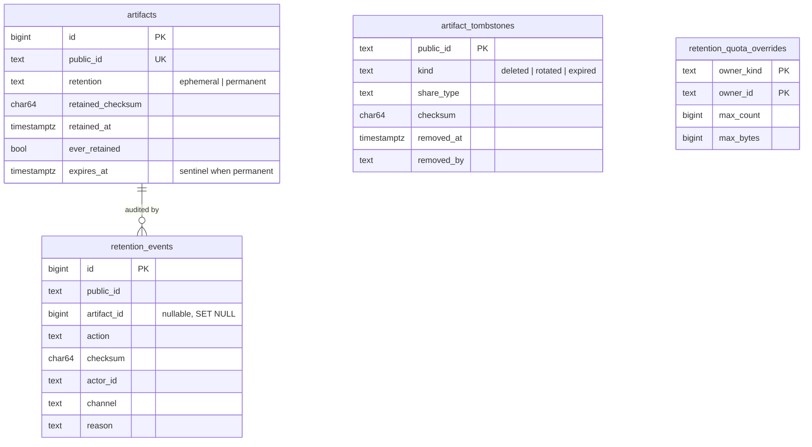

# Design: Opt-In Permanent Retention

## Context

ADR-0026 amends ADR-0007 so that an owner can mark an artifact permanent. SPEC-0020 holds
the requirements. This document gives the concrete shapes: schema, configuration, API,
MCP, CLI, operator commands and events. It also explains the few choices that are not
obvious from the requirements.

The existing machinery constrains the design:

* `artifacts.expires_at` is `TIMESTAMPTZ NOT NULL`. About fifteen read paths filter on
  `expires_at > now()`: `store/read.go`, `store/list.go`, `store/policy.go`,
  `annotation/service.go`, `trajectory/*`, `webhook/*`. The reaper selects
  `expires_at <= now()` (`store/reap.go`).
* `MaxRequestedTTL` is 30 days, hardcoded in `httpapi.New` (`api.go`). Both TTL surfaces
  reject values above it.
* Rotation is `store.RotateID`, which records the old id in `retired_ids` for a grace
  window. `freshPublicID` (`store/create.go`) excludes those ids.
* Scopes: `agentScopes()` grants `artifacts:read`, `artifacts:write` and
  `annotations:write`. `sharing:manage` is human-only (`httpapi/auth.go`).
* Events: `internal/outboundhook` builds the ADR-0017 envelope. ADR-0022 (in parallel)
  adds kinds, the `CAIRN_OUTBOUND_WEBHOOK_EVENTS` allowlist, and the common `actor_kind` /
  `auth` fields.

## Goals / Non-Goals

### Goals

- Mark an artifact permanent without touching any existing liveness predicate.
- Publish a checksum that anyone can reproduce, for single bodies and for bundles.
- Keep quota enforcement race-free per owner, whether the owner is a user or a team.
- Make removal of a retained record accountable: every removal writes a tombstone and an
  audit row.
- Keep `artifact.created` byte-identical.

### Non-Goals

- Retaining traces or webhook endpoints. Deferred until trace export needs it.
- Legal hold, WORM storage, or object-lock integration. A permanent artifact is still
  deletable by its owner, and that is deliberate.
- An operator HTTP admin API. The host-side `cairnd` subcommands are the operator surface.
  ADR-0029 makes the operator an instance role (`CAIRN_OPERATORS`) that may bound tenant
  data but never read, route or copy it. Every command here only bounds data.
- Dedup-aware quota accounting. Quotas count logical bytes, so that users can predict them.
- Changing the ephemeral TTL maximum. Permanent is not a TTL.

## Decisions

### Permanence is a column; the expiry sentinel keeps every predicate working

**Choice.** Add `retention TEXT NOT NULL DEFAULT 'ephemeral'`. A permanent row stores
`expires_at = '9999-12-31 23:59:59+00'`, the constant `store.PermanentExpiry`. A CHECK
constraint ties the two together. The API renders a permanent artifact's expiry as `null`
and `never`, and the sentinel never leaves the store.

**Rationale.** With the sentinel, every existing `expires_at > now()` stays true for a
permanent row, and the reaper's `expires_at <= now()` never selects it, so no read query or
reaper change is needed for correctness. If an implementer misses a read path, nothing
breaks.

**Alternatives considered.**
- *Nullable `expires_at`, with NULL meaning never.* Every predicate becomes
  `expires_at IS NULL OR expires_at > now()`. Missing one site makes a permanent artifact
  silently unreadable on that surface: fail-closed, but a real bug with a large blast
  radius.
- *`'infinity'::timestamptz`.* Semantically the cleanest. But pgx v5 refuses to scan an
  infinite timestamp into `time.Time`, so every scan site would need a `pgtype.Timestamptz`
  conversion, which is the same missed-site risk.

### The bundle checksum is `sha256sum` of the manifest

**Choice.** `sha256(concat(member.sha256 + "  " + member.name + "\n" for each member in ordinal order))`.

**Rationale.** A reader can verify it with nothing but `sha256sum`. Download the members,
print `<hash>  <name>` lines in ordinal order, and hash that text. Member order is the
bundle's ordinal order, which the API already exposes. A JSON canonicalisation would need
a specified serializer, and "canonical JSON" is where cross-language verification goes to
die.

### Quotas: env defaults, per-owner overrides, advisory lock

**Choice.** Defaults come from the environment. Overrides live in
`retention_quota_overrides`, keyed by (owner_kind, owner_id). The retain transaction takes
`pg_advisory_xact_lock(hashtextextended('cairn:retention:' || owner_key, 0))`, sums usage
from `artifacts WHERE owner = $1 AND retention = 'permanent'`, compares, and updates.

**Rationale.** Usage is derived, not stored, so there is no counter that can drift. The
partial index `WHERE retention = 'permanent'` keeps the sum to a single owner's permanent
rows. The advisory lock serializes only one owner's retains.

**Alternative considered.** A `retention_usage` counter row. It is faster, but it is a
second source of truth that has to agree with the rows, and every delete, release and
reaper path would have to maintain it.

### Tombstones are a table, not a soft-deleted artifact row

**Choice.** A separate `artifact_tombstones` table keyed by `public_id`.

**Rationale.** The artifact row's cascade is what reclaims annotations, bundle members and
blob references, and a soft-deleted row would keep all of those alive. A tombstone holds
only the fields SPEC-0020 REQ-9 names. `freshPublicID` checks it forever, which is cheap
because it is a primary-key probe.

### The fourth scope is opt-in and additive only

**Choice.** `retention:write` is a scope the OAuth consent screen offers unchecked, as a
separate line: "Make artifacts permanent (uses your quota)". A PAT mint form offers the
same checkbox. The scope is never added to `agentScopes()`. The server enforces it only on
`artifact_retain` and `POST .../retain`.

**Rationale.** Agents inherit and never exceed a human's reach (ADR-0004). Retaining
widens no access and is bounded by quota, while release and delete destroy evidence. The
asymmetry lets an agent that runs the approval bookkeeping lock a record the human
approved, and it still can never unlock one.

**Alternative considered.** A retention request that the owner confirms in the web UI.
That adds a pending state and a notification path Cairn does not have. Approval semantics
belong to ADR-0022's human-only reactions, not to a second approval mechanism.

### Operator commands on `cairnd`

**Choice.** `cairnd` gains subcommand dispatch. With no arguments it serves, exactly as
today. `cairnd retention …` connects with the same `CAIRN_DATABASE_URL` and runs one
operation.

**Rationale.** The operator is whoever holds the host and the database. There is no
operator credential yet. ADR-0029 defines the operator as an instance role, and a
host-side command needs no new network surface. Quota changes are audited in
`retention_quota_audit`.

## Architecture

```mermaid
sequenceDiagram
    autonumber
    participant C as Client (web / CLI / MCP)
    participant A as httpapi
    participant S as store
    participant R as redaction scanner (ADR-0023)
    participant DB as Postgres
    participant E as outboundhook
    C->>A: POST /v1/artifacts/{id}/retain
    A->>A: auth, CSRF, scope (sharing:manage or retention:write + agent gate)
    A->>S: Retain(ctx, id, principal)
    S->>DB: BEGIN; SELECT ... FOR UPDATE (owner check, mode, share_type, size)
    S->>R: rescan stored bodies
    R-->>S: clean / finding
    S->>DB: pg_advisory_xact_lock(owner); SUM permanent usage
    S->>DB: UPDATE artifacts SET retention='permanent', expires_at=sentinel, retained_checksum, retained_at
    S->>DB: INSERT retention_events (retain)
    S->>DB: COMMIT
    S-->>A: artifact (retention.mode=permanent)
    S->>E: emit artifact.retained (routed by owning workspace, ADR-0022/0029)
    A-->>C: 200 artifact
```



### Schema (next free migration number at implementation time)

```sql
-- Permanent retention (ADR-0026, SPEC-0020).
ALTER TABLE artifacts
    ADD COLUMN IF NOT EXISTS retention TEXT NOT NULL DEFAULT 'ephemeral',
    ADD COLUMN IF NOT EXISTS retained_checksum CHAR(64),
    ADD COLUMN IF NOT EXISTS retained_at TIMESTAMPTZ,
    ADD COLUMN IF NOT EXISTS ever_retained BOOLEAN NOT NULL DEFAULT false;

ALTER TABLE artifacts ADD CONSTRAINT artifacts_retention_chk
    CHECK (retention IN ('ephemeral', 'permanent'));

-- The sentinel is exactly store.PermanentExpiry; a test asserts they agree.
ALTER TABLE artifacts ADD CONSTRAINT artifacts_retention_expiry_chk
    CHECK ((retention = 'permanent') = (expires_at = TIMESTAMPTZ '9999-12-31 23:59:59+00'));

ALTER TABLE artifacts ADD CONSTRAINT artifacts_retained_checksum_chk
    CHECK (retention = 'ephemeral' OR retained_checksum IS NOT NULL);

CREATE INDEX IF NOT EXISTS artifacts_permanent_owner_idx
    ON artifacts (owner_id) WHERE retention = 'permanent';

CREATE TABLE retention_events (
    id           BIGINT GENERATED ALWAYS AS IDENTITY PRIMARY KEY,
    public_id    TEXT        NOT NULL,
    artifact_id  BIGINT      REFERENCES artifacts(id) ON DELETE SET NULL,
    action       TEXT        NOT NULL CHECK (action IN
                   ('retain','release','delete','rotate','expire','operator_release','operator_purge')),
    checksum     CHAR(64),
    actor_id     TEXT        NOT NULL,          -- 'system' for expiry, 'operator' for cairnd
    on_behalf_of TEXT        NOT NULL DEFAULT '',
    channel      TEXT        NOT NULL,
    reason       TEXT        NOT NULL DEFAULT '' CHECK (char_length(reason) <= 280),
    created_at   TIMESTAMPTZ NOT NULL DEFAULT now()
);
CREATE INDEX retention_events_public_id_idx ON retention_events (public_id);

CREATE TABLE artifact_tombstones (
    public_id   TEXT        PRIMARY KEY,
    kind        TEXT        NOT NULL CHECK (kind IN ('deleted','rotated','expired')),
    share_type  TEXT        NOT NULL,
    checksum    CHAR(64)    NOT NULL,
    owner_id    TEXT        NOT NULL,           -- never rendered; operator + ADR-0029 routing
    created_at  TIMESTAMPTZ NOT NULL,
    retained_at TIMESTAMPTZ NOT NULL,
    removed_at  TIMESTAMPTZ NOT NULL DEFAULT now(),
    removed_by  TEXT        NOT NULL,
    removed_via TEXT        NOT NULL,
    reason      TEXT        NOT NULL DEFAULT '' CHECK (char_length(reason) <= 280)
);

-- A purged tombstone must still never be re-minted.
CREATE TABLE purged_ids (
    public_id TEXT PRIMARY KEY,
    purged_at TIMESTAMPTZ NOT NULL DEFAULT now()
);

CREATE TABLE retention_quota_overrides (
    owner_kind TEXT   NOT NULL CHECK (owner_kind IN ('user','team')),
    owner_id   TEXT   NOT NULL,
    max_count  BIGINT,                 -- NULL = instance default; -1 = unlimited
    max_bytes  BIGINT,
    updated_at TIMESTAMPTZ NOT NULL DEFAULT now(),
    PRIMARY KEY (owner_kind, owner_id)
);
```

```sql
-- Operator quota changes are audited (ADR-0029: per-owner overrides are audited).
CREATE TABLE retention_quota_audit (
    id         BIGINT GENERATED ALWAYS AS IDENTITY PRIMARY KEY,
    owner_kind TEXT        NOT NULL,
    owner_id   TEXT        NOT NULL,
    old_count  BIGINT, new_count BIGINT,
    old_bytes  BIGINT, new_bytes BIGINT,
    operator   TEXT        NOT NULL,   -- CAIRN_OPERATORS identity, or host user for cairnd
    reason     TEXT        NOT NULL DEFAULT '',
    created_at TIMESTAMPTZ NOT NULL DEFAULT now()
);
```

When ADR-0029 lands, `owner_id` becomes its `owner_user_id` XOR `owner_team_id` split. The partial index
and the advisory-lock key follow that key.

### Configuration

| Variable | Default | Meaning |
|---|---|---|
| `CAIRN_PERMANENT_RETENTION` | `false` | Master switch (SPEC-0020 REQ-2) |
| `CAIRN_PERMANENT_MAX_ARTIFACT_BYTES` | value of `CAIRN_MAX_UPLOAD_BYTES` | Per-artifact ceiling; for a bundle, the sum of its members |
| `CAIRN_PERMANENT_USER_MAX_COUNT` | `100` | Default per-user count quota (`unlimited` allowed) |
| `CAIRN_PERMANENT_USER_MAX_BYTES` | `1GiB` | Default per-user byte quota |
| `CAIRN_PERMANENT_TEAM_MAX_COUNT` | `1000` | Default per-team count quota |
| `CAIRN_PERMANENT_TEAM_MAX_BYTES` | `10GiB` | Default per-team byte quota |
| `CAIRN_PERMANENT_AGENT_RETAIN` | `false` | Operator gate for agent retain (REQ-6) |

### REST shapes

`POST /v1/artifacts/{id}/retain` takes an empty body or `{}` and returns `200` with the
artifact:

```json
{
  "id": "k3Jd9",
  "share_type": "markdown",
  "checksum": "9f2c...e1",
  "retention": {
    "mode": "permanent",
    "checksum": "9f2c...e1",
    "retained_at": "2026-09-22T18:04:11Z",
    "ever_retained": true
  },
  "expires_at": null,
  "expires_in": "never",
  "expires_in_seconds": null
}
```

`POST /v1/artifacts/{id}/release` takes `{"ttl_seconds": 604800}`, which is optional and
bounded like `/ttl`. It returns `200` with the artifact in `mode: "ephemeral"` and
`ever_retained: true`.

`DELETE /v1/artifacts/{id}` takes an optional `{"reason": "superseded by v2"}` and returns
`204`, as today.

A read of a tombstoned id returns `410`:

```json
{
  "error": {"code": "gone", "message": "removed by its owner", "request_id": "..."},
  "tombstone": {
    "id": "k3Jd9",
    "kind": "deleted",
    "share_type": "markdown",
    "checksum": "9f2c...e1",
    "created_at": "2026-09-01T10:00:00Z",
    "retained_at": "2026-09-02T09:12:00Z",
    "removed_at": "2026-12-01T14:30:00Z",
    "removed_by": "sam@example.com",
    "removed_via": "via web",
    "reason": "superseded by v2"
  }
}
```

`GET /v1/retention/usage[?team=<id>]` returns `200`:

```json
{
  "enabled": true,
  "agent_retain": false,
  "max_artifact_bytes": 67108864,
  "owner": {"kind": "user", "id": "sam@example.com"},
  "count": {"used": 3, "limit": 100},
  "bytes": {"used": 482113, "limit": 1073741824}
}
```

### MCP

`artifact_retain`: `{ "id": "<id or mcp://cairn/<id>>" }` returns the artifact object. The
scope error follows the existing `mcpScopeErr` shape and names `retention:write`.
`artifact_read` output gains `retention` through the shared artifact response. A tombstoned
id returns a tool error with code `gone` and the tombstone object.

### CLI

```
cairn retain <id|url|mcp-handle>        # prints: k3Jd9  permanent  sha256:9f2c…e1
cairn release <id> [--ttl 7d]
cairn retention [--team <id>]           # usage and limits
```

Each honors `--json`, which prints the server object verbatim, and the SPEC-0008 exit-code
map: `409` is exit 1 with a `conflict` code.

### Operator commands

```
cairnd retention quota get   --user sam@example.com
cairnd retention quota set   --team research --count 5000 --bytes 50GiB
cairnd retention quota unset --user sam@example.com
cairnd retention release --owner sam@example.com --ttl 30d --reason "account closure"
cairnd retention release --all --ttl 30d --reason "retention disabled on this instance"
cairnd retention purge-tombstone k3Jd9 --reason "legal takedown ref 2026-114"
```

### Events

These use the ADR-0022 envelope. Every field below is additive and omitted when it does not
apply.

```json
{"source":"cairn","kind":"artifact.retained","event_id":"…","created_at":"…",
 "data":{"id":"k3Jd9","share_type":"markdown","title":"ADR-0042 approved","url":"https://cairn.example.com/k3Jd9",
         "actor_id":"sam@example.com","channel":"via web","actor_kind":"human","auth":"session",
         "tags":["decision"],"checksum":"9f2c…e1","retention":"permanent"}}
```

`artifact.released` has the same shape, with `retention: "ephemeral"` and the new
`expires_at`. `artifact.deleted` carries `id`, `share_type`, `url`, the actor fields,
`checksum`, `retention` (its mode before removal) and `tombstone: {kind, removed_at}`. It
leaves out `title` and `tags`.

Switchboard's `.artifact` projection passes a fixed key list. `checksum` and `retention`
need adding there before a routing rule can match on them. That is a cross-repo story.

### Code map

| Area | Files |
|---|---|
| Domain | `internal/artifact/artifact.go` (Retention type, `PermanentExpiry`) |
| Store | `internal/store/retention.go` (new: Retain, Release, usage), `store/delete.go`, `store/policy.go` (RotateID refusal and tombstone), `store/reap.go` (tombstone on expiry of ever-retained rows), `store/create.go` (`freshPublicID` checks tombstones and purged ids), `store/read.go` / `list.go` (scan new columns) |
| HTTP | `internal/httpapi/retention.go` (new), `api.go` (routes, response shape), `errors.go` (`gone` code → 410), `auth.go` (`retention:write`) |
| OAuth/PAT | `internal/oauth` (scope and consent line), `internal/pat`, `httpapi/settings.go`, consent template |
| MCP | `internal/httpapi/mcp.go` (`artifact_retain`) |
| CLI | `internal/clicmd/retain.go`, `release.go`, `retention.go` (new); `internal/cliclient` |
| Web | `internal/httpapi/web.go`, `templates/shell.html` (panel controls, badge), `templates/error.html` or a new `tombstone.html` |
| Events | `internal/outboundhook` (three kinds, registered in the ADR-0022 kind registry, routed by owner) |
| Operator | `cmd/cairnd/main.go` (subcommand dispatch), `internal/retentionadmin` (new) |
| Config | `internal/config/config.go` |
| Metrics | the SPEC-0014 collector package, when it lands (cairn#256) |

## Risks / Trade-offs

- **The sentinel leaks through a code path that renders `expires_at` raw.** Mitigation: one
  `toArtifactResponse` path maps it to null; a test scans every JSON surface for the
  sentinel year.
- **A permanent link leaks.** Mitigation: restrict to owner-only once cairn#182 enforces
  `private`; until then, release and rotate. The docs say this plainly.
- **Storage grows without bound.** Mitigation: quotas, the per-artifact ceiling, default
  off, and the REQ-15 gauges.
- **A tombstone discloses the removing actor to link holders.** Accepted. The live artifact
  already showed its provenance actor to the same audience.
- **The retain-time rescan is slow for a large bundle.** Mitigation: the scan runs before
  the advisory lock is taken, so one owner's slow retain does not block another's.
- **The fourth scope confuses consent.** Mitigation: it is a separate, unchecked line whose
  copy says what it spends ("uses your quota") and what it cannot do ("cannot delete or
  un-retain").

## Migration Plan

1. Migration: additive columns with defaults (metadata-only on Postgres 11+) and new
   tables. No backfill: every existing artifact is `ephemeral` with `ever_retained = false`.
2. Ship the store, reaper and rotation changes with the feature switched off. Behavior is
   identical until an operator enables it.
3. Ship the REST, MCP, CLI and web surfaces, then the events (opt-in), then the metrics.
4. There is no down migration, because this repo's migrations are forward-only. Rolling
   back means disabling the feature. Permanent rows stay valid under the old code only
   because the sentinel keeps them live, so the old binary reads them as a long TTL, which
   is safe.

## Open Questions

- Should the ephemeral maximum (30 days) become an operator setting in the same change?
  It is adjacent, not required. Left out to keep this capability about permanence.
- Once ADR-0029 defines an operator credential, should the quota commands also get an
  HTTP surface for operators who cannot shell into the host?
- Should retaining a closed trace be allowed with a span-digest checksum? Deferred until
  Harness trace export (F-H7) produces traces worth keeping.
