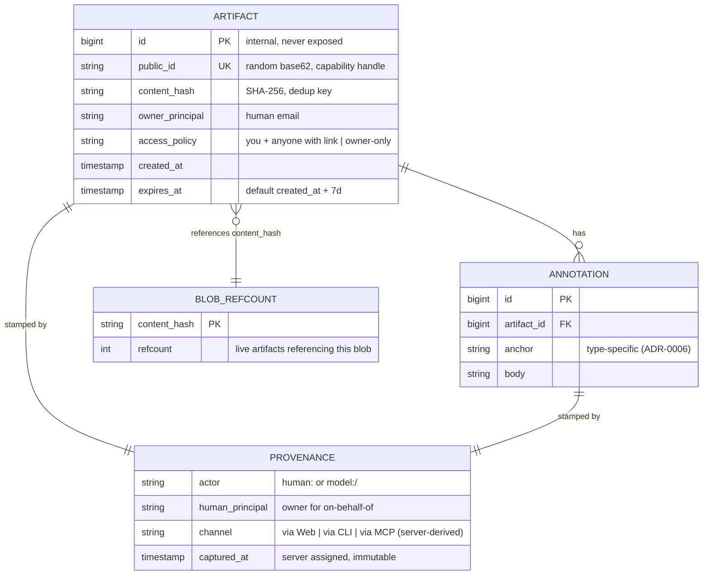

# Design: Provenance, Link-Based Access, and Retention

## Context

Three policies govern every Cairn artifact and annotation, and they only make sense
together: **provenance** (who/what/how/when), **link-based access control** (the
capability-URL is the read token), and **retention** (ephemeral by default, hard
delete on expiry). This spec (SPEC-0009) realizes **ADR-0007** (provenance,
capability access, default expiry) and **ADR-0005** (short opaque ids as the
capability handle), and builds on **SPEC-0002** (artifact core, storage/content
model from ADR-0008). It is consumed by SPEC-0007 (the MCP surface stamps `via MCP`
and inherits, never exceeds, the human's reach).

Constraints fixed by the ADRs and house stack:

- **PostgreSQL** holds artifact/annotation/provenance rows and the blob refcount;
  **S3-compatible object storage** holds content-addressed bodies (ADR-0008).
- Public ids are **random base62, ~8 chars**, opaque and unguessable (ADR-0005) —
  the id *is* the secret.
- Provenance's sensitive fields (`channel`, `captured_at`) are **server-derived** and
  immutable, so a client cannot forge them.
- Expiry must **reclaim** body + metadata, cooperating with object storage.

## Goals / Non-Goals

### Goals

- Capture immutable, server-derived provenance (`actor`, `channel`, `captured_at`) on
  every artifact and annotation, with an un-spoofable channel.
- Make the capability-URL the read token (no reader account), require authentication
  to annotate, and keep sharing/TTL changes explicit and owner-only.
- Provide id rotation as the revoke-a-leaked-link primitive and a uniform 404 that
  makes ids non-enumerable.
- Enforce a 7-day default TTL (owner-adjustable) with a visible countdown, and
  hard-delete on expiry via a reference-counted reaper plus a lifecycle backstop.

### Non-Goals

- No account/ACL-based access (rejected in ADR-0007 Option B) — link capability only.
- No public-and-permanent pastebin mode (ADR-0007 Option C).
- No soft delete / recycle bin — ephemerality is real; deletion is unrecoverable.
- Id generation mechanics, alphabet, length, and collision-retry are specified in
  ADR-0005 / its own spec; this spec consumes the id as the capability handle.
- Viewer sanitization details live in SPEC-0003; this spec only requires access
  responses not to weaken them.

## Decisions

### Provenance: server-derived, immutable, dual actor for on-behalf-of

**Choice**: Persist `actor` (typed `human:<email>` or `model:<vendor>/<model>`),
`channel` (`via Web`/`via CLI`/`via MCP`, derived from the authenticated surface),
and `captured_at` (server timestamp) at creation. Never editable; a correction is a
new record. For agent actions the record carries **both** the model actor and the
human principal.

**Rationale**: Deriving `channel`/`captured_at` server-side is what makes provenance
trustworthy — an agent (ADR-0004) cannot forge `via CLI` while acting over MCP.
Immutability yields an audit trail. The dual actor implements ADR-0004's
subject-vs-actor mapping: the human owns; the display foregrounds the model.

**Alternatives considered**:

- **Client-asserted channel/time**: trivially spoofable, destroys the audit value.
  Rejected.
- **Single actor (model OR human)**: loses ownership vs display distinction needed for
  access control + attribution. Rejected.

### Access: the capability-URL is the read token

**Choice**: Possession of a valid unguessable id grants read with no reader account
(`anyone with link`). The creating human is the owner and the only party who may
mutate policy (`you`). Annotating requires authentication. Uniform 404 for unknown /
unauthorized / expired.

**Rationale**: Matches `🔒 you + anyone with link` exactly and keeps the
`cat file | cairn` and agent-receipt loops frictionless (readers need only the link).
Requiring auth to annotate keeps every annotation's provenance actor real.

**Alternatives considered**:

- **Account/ACL access**: contradicts `anyone with link`, adds login friction, wrong
  for agent receipts meant to be handed onward. Rejected (ADR-0007 Option B).
- **Anonymous/pseudonymous annotation**: would make provenance untrustworthy.
  Rejected (ADR-0007).

### Revocation = id rotation

**Choice**: Because access is defined by link possession, "revoke a link" is
precisely "rotate the id" — mint a new capability, invalidate the old link, and never
reuse a retired id within TTL-plus-grace (ADR-0005). Restricting to owner-only
unshares.

**Rationale**: Falls directly out of the capability model; no separate token-blocklist
machinery. The retired-id rule prevents a stale link resolving to a newer artifact.

### Retention: application-authoritative refcounted reaper + storage backstop

**Choice**: `expires_at = created_at + 7 days` by default, owner-adjustable. A Cairn
reaper is the source of truth: past `expires_at` it deletes metadata immediately and
issues a blob delete. Because bodies are content-addressed and deduped (ADR-0008),
blob deletion is **reference-counted** — the blob is GC'd only when its content-hash
refcount hits zero. The object-storage **lifecycle rule** is a conservative backstop
set **longer than the maximum artifact TTL**, sweeping only orphans (refcount-zero
blobs whose delete failed, plus upload debris).

**Rationale**: Makes ephemerality real (reclaims body + metadata, not hide) while
respecting dedup — a blob shared by a live artifact must survive. Two layers guard
against dropped deletes without the backstop ever racing a live reference.

**Alternatives considered**:

- **Lifecycle-only expiry (no app reaper)**: cannot honor refcounts — would delete a
  blob still referenced by a live artifact, or lag DB state. Rejected.
- **Delete blob whenever any artifact expires**: corrupts deduped shares. Rejected in
  favor of refcounting.
- **Soft delete**: contradicts real ephemerality. Rejected.

## Architecture

Three namespaces stay deliberately non-overlapping (ADR-0005): the public `public_id`
(the only one in URLs), an internal primary key, and the SHA-256 content address (the
object-storage/dedup key). Resolution walks `public_id → artifact row → content hash
→ blob`. The refcount table keys on the content hash; the reaper is the only writer of
blob deletes.



Expiry / reaper flow, showing the refcount decision and the lifecycle backstop:

```mermaid
sequenceDiagram
  autonumber
  participant R as Reaper (worker, ctx-cancelable)
  participant DB as PostgreSQL
  participant OS as Object storage
  participant LC as Lifecycle backstop

  loop periodic sweep
    R->>DB: BEGIN tx; select artifacts past expires_at
    R->>DB: delete artifact + annotations + provenance rows
    R->>DB: decrement refcount(content_hash)
    DB-->>R: new refcount value
    R->>DB: COMMIT tx
    alt refcount == 0
      R->>OS: delete blob(content_hash)
      OS-->>R: ok / failure
      Note over R,OS: on failure -> log, leave orphan for LC (never report success)
    else refcount > 0
      Note over R,DB: blob shared by a live artifact -> keep
    end
  end
  Note over OS,LC: lifecycle TTL > max artifact TTL -> sweeps only orphaned/refcount-0 blobs + upload debris
```

Access resolution returns a uniform 404 for unknown, unauthorized, and expired ids,
so probing the ~47.6-bit keyspace (ADR-0005) yields no signal; rate limiting and the
short TTL shrink the live keyspace an attacker could ever hit.

## Risks / Trade-offs

- **A leaked capability-URL grants read until rotation or expiry** → mitigated by
  unguessable ids (ADR-0005), the short default 7-day TTL, uniform 404s, resolution
  rate limiting, and id rotation as the revoke primitive.
- **Hard delete is unrecoverable** (accidental early expiry / wrong TTL loses data) →
  mitigated by making TTL changes explicit owner actions and showing countdowns on
  every surface; no silent shortening.
- **Refcount races** (a new artifact references a content hash the reaper is about to
  delete) → race-safe refcount reads/decrements and transactional reaping; race
  detection in CI; the lifecycle backstop is set longer than max TTL so it can never
  win a race against a live reference.
- **Dropped blob deletes** leave orphans → the conservative lifecycle backstop sweeps
  them; failures are logged, never masked as success.
- **Channel spoofing** by a client → `channel` is derived from the authenticated
  surface and any client-asserted value is ignored.
- **Operational machinery** (refcount table, reaper lifecycle, tuned lifecycle rules)
  is extra surface → contained to one reaper worker and one refcount table, covered by
  concurrency/DB requirements and CI race detection.

## Open Questions

- The exact **workspace cap** on owner-set TTL (including whether no-expiry is
  permitted per workspace) is a policy knob left to workspace configuration.
- Whether an annotator must belong to the artifact's workspace or may be any
  authenticated Cairn user (ADR-0007 records this as a deliberate policy knob; the
  invariant is only that annotation is never anonymous).
- The **grace window** length for retired-id non-reuse (ADR-0005 requires
  TTL-plus-grace; the exact grace duration is a tuning parameter).
- Reaper cadence and batch size versus expiry-latency expectations (how soon after
  `expires_at` a 404 is guaranteed).
- Whether id rotation should optionally notify prior link-holders or is silent (design
  brief is silent; defaulting to silent revoke).
