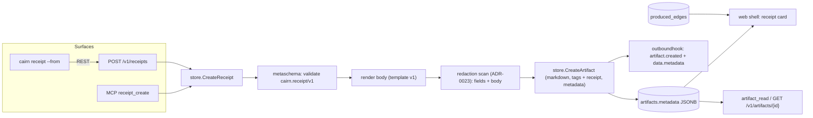

# Design: Structured Receipts

## Context

ADR-0027 adds a typed `metadata` object to artifacts, backed by a closed schema registry
whose first schema is `cairn.receipt/v1`. Receipts get a dedicated verb on each surface, a
server-rendered body, a card, and an event field. SPEC-0021 holds the requirements. This
document gives the concrete shapes.

What exists today:

* Creates funnel through `store.CreateArtifact` / `store.CreateBundle`
  (`internal/store/create.go`, `bundle.go`). Tags are normalized by
  `artifact.NormalizeTags` and stored as `TEXT[]` (migration 0015).
* `internal/outboundhook` encodes `artifact.created`. Its golden files pin the bytes of an
  untagged event. ADR-0022 appends `actor_kind` and `auth` to that
  event and adds a kind registry.
* MCP tools are registered in `internal/httpapi/mcp.go`, with agent-shaped schemas from
  `mcp_schema.go`.
* The markdown viewer and the A2UI markdown rendering (`md2a2ui`) already render any
  markdown body.
* `produced_edges(run_id, span_id, artifact_id)` with `produced_edges_artifact_idx`
  (migration 0004) records which span produced which artifact. Resolution checks only that
  the artifact exists and is unexpired.
* Switchboard's envelope projects `data.metadata` to `.artifact.metadata` and passes it
  through unchanged (`internal/routing/envelope.go` in Switchboard).

## Goals / Non-Goals

### Goals

- One object (the metadata) that the body, card, event, search index and export all
  derive from.
- A tool schema a model can fill in correctly without reading docs.
- No change to any artifact that is not a receipt.

### Non-Goals

- Verifying receipt claims (evidence links are not fetched, outcomes are not measured).
- A second metadata schema. The registry is ready for one, but this spec ships only the
  receipt.
- Editing receipts. Follow-ups are new receipts that point at the earlier one with
  `follows`.
- Scheduling the outcome measurement. `measure_at` is data that a Switchboard rule or a
  Harness schedule can act on.

## Decisions

### A generic JSONB column with a closed, code-owned registry

**Choice.** `artifacts.metadata JSONB NULL`, plus `internal/metaschema`, a compile-time
registry mapping a schema id to a validator and a renderer. `cairn.receipt/v1` is the only
entry.

**Rationale.** A generic column gives the next schema a place to land without a migration.
A closed registry keeps it from becoming an unvalidated key-value store (ADR-0018's
rejected option). Keeping the registry in code keeps validation and rendering in lockstep
with the binary.

**Alternative considered.** Receipt-specific columns (`receipt_changed`, …). They are the
most strongly typed, but every future schema would cost a migration, and the event would
need per-schema encoding.

### Validation in Go, published as JSON Schema

**Choice.** A hand-written validator produces field-path errors (`outcome.measure_at`,
`evidence[2].url`). The MCP tool's input schema is generated from the same Go struct tags
the other tools use (`mcp_schema.go`). A JSON Schema document is also served at
`/v1/schemas/cairn.receipt/v1.json`, so non-MCP clients can validate locally.

**Rationale.** Error messages must name the field (ADR-0025). A generic JSON Schema
library's errors are poor for models to act on.

### The body is rendered by a versioned template

**Choice.** A Go `text/template` embedded per schema version renders markdown. User text is
escaped for markdown: leading `#`, `>`, `-`, `|` and backticks are neutralized in inline
positions. Line endings are normalized to `\n`.

**Rationale.** Deterministic bytes, so identical fields give an identical checksum. A new
template is a new schema version, which means an old receipt never re-renders differently.

The rendered layout for v1:

```markdown
# Receipt: <changed, first line>

> **You need to do:** <human_action>

**What changed:** <changed>

**Who experiences it:** <affected>

## Before

<before>

## After

<after>

## How we know it is active

- [<label or url>](<url>)
- … or: _No evidence linked._
<evidence_note, if any>

## Outcome

<status sentence: "Measured: <summary>" | "Pending: measured on <measure_at>" | "Not applicable">

## What remains

| Item | Owner |
|---|---|
| <item> | <owner> |
… or: _Nothing remains._

## What the system now knows

<learned>

---
_Receipt schema cairn.receipt/v1. Follows: <follows id, if any>._

## Details

<details, if any>
```

### A dedicated verb on every surface, one store path

**Choice.** `store.CreateReceipt(ctx, in ReceiptInput, prov)` validates the input, renders
the body, adds the `receipt` tag, and then calls the existing `CreateArtifact` path with
`share_type = markdown` and `metadata` set, inside the same transaction. The MCP, REST and
CLI surfaces are thin adapters over that one call.

**Rationale.** It is the same choke point that emits the event, applies redaction
(ADR-0023) and records provenance. That gives the new verb parity with every other create
for free.

### Owner-scoped cross-links

**Choice.** `follows` resolution, "Followed by", and "Produced by run" all filter on
`owner = receipt.owner`. With ADR-0029 that becomes the owner key, a user or a team.

**Rationale.** A `produced_edges` row can be written by anyone who can name an artifact id.
Rendering a stranger's run on your receipt would let them decorate your record.

## Architecture



### Schema (next free migration number at implementation time)

```sql
-- Typed artifact metadata (ADR-0027, SPEC-0021). NULL for every artifact that is not
-- created through a metadata-bearing verb; the schema discriminator is validated by
-- internal/metaschema at write time, and the CHECKs are a backstop for direct writes.
ALTER TABLE artifacts ADD COLUMN IF NOT EXISTS metadata JSONB;

ALTER TABLE artifacts ADD CONSTRAINT artifacts_metadata_schema_chk
    CHECK (metadata IS NULL OR (jsonb_typeof(metadata) = 'object' AND metadata ? 'schema'));

ALTER TABLE artifacts ADD CONSTRAINT artifacts_metadata_size_chk
    CHECK (metadata IS NULL OR octet_length(metadata::text) <= 16384);

-- follows / followed-by lookups, owner-scoped.
CREATE INDEX IF NOT EXISTS artifacts_receipt_follows_idx
    ON artifacts ((metadata->>'follows'), owner_id)
    WHERE metadata->>'schema' = 'cairn.receipt/v1';
```

`follows` is stored as the public id at create time. If the earlier receipt's id is later
rotated, the link degrades to that id's tombstone or 404. This is acceptable because
permanent receipts cannot rotate (ADR-0026).

### MCP tool: `receipt_create`

```json
{
  "name": "receipt_create",
  "inputSchema": {
    "type": "object",
    "required": ["changed", "affected", "before", "after", "evidence", "outcome", "remaining", "learned"],
    "additionalProperties": false,
    "properties": {
      "changed":       {"type": "string", "description": "What changed? One or two sentences a non-technical reader understands. This is the TL;DR."},
      "affected":      {"type": "string", "description": "Who experiences the change?"},
      "before":        {"type": "string", "description": "What happened before the change?"},
      "after":         {"type": "string", "description": "What happens now?"},
      "evidence":      {"type": "array", "maxItems": 20, "description": "How do we know it is actually active? Links to the PR, deploy, run, dashboard or check. May be empty; the card will say so.",
                        "items": {"type": "object", "required": ["url"], "additionalProperties": false,
                                  "properties": {"label": {"type": "string"}, "url": {"type": "string"}}}},
      "evidence_note": {"type": "string", "description": "Anything the links do not show."},
      "outcome":       {"type": "object", "required": ["status"], "additionalProperties": false,
                        "properties": {"status": {"enum": ["measured", "pending", "not_applicable"]},
                                       "summary": {"type": "string", "description": "Required when measured."},
                                       "measure_at": {"type": "string", "description": "RFC 3339; required when pending."}}},
      "human_action":  {"type": "string", "description": "What must a human do? Omit when the answer is nothing; the server records \"Nothing\"."},
      "remaining":     {"type": "array", "maxItems": 20, "description": "What remains, and who owns it. Empty when nothing remains.",
                        "items": {"type": "object", "required": ["item", "owner"], "additionalProperties": false,
                                  "properties": {"item": {"type": "string"}, "owner": {"type": "string"}}}},
      "learned":       {"type": "string", "description": "What does the system now know that it didn't? Say \"Nothing new: routine work under existing guidance\" when that is the truth."},
      "follows":       {"type": "string", "description": "Id or mcp://cairn/ handle of an earlier receipt for the same work."},
      "title":         {"type": "string"},
      "details":       {"type": "string", "description": "Optional markdown appended under Details."},
      "tags":          {"type": "array", "items": {"type": "string"}},
      "model":         {"type": "string", "description": "The model producing this receipt, e.g. claude-opus-5."}
    }
  }
}
```

The output is the standard artifact object, including `metadata`.

### REST: `POST /v1/receipts`

The request body is the MCP input as JSON. The response is `201` with the artifact object.
The response and any read carry:

```json
"metadata": {
  "schema": "cairn.receipt/v1",
  "changed": "Support replies now reach the customer's original Slack thread.",
  "affected": "Support staff and customers who open threads in Slack.",
  "before": "Replies landed in a new top-level message.",
  "after": "Replies land in the thread they answer.",
  "evidence": [{"label": "PR", "url": "https://github.com/example/app/pull/41"}],
  "outcome": {"status": "pending", "measure_at": "2026-09-29"},
  "human_action": "Nothing",
  "remaining": [{"item": "Backfill last week's orphaned replies", "owner": "support-bot"}],
  "learned": "The Slack API returns thread_ts only on the parent event."
}
```

### CLI

```
cairn receipt --from receipt.yaml [--details notes.md] [--tag repo:stump.wtf/cairn] [--title ...]
cat receipt.json | cairn receipt --from -
```

The CLI parses YAML locally into the same JSON and posts it to `/v1/receipts`. The server
validates it, and the CLI prints the server's field-path errors verbatim.

### Event

The ADR-0022 envelope, with `metadata` appended last:

```json
{"source":"cairn","kind":"artifact.created","event_id":"…","created_at":"…",
 "data":{"id":"R4m2x","share_type":"markdown","title":"Receipt: Support replies now reach…",
         "url":"https://cairn.example.com/R4m2x","channel":"via MCP","model":"claude-opus-5",
         "actor_id":"sam@example.com","expires_at":"…","on_behalf_of":"claude-code/2.3",
         "tags":["receipt"],"actor_kind":"agent","auth":"oauth",
         "metadata":{"schema":"cairn.receipt/v1", "…": "…"}}}
```

A Switchboard rule example (for docs):
`.artifact.metadata.schema == "cairn.receipt/v1" and .artifact.metadata.human_action != "Nothing"`.

### Card layout

```
┌ Receipt, asserted by claude · opus-5 for sam@example.com via MCP · 2h ago ┐
│ Support replies now reach the customer's original Slack thread.           │
│ [ You need to do: Nothing ]                                                │
│ Before ─────────────────────── │ After ─────────────────────────────────── │
│ Replies landed in a new …      │ Replies land in the thread they answer.   │
│ How we know it's active: PR ↗                                              │
│ Outcome: pending — measured on 29 Sep 2026                                 │
│ What remains: Backfill last week's orphaned replies · support-bot          │
│ What the system now knows: The Slack API returns thread_ts only on …       │
│ Produced by run 7Hq2a · Follows —                                          │
└────────────────────────────────────────────────────────────────────────────┘
```

### Code map

| Area | Files |
|---|---|
| Registry | `internal/metaschema/` (new): `registry.go`, `receipt_v1.go`, `receipt_v1.tmpl`, tests with golden renders |
| Domain | `internal/artifact/artifact.go` (`Metadata json.RawMessage`) |
| Store | `internal/store/receipt.go` (new: `CreateReceipt`), `store/create.go` (write the metadata), `store/read.go` / `list.go` (scan it) |
| HTTP | `internal/httpapi/receipts.go` (new), `api.go` (route and response `metadata`), a schema document route |
| MCP | `internal/httpapi/mcp.go` (`receipt_create`), `mcp_schema.go` |
| CLI | `internal/clicmd/receipt.go` (new), `internal/cliclient` |
| Web | `internal/httpapi/web.go` (card view model, owner-scoped produced-by and follows), `templates/shell.html` (card partial), CSS tokens |
| Events | `internal/outboundhook` (append `metadata`; new golden files) |
| Docs | `website/docs/guides/` receipts guide, including the `produced_artifact_id` ordering |

## Risks / Trade-offs

- **A template bug ships in v1 and is frozen.** Mitigation: golden render tests, and a
  review of the rendered output before the schema is published. Once published, a fix is
  `v2`.
- **Models fill `learned` with filler.** Accepted. The field forces a disposition; quality
  is a prompt concern for the plugin and for Harness personas.
- **Metadata makes events larger.** It is bounded at 16 KiB, well inside Switchboard's
  ingest limits.
- **`follows` points at a rotated id.** It degrades to a tombstone or 404. Permanent
  receipts cannot rotate.
- **Loose receipts (tag only) and structured ones coexist.** Rendering keys on the schema,
  and the Bin can filter on the tag. The plugin migration moves new receipts to the
  structured form.

## Migration Plan

1. Migration: a nullable column and CHECKs (metadata-only), plus the partial index.
2. Ship the registry, store, REST and MCP together. Then ship the card, the CLI and the
   event field.
3. Update the plugin's `/cairn:receipt` in its own repository to call `receipt_create`.
4. No backfill. Existing loose receipts stay markdown.

## Open Questions

- Should the web shell offer a "Create receipt" form for humans? It is left out because
  receipts are an agent and script output, and parity is met by REST and CLI.
  **Resolved (design review 2026-09-22):** no form, as proposed.
- Should `outcome.measure_at` also drive a built-in reminder, such as a follow-up event at
  that time? It is left to Switchboard and Harness scheduling, so Cairn does not gain a
  scheduler. **Resolved (design review 2026-09-22):** no built-in reminder, as proposed.
