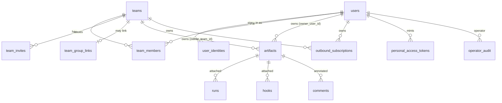

# Design: Teams and Tenancy

## Context

ADR-0029 decides that every artifact belongs to a user or a team, that visibility is `link`, `team`
or `private` and is enforced, that outbound webhooks become owned subscriptions, and that the
operator is an instance role that owns nothing. SPEC-0023 (`spec.md`) holds the normative
requirements; this document covers how and why.

Facts from `main` at `dea1f0b` this design rests on:

* There is no users table. `artifacts.owner_id` and `actor_id` are `TEXT` holding whatever the
  authenticator produced: the OIDC `email` claim unverified and not lower-cased, falling back to the
  raw `sub` (`internal/httpapi/oidc.go:198-202`); GitHub's lower-cased primary verified email
  (`internal/authprovider/authprovider.go:157`); a dev-login string; or a `CAIRN_API_TOKENS` actor.
* `visibility` is `TEXT NOT NULL DEFAULT 'link'` with no constraint; the Go type has `link` and
  `private` (`internal/artifact/artifact.go:47-54`); every create path hardcodes `link`.
* `GetByPublicID` (`internal/store/read.go:21-52`) filters on `public_id` and expiry only, and the
  trajectory, webhook and annotation packages each resolve ids the same way.
* Outbound events come from `store.emitCreated` (`internal/store/store.go:147-166`) into
  `internal/outboundhook`, which posts to every env target with one secret.
* `CAIRN_API_TOKENS` is parsed by `ParseAPITokens` (`internal/httpapi/auth.go:120-161`) and is first
  in the bearer chain (`api.go:300`), ahead of PATs and OAuth.
* Sessions already record `issuer` and `subject` (migration 0016), which is what operator matching
  and identity linking build on.

## Goals / Non-Goals

### Goals

- Make ADR-0001's workspace real: personal or team, one owner per artifact.
- Make "you only" true on every surface, with one function deciding.
- Let each user and team wire Cairn to their own automation, and stop sending everyone's events to
  the operator from day one.
- Give the operator a bounded, audited role; make static tokens unable to impersonate.
- Match Switchboard's roles, invites and group sync so one person meets one model twice.

### Non-Goals

- Per-artifact reader lists, or sharing one artifact with one named outside user.
- Syncing teams with Switchboard. Separate stores.
- Nested teams or an organisation layer.
- Per-tenant object-store buckets or encryption keys (audit A17 is accepted, not fixed).
- Login policy itself: who may become a user is ADR-0024's enrollment gate (`CAIRN_ENROLLMENT_MODE`,
  `allowlist | invite | open`, default `invite` when GitHub login is configured). This spec supplies the invitations its `invite` mode reads
  and the `(issuer, subject)` identities its gate is defined over.

## Decisions

### A `users` table, linked by verified email only

**Choice**: `users(id, primary_email citext, display_handle, suspended_at)` and
`user_identities(user_id, issuer, subject, email, email_verified)` with `UNIQUE (issuer, subject)`.
Sign-in resolves `(issuer, subject)`; a new identity attaches to an existing user only when its
email is verified and equals the user's primary email; otherwise it creates a user.

**Rationale**: team membership, quotas and subscriptions all hang off the principal. An unverified,
case-sensitive email string cannot carry them: an IdP that lets a user set their own email would let
them become someone else, and `Joe@` and `joe@` are two owners today. Linking by verified email keeps
ADR-0019's promise that a Pocket ID and a GitHub login for the same person are one principal.

**Alternatives considered**:
- Keep `owner_id TEXT` and lower-case it: fixes case, not takeover, and leaves memberships keyed on a
  string any provider can assert.
- Key users on `(issuer, subject)` with no email linking: safe, but splits every person who uses both
  providers into two users, breaking ADR-0019.

### Owner columns are a pair, as in Switchboard

**Choice**: `artifacts.owner_user_id` and `owner_team_id`, both foreign keys, with
`CHECK (num_nonnulls(owner_user_id, owner_team_id) = 1)`, plus `created_by_user_id`. The legacy
`owner_id` and `actor_id` strings stay for one release for rollback and display, then are dropped.

**Rationale**: the same three lines Switchboard's SPEC-0033 uses, so a reader of either codebase
recognises the shape, and cascades come from Postgres.

### One `authorizeRead`, applied at the store boundary

**Choice**: a single function every read path calls with the resolved artifact and the reader:

```go
// Governing: ADR-0029, SPEC-0023 REQ "Read Authorization on Every Surface"
func authorizeRead(r Reader, a ArtifactRef) bool {
    switch a.Visibility {
    case VisibilityLink:
        return true // the caller presented the current public id
    case VisibilityPrivate:
        return r.UserID != "" && r.UserID == a.OwnerUserID
    case VisibilityTeam:
        return r.UserID != "" && r.Teams.Has(a.OwnerTeamID) && !r.Suspended
    }
    return false
}
```

The resolvers that exist today — `GetByPublicID`, the trajectory, webhook and annotation
`resolveArtifact` helpers, and the produced-edge join — are replaced by one
`ResolveReadable(ctx, reader, publicID)` that applies the visibility predicate in SQL and returns
`errs.ErrNotFound` for every refusal. `Reader.Teams` is loaded once per request from
`team_members`, never cached across requests.

**Rationale**: #182 exists because each surface resolved ids on its own and none checked. One
resolver makes a surface that skips the check a surface that does not compile against the store.

**Alternatives considered**:
- A middleware check on routes: misses MCP resources, A2UI renderings, SSE subscriptions and joins
  such as produced links, which are exactly where the audit found gaps.

### Visibility is constrained by owner in the schema

**Choice**:

```sql
ALTER TABLE artifacts ADD CONSTRAINT artifacts_visibility_by_owner CHECK (
  (owner_user_id IS NOT NULL AND visibility IN ('link','private')) OR
  (owner_team_id IS NOT NULL AND visibility IN ('link','team')));
```

**Rationale**: "private on a team artifact" has no single meaning, so it is unrepresentable rather
than interpreted.

### Subscriptions are rows; delivery reuses the existing worker

**Choice**: `outbound_subscriptions` replaces the env target list as the source of targets.
`internal/outboundhook` keeps its bounded queue, retry schedule and graceful shutdown (SPEC-0012),
and changes in three places: the event carries its workspace; the emitter looks up that
workspace's enabled subscriptions matching the filters; each POST is signed with that
subscription's secret. The env target list is deleted from `internal/config` and from the worker in
the same change. SSRF checks move into a dialer that re-validates the resolved address on
every connection, the pattern Switchboard's `internal/push` uses.

**Rationale**: the delivery machinery is sound; what was wrong is who the targets belong to.

### The env firehose is removed, not staged

**Choice**: the change that adds `outbound_subscriptions` deletes `CAIRN_OUTBOUND_WEBHOOK_URLS` and
`CAIRN_OUTBOUND_WEBHOOK_SECRET` outright: parsing, delivery and documentation, with one CHANGELOG
upgrade line. No narrowed stage, no warning, no import command. A subscription may carry a secret
its creator supplies, so an operator re-points the hosted instance's handoff lane by creating one
subscription with the Switchboard webhook's existing signing secret.

**Rationale**: Cairn is pre-1.0, and Joe's design review (2026-09-22) was explicit: "retire it, but
nuke it 100%." A staged retirement would keep a path that leaks users' events alive for 90 days and
add three releases of code written to be deleted. Letting the creator supply the secret removes the
one thing the import command was for, keeping the receiver unchanged, without leaving any reader of
the old variables in the code.

**Alternatives considered**: narrowing the env targets to operator-owned artifacts and retiring them
in three stages (the first draft of this design; rejected in review); an import command that copies
env targets into subscriptions (rejected: it keeps code that reads the removed variables).

### Static tokens resolve to an operator's user at boot

**Choice**: `ParseAPITokens` resolves each entry's user at startup against `users` and the operator
list, and fails boot on any that is not an operator. The token's principal carries the user id, not
a string.

**Rationale**: a credential the user cannot see or revoke must not be able to act as them. The
operator automating their own account is the only use the env var legitimately serves; everyone else
has PATs.

### Teams, invites and group sync match Switchboard

**Choice**: the same tables, role names, invite lifetime, verified-email binding and group-link rule
as Switchboard's SPEC-0033, adapted only where the products differ (artifacts instead of endpoints;
browser session instead of passkey issuer for destructive actions, because Cairn has no passkey
step-up).

**Rationale**: a person on `stump` in both products should not learn two meanings of "admin".

## Architecture



```mermaid
sequenceDiagram
  participant M as Team member's agent
  participant C as cairnd
  participant DB as Postgres
  participant OH as outboundhook
  participant SB as Team's Switchboard webhook
  M->>C: artifact_create(team: "stump", tags: [handoff])
  C->>DB: membership check · insert (owner_team_id, visibility team)
  C->>OH: event {workspace: team stump}
  OH->>DB: stump's enabled subscriptions matching filters
  OH->>OH: SSRF re-check at dial
  OH->>SB: POST signed with the subscription's secret
  Note over OH: no instance-wide target exists; only the owning workspace's subscriptions receive it
```

## Schema

Migration `0017_teams_and_tenancy.sql` (number confirmed against `main` at implementation):

```sql
CREATE EXTENSION IF NOT EXISTS citext;

CREATE TABLE users (
    id             uuid PRIMARY KEY DEFAULT gen_random_uuid(),
    primary_email  citext UNIQUE,
    email_verified boolean NOT NULL DEFAULT false,   -- false for legacy rows until claimed
    display_handle text NOT NULL,
    suspended_at   timestamptz,
    created_at     timestamptz NOT NULL DEFAULT now()
);
CREATE TABLE user_identities (
    user_id        uuid NOT NULL REFERENCES users(id) ON DELETE CASCADE,
    issuer         text NOT NULL,
    subject        text NOT NULL,
    email          citext,
    email_verified boolean NOT NULL,
    last_seen_at   timestamptz NOT NULL DEFAULT now(),
    PRIMARY KEY (issuer, subject)
);

CREATE TABLE teams (
    id           uuid PRIMARY KEY DEFAULT gen_random_uuid(),
    slug         text NOT NULL UNIQUE CHECK (slug ~ '^[a-z0-9]+(-[a-z0-9]+)*$' AND length(slug) BETWEEN 3 AND 40),
    display_name text NOT NULL,
    suspended_at timestamptz,
    created_at   timestamptz NOT NULL DEFAULT now()
);
CREATE TABLE team_members (
    team_id  uuid NOT NULL REFERENCES teams(id) ON DELETE CASCADE,
    user_id  uuid NOT NULL REFERENCES users(id) ON DELETE CASCADE,
    role     text NOT NULL CHECK (role IN ('owner','admin','member')),
    source   text NOT NULL DEFAULT 'manual' CHECK (source IN ('manual','oidc_group')),
    added_at timestamptz NOT NULL DEFAULT now(),
    PRIMARY KEY (team_id, user_id, source)
);
CREATE TABLE team_invites (
    id           uuid PRIMARY KEY DEFAULT gen_random_uuid(),
    team_id      uuid NOT NULL REFERENCES teams(id) ON DELETE CASCADE,
    email        citext NOT NULL,
    role         text NOT NULL CHECK (role IN ('owner','admin','member')),
    token_sha256 bytea NOT NULL UNIQUE,
    invited_by   uuid REFERENCES users(id) ON DELETE SET NULL,
    expires_at   timestamptz NOT NULL,
    accepted_at  timestamptz,
    revoked_at   timestamptz
);
CREATE TABLE team_group_links (
    team_id    uuid PRIMARY KEY REFERENCES teams(id) ON DELETE CASCADE,
    group_name text NOT NULL,
    role       text NOT NULL CHECK (role IN ('admin','member'))
);

ALTER TABLE artifacts
    ADD COLUMN owner_user_id      uuid REFERENCES users(id) ON DELETE CASCADE,
    ADD COLUMN owner_team_id      uuid REFERENCES teams(id) ON DELETE CASCADE,
    ADD COLUMN created_by_user_id uuid REFERENCES users(id) ON DELETE SET NULL;
-- after backfill:
ALTER TABLE artifacts ADD CONSTRAINT artifacts_one_owner CHECK (num_nonnulls(owner_user_id, owner_team_id) = 1);
ALTER TABLE artifacts ADD CONSTRAINT artifacts_visibility_by_owner CHECK (
  (owner_user_id IS NOT NULL AND visibility IN ('link','private')) OR
  (owner_team_id IS NOT NULL AND visibility IN ('link','team')));

CREATE TABLE outbound_subscriptions (
    id                   uuid PRIMARY KEY DEFAULT gen_random_uuid(),
    owner_user_id        uuid REFERENCES users(id) ON DELETE CASCADE,
    owner_team_id        uuid REFERENCES teams(id) ON DELETE CASCADE,
    created_by_user_id   uuid REFERENCES users(id) ON DELETE SET NULL,
    url                  text NOT NULL,
    secret_enc           bytea NOT NULL,            -- encrypted at rest; shown once
    event_types          text[] NOT NULL DEFAULT '{}',   -- empty = all
    share_types          text[] NOT NULL DEFAULT '{}',
    tags                 text[] NOT NULL DEFAULT '{}',
    paused               boolean NOT NULL DEFAULT false,
    disabled_reason      text,
    consecutive_failures int NOT NULL DEFAULT 0,
    last_attempt_at      timestamptz,
    last_status          int,
    created_at           timestamptz NOT NULL DEFAULT now(),
    CHECK (num_nonnulls(owner_user_id, owner_team_id) = 1)
);

CREATE TABLE operator_audit (
    id          bigserial PRIMARY KEY,
    operator_id uuid REFERENCES users(id) ON DELETE SET NULL,
    target_user uuid REFERENCES users(id) ON DELETE SET NULL,
    target_team uuid REFERENCES teams(id) ON DELETE SET NULL,
    action      text NOT NULL,
    reason      text NOT NULL CHECK (length(reason) > 0),
    detail      jsonb NOT NULL DEFAULT '{}',
    at          timestamptz NOT NULL DEFAULT now()
);
```

`personal_access_tokens.owner_id`, `mcp_sessions.owner_id`, `oauth_grants.actor_id` and
`comments`/`reactions.actor_id` gain `user_id` columns backfilled the same way. The hooks table gains
a separate `read_id` (audit A8) so the ingress id stops being a read capability.

## API

```http
POST /v1/teams                                {"slug": "stump", "display_name": "Stump family"}
→ 201 {"slug": "stump", "role": "owner"}

POST /v1/subscriptions
{"owner": "team:stump", "url": "https://switchboard.example/webhooks/w/…",
 "event_types": ["artifact.created"], "tags": ["handoff"]}
→ 201 {"id": "…", "secret": "whsec_…", "owner": "team:stump", …}   # secret shown once

POST /v1/artifacts/{id}/move                  {"team": "stump"}
→ 200 {"id": "…", "owner": "team:stump", "visibility": "team"}

GET /v1/bin?workspace=team:stump&tag=handoff
```

MCP: `artifact_create`, `bundle_create` and `run_create` gain an optional `team` string. CLI:
`cairn ls --team <slug>`, `cairn push --team <slug>`, `cairn subscriptions {ls,add,rotate,rm}`.

Error codes introduced: `invalid_visibility`, `move_out_of_team`, `last_owner`,
`role_ceiling`, `team_ceiling_reached`, `group_not_held`.

## Configuration

| Variable | Default | Meaning |
|---|---|---|
| `CAIRN_OPERATORS` | empty | comma-separated `<issuer>\|<subject>` of operators |
| `CAIRN_OPERATOR_GROUP` | empty | OIDC group whose members are operators |
| `CAIRN_MAX_TEAMS_PER_USER` | `10` | teams one user may own |
| `CAIRN_OIDC_GROUPS_CLAIM` | empty (sync off) | claim to request and read |
| `CAIRN_SUBSCRIPTIONS_PER_USER` / `_PER_TEAM` | `5` / `10` | subscription ceilings |
| `CAIRN_OUTBOUND_ALLOW_HTTP` | `false` | permit `http://` subscription targets |
| `CAIRN_PERMANENT_USER_MAX_COUNT` / `_USER_MAX_BYTES` / `_TEAM_MAX_COUNT` / `_TEAM_MAX_BYTES` | unset (no quota) | permanent retention quotas, defined by SPEC-0020; retention itself is off unless `CAIRN_PERMANENT_RETENTION=true` |
| `CAIRN_HOOK_REQUEST_CAP_MAX` | `5000` | ceiling on a hook's `request_cap` (A15) |
| `CAIRN_OUTBOUND_WEBHOOK_URLS`, `_SECRET` | **removed** | no longer read; use owned subscriptions (REQ "Removing the Instance-Wide Outbound Targets") |
| `CAIRN_API_TOKENS` | — | `secret:<user>[:agent\|:human]`, operator users only; legacy `secret:actor` fails boot |

## Audit Findings

From `main` at `dea1f0b`. SPEC-0023 REQ "Closing the Audited Surfaces" binds to this table.

| # | Surface | Evidence | Fix | Requirement |
|---|---|---|---|---|
| A1 | `private` unenforced on every read path (#182) | `internal/store/read.go:21-52`; `api.go:461-463`; `mcp.go:806-830`; `mcp_a2ui.go`; trajectory and webhook readers | `ResolveReadable` + `authorizeRead` | Read Authorization on Every Surface |
| A2 | `CAIRN_API_TOKENS` acts as any string, with `sharing:manage` | `auth.go:120-161,198-220`; `auth.go:42-46` | operator users only, agent scopes by default | Static API Tokens Act as an Operator's User |
| A3 | GitHub sign-in open to every account | `github.go:25-31`; `authprovider.go:128-167` | ADR-0024's `CAIRN_ENROLLMENT_MODE` gate; its `invite` mode reads this spec's invitations | Team Invitations |
| A4 | Instance-wide outbound targets (#185) | `internal/config/config.go:104-109`; `internal/store/store.go:147-166`; `internal/outboundhook/outboundhook.go` | owned subscriptions; env targets removed in the same change | Owned Outbound Subscriptions; Removing the Instance-Wide Outbound Targets |
| A5 | Identity is an unverified, unnormalised string | `oidc.go:198-202`; `0002_annotations.sql` | `users` + `user_identities` | Users and Identities |
| A6 | Dev password live on GitHub-only deployments | `session.go:277-279` | disabled whenever a real provider exists | Users and Identities |
| A7 | REST runs and hooks skip the write-scope check | `runs.go:41-43`; `hooks.go:46` | `requireScope(artifacts:write)` | Closing the Audited Surfaces |
| A8 | A hook's ingress URL is also its read URL | `hooks.go:292-298`; `internal/webhook/service_integration_test.go:342` | separate `read_id`; reads through `authorizeRead` | Closing the Audited Surfaces |
| A9 | Produced links: any live id, no owner or visibility check | `internal/trajectory/service.go:515-531`; `read.go:138-146` | require read of the target at append; filter the join | Read Authorization on Every Surface |
| A10 | Comments: no visibility check, no owner moderation, no delete route | `internal/annotation/service.go:509-519` | `authorizeRead` on annotate; owner and admin delete | Closing the Audited Surfaces |
| A11 | `on_behalf_of` client-asserted over REST | `runs.go:63`; `hooks.go:62`; `annotations.go:66` | server-derived, as MCP does | Closing the Audited Surfaces |
| A12 | No offboarding | PATs never expire; sessions not swept | suspension revokes everything | Operator Surfaces Bound Tenant Data and Never Read It |
| A13 | No operator role | nothing in `internal/` | `CAIRN_OPERATORS` | Operator and User Profiles |
| A14 | Anonymous global OAuth client registration | `internal/oauth/service.go:76-105` | redirect origin on consent; unverified marker | Closing the Audited Surfaces |
| A15 | Hook `request_cap` unbounded; limits per IP | `internal/webhook/webhook.go:75` | operator ceiling | Closing the Audited Surfaces |
| A16 | One global retention policy | `internal/config/config.go:194`; `api.go:219-221` | per-owner permanent quota (ADR-0026); TTL bounds stay instance-wide | Quotas for Permanent Retention |
| A17 | Blobs deduplicated across users | `internal/store/blob.go:105-123` | accepted; documented | — |
| A18 | Public reads show the creator's email | `api.go:543-548` | display handle to anonymous readers | Users and Identities |
| A19 | MCP session bookkeeping keyed by id | `internal/mcpsession/service.go:42-89` | `WHERE owner` on upsert and touch | Closing the Audited Surfaces |
| A20 | Settings lists only PATs and MCP sessions; bearer can open it | `settings.go:166,177`; `session.go:251` | browser session; list every credential | Closing the Audited Surfaces |
| A21 | `CAIRN_DEV_INSECURE_BEARER_AUTH` can delete anything | `auth.go:240-250` | refuse with an `https` base URL | Users and Identities |
| A22 | Metrics need an operator credential that does not exist | SPEC-0014 | operator profile defines it | Operator Surfaces Bound Tenant Data and Never Read It |
| A23 | OTLP `trace_id` would be a global keyspace | SPEC-0011 | key by `(owner, trace_id)` | Closing the Audited Surfaces |
| A24 | Stream subscriptions don't check the id or access | `mcp.go:1737,1894` | `authorizeRead` before subscribe | Closing the Audited Surfaces |
| A25 | No tests for A1, A7, A9 | — | the cross-tenant suite | Closing the Audited Surfaces |

## Consistency with Switchboard

| | Cairn (this spec) | Switchboard (its SPEC-0033) |
|---|---|---|
| Profiles | operator, user | operator, user |
| Operator entry | `CAIRN_OPERATORS`, `<issuer>\|<subject>` | `SWITCHBOARD_OPERATORS`, `<issuer>\|<subject>` |
| Owner columns | `owner_user_id` XOR `owner_team_id` | `owner_human_id` XOR `owner_team_id` |
| Roles | owner, admin, member: use / configure / govern | same |
| Invites | email, 7 days, single-use, hashed, verified match, role ≤ inviter | same |
| Group sync | `CAIRN_OIDC_GROUPS_CLAIM`, owner links, member or admin, login-time | same with `SWITCHBOARD_` |
| Flow | artifacts move into a team, never out | routes flow into a team, never out |
| Enrollment | `CAIRN_ENROLLMENT_MODE` (ADR-0024): `allowlist`, `invite`, `open`; `invite` by default with GitHub login, else `open` | `SWITCHBOARD_ENROLLMENT_MODE`: the same modes, default and semantics |
| Instance-wide destinations | env firehose removed in the change that ships subscriptions | none exist; forbidden |
| Replaced behaviour | removed outright, no deprecation window (pre-1.0) | same |

A person in `stump` in both products holds two memberships, one per store, and meets the same roles
in each. The cross-product handoff is owned at both ends: a Cairn team subscription posts to a
Switchboard webhook owned by the Switchboard team, which puts todos on that team's queue.

## Risks / Trade-offs

- **The users backfill is the largest migration Cairn has run.** → Additive first (new columns and
  tables alongside the strings), switch reads, then drop the strings a release later; the backfill is
  idempotent and verified by comparing every user's Bin before and after.
- **Legacy strings that were raw OIDC subjects** (no email) cannot be claimed by email. → They are
  claimed by the `(issuer, subject)` the session table already recorded for them; any left unclaimed
  are listed in the operator console as legacy owners.
- **`private` becomes a lock.** → Release notes, and the getting-started guide's warning is replaced
  with the real behaviour.
- **An env-fed receiver goes quiet on upgrade.** A deployment that set `CAIRN_OUTBOUND_WEBHOOK_URLS`
  delivers nothing after upgrading until the operator creates a subscription. → The CHANGELOG's
  upgrade note names the variables and the one step; the receiver keeps its secret because the
  subscription can carry it.
- **Per-subscription fan-out multiplies outbound requests.** → The bounded queue and per-owner
  ceilings cap it; delivery never blocks creation.
- **Team members see every team artifact.** → That is the definition; the invite page says so.

## Migration Plan

1. `users`, `user_identities`, backfill from `owner_id`, `actor_id` and sessions; `owner_user_id`
   on artifacts; constraints `NOT VALID` then validated.
2. `authorizeRead` and `ResolveReadable` on every surface; the cross-tenant suite; invert
   `policy_integration_test.go:178`. (Ships #182 before teams exist.)
3. `outbound_subscriptions`, and the removal of `CAIRN_OUTBOUND_WEBHOOK_URLS` / `_SECRET` with its
   CHANGELOG upgrade note, in one change. (Ships #185.)
4. Static token resolution; legacy `secret:actor` entries fail boot, with a CHANGELOG note.
5. Teams, roles, invites, visibility `team`, moves, the Bin team view, MCP and CLI `team`.
6. Operator console, suspension, quotas, group sync.
7. Remaining audit fixes (A7–A24), each independently shippable.
8. Drop the legacy `owner_id` / `actor_id` strings, one release after step 1. This is a rollback
   safeguard for the backfill inside the database, not a user-facing compatibility path: no read
   uses the strings after step 1.

## Open Questions

- **Team default visibility.** This design makes new team artifacts `team`, unlike personal ones.
  Is that right for agent handoffs inside a team, where a `link` is what the next agent is handed?
- **Legacy `private` links.** Should the release that enforces `private` also rotate every private
  artifact's id, so links already sent can never resolve even if a later bug reopens reads?
