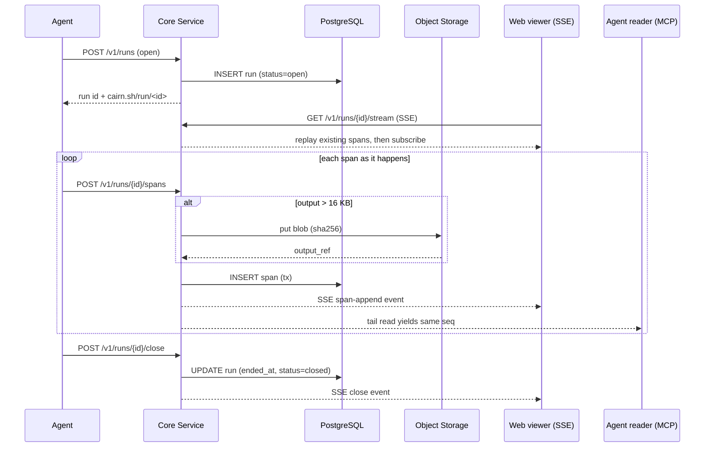

# Design: Trajectory Share

## Context

The flagship new share type (design brief, turn 7) is the **trajectory**: a whole agent
run, shared. The viewer pins an OTel-style span waterfall above a readable activity stream;
a RUN panel shows derived stats; a `write` span links out to the artifact it produced.
**ADR-0009** decided the capture format and ingestion path — a native run/span tree with
content-addressed outputs and dual (batch + incremental) ingestion — and explicitly chose
to be *OTel-inspired, not OTLP-compliant*. This spec formalizes that model's observable
behavior.

Constraints inherited from the ADRs:

- **SPEC-0002 / ADR-0002** — a trajectory is an ordinary artifact and a registry entry; it
  gets provenance, link access, expiry, and the app shell for free.
- **ADR-0008** — bodies (large span outputs, produced-artifact bodies) live in
  content-addressed object storage; metadata lives in PostgreSQL.
- **ADR-0006 / SPEC-0006** — reactions and comments attach through the unified annotation
  layer via typed anchors (`trajectory_turn`, `trajectory_toolcall`, `trajectory_span`).
- **ADR-0012** — one Go core service, REST/JSON under `/v1`, SSE for live push, keyset
  pagination, a structured error envelope.
- **ADR-0007** — link-capability reads, immutable trustworthy provenance, ephemeral TTL.

## Goals / Non-Goals

### Goals

- Persist a run faithfully enough to draw the waterfall, compute the RUN stats, and tie the
  run to the artifacts it produced.
- Support both "share a finished run" (batch) and "watch a running one" (incremental),
  converging to the identical final run.
- Keep oversized tool output out of PostgreSQL by content-addressing it in object storage.
- Derive all run stats from the span tree so they can never disagree with the waterfall.
- Give ADR-0006 a stable per-span anchor for reactions and comments.

### Non-Goals

- OTLP wire compliance, trace-context propagation, sampling, metrics/logs signals — Cairn
  is a sharing surface, not a tracing backend.
- Token-cost lane on the waterfall, run-vs-run diff, errored-run red-span rendering — all
  "try next," additive, and deliberately absent from the v1 schema (no span error/status
  field).
- Deciding the pixel-level rendering (ADR-0011) or the SSE transport internals (ADR-0012);
  this spec fixes the model and the observable ingest/read behavior.

## Decisions

### Native span tree over verbatim OTLP

**Choice**: Store runs as Cairn-defined span rows keyed by `(run_id, span_id)` with a
recommended `category` set (any non-empty string accepted), `parent_span_id`/`seq`
nesting, and run-relative timing.

**Rationale**: The model carries exactly the fields the waterfall and RUN panel need and
nothing else; stats are derivable; sub-agents fall out of `parent_span_id`. The
recommended set — `reason · exec · read · net · write · search · plan · tool · analyze · test · fix · fail · meta`
— covers the vocabulary agents naturally produce, and accepting arbitrary non-empty
strings means agents are never forced to remap their categories. Known categories get
their designated accent color; unknowns fall back to a neutral default.

**Alternatives considered**:
- Verbatim OTLP storage: OTel `SpanKind` does not map onto the recommended categories, so
  we would translate at read time anyway — verbatim storage buys nothing and drags in a
  telemetry vocabulary far larger than needed.
- Closed five-value enum (original ADR-0009 design): too rigid — agents producing spans
  with categories like `search`, `analyze`, `tool`, or `fail` were rejected at ingest,
  forcing lossy remapping.
- Opaque event log: forfeits server-side stat derivation, querying, and stable per-span
  anchoring that ADR-0006 needs.
- Single immutable blob per run: makes a live run a repeated whole-blob re-upload and forbids
  per-span reactions without re-parsing.

### Stats derived, never stored as truth

**Choice**: Wall time, span count, tool-call count, and time-by-category are computed from
span rows (+ the run's token count); aggregates may be *cached* for a closed run only.

**Rationale**: A derived panel is provably consistent with the waterfall and lets a live
run's stats tick upward as spans append. Storing them as authoritative fields invites drift.

### Inline-vs-referenced output split

**Choice**: Outputs ≤ 16 KB inline on the span row; larger outputs go to object storage
(SHA-256) and the span holds an `output_ref`, fetched lazily on expand.

**Rationale**: A `bash` span can emit megabytes; that must not bloat Postgres. Content
addressing dedups identical outputs and makes downloads cacheable (ADR-0008).

### `produced` edge, not embedded body

**Choice**: A `write` span's produced artifact is an ordinary Cairn artifact; the link is a
directed `produced` row resolvable from both run and artifact.

**Rationale**: Honors ADR-0001's "a run produces artifacts" as a real queryable edge rather
than prose, and lets the produced artifact carry its own provenance, access, and TTL.

## Architecture

The trajectory subsystem is a thin set of core-service methods plus a viewer. Ingestion
adapters (REST, MCP) call the same core; the core persists spans to Postgres, spills large
outputs to object storage, and fans appended spans out over SSE to live viewers and over the
MCP tail read to agents. The viewer reads the span tree once and derives stats client-agnostically.

```mermaid
erDiagram
    RUNS ||--o{ SPANS : contains
    SPANS ||--o| BLOBS : "output_ref (large output)"
    SPANS ||--o{ PRODUCED_EDGES : "write span produces"
    PRODUCED_EDGES }o--|| ARTIFACTS : "target artifact"
    RUNS ||--|| ARTIFACTS : "is a"
    ARTIFACTS ||--o{ REACTIONS : "anchored (turn/toolcall)"
    ARTIFACTS ||--o{ COMMENTS : "anchored (span/selection)"

    RUNS {
        bigint id PK
        text public_id
        text prompt
        timestamptz started_at
        timestamptz ended_at
        text status "open|closed"
        bigint token_count
    }
    SPANS {
        bigint run_id FK
        text span_id
        text parent_span_id
        int depth
        int seq
        text category "free-form; recommended set: reason|exec|read|net|write|search|plan|tool|analyze|test|fix|fail|meta"
        text name
        text tool
        jsonb args
        text output_inline
        char output_ref_sha256 FK
        int start_offset_ms
        int duration_ms
    }
    PRODUCED_EDGES {
        bigint run_id FK
        text span_id
        bigint artifact_id FK
    }
```

Incremental ingest and live fan-out flow like this — one `seq`-ordered log backing both the
SSE web waterfall and the MCP tail read:

## Risks / Trade-offs

- **No OTLP bridge** → teams already exporting OpenTelemetry get no free ingest; they must
  emit Cairn's run shape (a thin adapter). Accepted per ADR-0009 — verbatim OTLP would cost
  a read-time translation for no gain.
- **Open category set** → unknown categories render with a neutral default color rather
  than being rejected. This is a deliberate trade-off: it means agents can always post their
  natural vocabulary without remapping, at the cost of a slightly less polished legend for
  non-standard categories. The recommended set is expanded to thirteen values to cover the
  most common agent activities.
- **No v1 error modeling** → a failed run is not schema-distinguishable from a successful
  one until the errored-run "try next" lands. Mitigation: failures are captured as ordinary
  spans; the feature is additive.
- **App-tier SSE fan-out** → many concurrent viewers on a hot live run is real per-connection
  work (ADR-0010/ADR-0012 note the deferred broker). Mitigation: context-cancelled teardown
  of dropped subscribers, `Last-Event-ID` resume, and race-tested subscriber state.
- **Derived stats on large runs** → recomputing time-by-category on every read could be
  costly; mitigated by caching aggregates for closed (immutable) runs while keeping rows the
  source of truth.
- **Orphaned blob on crash** → a span-output blob written before its row commits can orphan;
  mitigated by ADR-0008's DB-authoritative refcounted GC reaper.

## Open Questions

- What is the exact inline-output threshold, and is it configurable per deployment? (ADR-0009
  suggests ≤ 16 KB as an example.)
- What is the maximum span count per run before ingest is throttled or the run is capped?
- Should a run's token count be re-derivable/validated, or is the agent-reported figure
  authoritative (the ADR treats it as reported)?
- How long may a run stay `open` before it is auto-closed as abandoned, and does auto-close
  freeze stats identically to an explicit close?
- Does the `produced` edge support many artifacts per `write` span, or exactly one?
