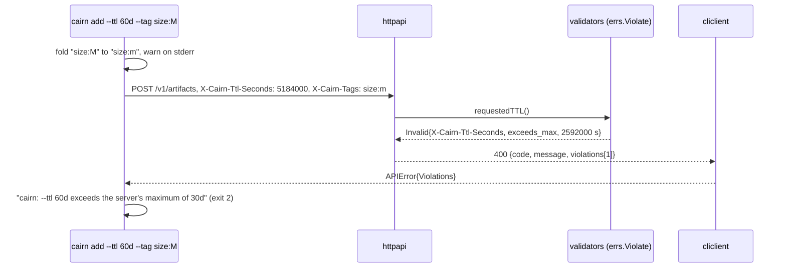

# Design: Actionable Validation Errors

## Context

`internal/errs` defines a `Code` taxonomy and `*Error` sentinels.
`errs.Validationf` wraps `ErrValidation` with a formatted message that is only
ever logged. `internal/httpapi/errors.go` renders every error as
`{code, message, details, request_id}`:

- `messageFor(CodeValidation)` is the fixed "the request was invalid";
- `details` is a caller-supplied `map[string]string` of identifiers.

The MCP adapter's `mcpToolErr` returns `"<code>: <messageFor(code)>"`. The CLI's
`cliclient.APIError` decodes `Details map[string]string` and prints `Message`.

About 158 sites produce validation errors. The TTL header path renders with
`nil` details, and the tag path with `{"field": "tag"}`.

See SPEC-0019 (`spec.md`) for the requirements and ADR-0025 for the decision.

## Goals / Non-Goals

### Goals

- Every client-reachable validation failure names its field, its reason and its
  limit, on REST, MCP and the CLI.
- The change is additive on the wire, with no shim kept for old clients
  (pre-1.0; design review, 2026-09-22).
- Not-found, unauthorized and forbidden responses are unchanged.
- The CLI folds tag case, with a warning.

### Non-Goals

- Replacing the envelope with RFC 9457 Problem Details.
- Internationalised messages.
- Client-side validation of charset, length or count in the CLI (the server
  stays authoritative).
- Surfacing internal invariant failures (for example "provenance channel is
  required", which a client cannot cause) as client violations. Those remain
  `invalid` until reclassified as internal errors.

## Decisions

### A typed violation in `internal/errs`

**Choice**:

```go
package errs

type Location string // header|query|form|body|path

type Reason string // closed registry, SPEC-0019 VE-2
const (
	ReasonRequired        Reason = "required"
	ReasonInvalidFormat   Reason = "invalid_format"
	ReasonInvalidCharset  Reason = "invalid_charset"
	ReasonUppercase       Reason = "uppercase"
	ReasonTooLong         Reason = "too_long"
	ReasonTooShort        Reason = "too_short"
	ReasonTooMany         Reason = "too_many"
	ReasonExceedsMax      Reason = "exceeds_max"
	ReasonNotPositive     Reason = "not_positive"
	ReasonUnknownValue    Reason = "unknown_value"
	ReasonDuplicate       Reason = "duplicate"
	ReasonMismatch        Reason = "mismatch"
	ReasonNotAllowed      Reason = "not_allowed"
	ReasonChecksum        Reason = "checksum_mismatch"
	ReasonTooLarge        Reason = "too_large"
	ReasonTooLargeToScan  Reason = "too_large_to_scan"
	ReasonSecretDetected  Reason = "secret_detected"
	ReasonInvalid         Reason = "invalid" // unmigrated sites only
)

type Violation struct {
	Field    string         `json:"field"`
	Location Location       `json:"location"`
	Reason   Reason         `json:"reason"`
	Limit    any            `json:"limit,omitempty"` // number or string
	Unit     string         `json:"unit,omitempty"`
	Value    *string        `json:"value,omitempty"` // capped, VE-3
	Message  string         `json:"message"`
	Extra    map[string]any `json:"-"` // rule/line/column for secret_detected, flattened on encode
}

// Invalid is the domain error: one or more violations, wrapping ErrValidation
// (or ErrTooLarge for too_large) so CodeOf and errors.Is keep working.
type Invalid struct {
	Violations []Violation
	internal   string // for logs only
}

func (e *Invalid) Error() string { return e.internal }
func (e *Invalid) Unwrap() error { /* ErrValidation or ErrTooLarge */ }

func Violate(field string, loc Location, r Reason, opts ...Opt) *Invalid
func WithLimit(v any, unit string) Opt
func WithValue(s string) Opt // truncates to 64 bytes on a rune boundary
func Join(errs ...*Invalid) *Invalid // cumulative, VE-4
func ViolationsOf(err error) []Violation
```

`Message` is produced by one function, `message(reason, field, limit, unit,
value)`, that owns every sentence. Messages are therefore consistent, and
tested once, rather than hand-written at 158 sites.

**Rationale**: A typed error that still unwraps to the existing sentinels means
every `errors.Is(err, errs.ErrValidation)` in the codebase keeps working, and the
migration can go site by site.

### Rendering

**Choice**: `errorBody` gains a field:

```go
type errorBody struct {
	Code       errs.Code         `json:"code"`
	Message    string            `json:"message"`
	Details    map[string]string `json:"details,omitempty"`
	Violations []errs.Violation  `json:"violations,omitempty"`
	RequestID  string            `json:"request_id,omitempty"`
}
```

`writeError` behaves as follows:

- for `validation_failed` and `payload_too_large`, it takes `errs.ViolationsOf(err)`
  (or synthesises the single `invalid` violation);
- it sets `Message` to the first violation's `field: message`, or to
  `"N problems: …"` when there are several;
- it leaves `details` as the handler passed it, and does not copy violation
  fields into it;
- every other code takes the existing path untouched. That is what VE-5's
  byte-identical test pins.

`tagErrorDetails()` is deleted. Tag violations now carry their own field.

### MCP

**Choice**: `mcpToolErr` returns a `*mcp.CallToolResult` with `IsError: true`,
`Content: [{type: text, text: <top-level message>}]` and `StructuredContent:
{code, violations}`, in place of a bare Go error, for validation codes. Other
codes keep today's `"<code>: <message>"` text.

### CLI

**Choice**:

- `cliclient.APIError` gains `Violations []Violation`, decoded from the new key.
- `clicmd` gets a `renderViolations(err, flags)` that maps fields to flags
  through a small table, and formats TTL limits with the same duration formatter
  `--ttl` parses (`2592000` seconds is `30d`).
- `parseTagFlags` lower-cases ASCII uppercase and emits
  `cairn: warning: tag "size:M" sent as "size:m"` for each changed tag.
- The warning goes to stderr, so `--json` stdout stays machine-clean.

| Wire field | CLI flag |
|---|---|
| `X-Cairn-Ttl-Seconds`, `ttl_seconds` | `--ttl` |
| `tag`, `tags[n]`, `X-Cairn-Tags` | `--tag` |
| `X-Cairn-Type`, `type` | `--type` |
| `title`, `X-Cairn-Title` | `--title` |
| `X-Cairn-Redaction` | `--redact` |
| `members[n].*` | the n-th file argument (by path) |

### Migration order

Sites migrate in the order callers hit them:

1. TTL (header and policy body);
2. tags;
3. share type;
4. checksum;
5. upload size;
6. bundle members;
7. annotations (emoji, body, anchor, thread);
8. runs and span tree;
9. hooks.

The migration guard test (VE-6) holds an explicit list of sites. It grows with
each story, and a site already on the list can never regress to a bare error.

## Architecture



## Risks / Trade-offs

- **A long migration tail.** Mitigation: unmigrated sites still render (reason
  `invalid`), and the guard test makes coverage explicit and ratcheting.
- **Echoed values as a new output path.** Mitigation: a 64-byte cap,
  JSON-encoded only, and suppression for bodies and secrets (VE-3), with a test
  for each suppression.
- **Message drift across surfaces.** Mitigation: one message function in `errs`.
  REST, MCP and the CLI render the same `message` string (the CLI prefixes the
  flag mapping only).
- **Old CLI plus new server.** Mitigation: `details` keeps its type, and the
  top-level message improves on its own. A decode test pins this.

## Migration Plan

1. Land `errs.Violation` / `Invalid`, the renderer, the MCP change, and the
   compatibility tests (VE-1, VE-5, VE-6 scaffold, VE-7), with TTL and tags
   migrated as the first sites.
2. Land the CLI rendering and tag folding (VE-8, VE-9).
3. Migrate the remaining subsystems, one story each.
4. Publish the error reference page (reason registry, examples) in the website
   guides.
5. Rollback: revert the renderer. Domain violations still unwrap to
   `ErrValidation`, so the old generic path returns.

## Open Questions

- Should the server publish its limits (maximum TTL, maximum tags, upload cap)
  on an unauthenticated or `whoami`-adjacent endpoint, so the CLI can validate
  before sending? It is deferred. Violations already carry the limit on first
  failure.
