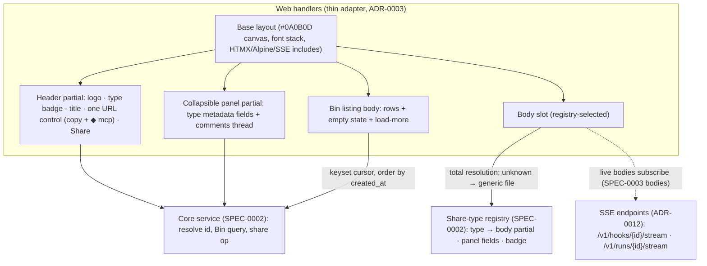

# Design: Web App Shell and the Bin

## Context

Cairn shows seven kinds of artifact — markdown, code, image, generic file, bundle, live
webhook, trajectory — in the *same* web frame. ADR-0011 fixes that frame: a
server-rendered `html/template` shell enhanced with HTMX (partial swaps, SSE-driven live
regions) and Alpine.js (view-local state), shipped inside the ADR-0012 Go binary with no
build step, meeting WCAG 2.1 AA and staying terminal-minimal. ADR-0003 fixes the shell's
place in the system: the web surface is a thin adapter over the one core service, and the
Bin listing is the *same* projection the CLI TUI renders.

This design realizes SPEC-0001, which owns the **shell frame** (header, URL control, Share
affordance, collapsible metadata + comments panel), the **body slot** contract, and the
**Bin** (listing rows, empty state, keyset pagination). It requires SPEC-0002 for the
Artifact aggregate, the share-type registry (type → body partial + panel fields + badge),
the public-id/URL scheme, and the Bin query. It deliberately does **not** design the
per-type bodies themselves — that is SPEC-0003.

## Goals / Non-Goals

### Goals

- One base layout that owns the header, URL control, and collapsible panel so the chrome
  is a single implementation reused by every type.
- A body-slot contract where the registry selects the partial and the shell never
  `switch`es on type; adding a type is adding a partial.
- A URL control that is the visual anchor of the header: short link + local copy + `◆ mcp`
  handle for the same id.
- A Share affordance and dialog that delegate all access rules to the core.
- A collapsible panel whose toggle is local (Alpine) but whose comment posting is a core
  round-trip (HTMX).
- A Bin listing provably identical to the CLI TUI (same server-side query), with an empty
  state and keyset pagination.
- WCAG 2.1 AA: landmarks, focus management, `aria-live` for swapped/streamed regions,
  non-color-only cues, keyboard operability.

### Non-Goals

- Per-type body rendering (markdown TOC, code outline, image pins, webhook inspector,
  trajectory waterfall) — SPEC-0003.
- The artifact/registry/storage/id backbone — SPEC-0002.
- Annotation storage and anchor legality — SPEC-0006 (the shell only renders affordances).
- Fully keyboard-driving the web shell to TUI parity — an explicit ADR-0011 "try next";
  v1 commits to AA operability, not a complete web-as-TUI keymap.
- A SPA/client router or client-side data layer — rejected by ADR-0011.

## Decisions

### Server-rendered base layout with two slots

**Choice**: A single Go `html/template` base layout renders the `#0A0B0D` canvas, the font
stack (IBM Plex Sans UI, JetBrains Mono for code/spans/ids), the HTMX/Alpine/SSE includes,
and two fill points — a **body slot** and a **panel**. The header partial and the panel
partial are defined once and composed into every page.

**Rationale**: ADR-0011 requires the header, URL control, and panel to be one
implementation reused across seven types. Composing partials into one base layout makes the
shared-shell invariant structural rather than a per-type convention.

**Alternatives considered**:
- Per-type full templates: re-templates the chrome seven times, guaranteeing drift —
  rejected by ADR-0011.
- A SPA that re-derives shell state client-side: doubles rendering logic and fights the
  aesthetic and the single-binary ethos — ADR-0011 Option B, rejected.

### Registry-driven body slot; shell never switches on type

**Choice**: The shell asks the SPEC-0002 registry for the artifact's body partial and panel
fields and mounts them. Resolution is **total** — an unknown/unregistered type resolves to
the generic file body — so the slot is never empty and the shell holds no `switch shareType`.

**Rationale**: ADR-0002/ADR-0011 keep the shell closed for modification: adding a type is
adding a registered partial, and total resolution guarantees forward/backward
compatibility (an older binary still shows an unknown type as a file card).

**Alternatives considered**:
- A `switch` in the shell over the type set: spreads type knowledge into the chrome and
  turns "add a type" into a scavenger hunt — ADR-0002 Option B, rejected.

### Local interactivity in Alpine, server truth in HTMX

**Choice**: View-local, ephemeral UI state — the panel collapse toggle, the URL copy, the
reaction `＋` picker — lives in Alpine with no round-trip. Domain mutations — posting a
comment, changing sharing, loading more of the Bin, and swapping live stream fragments —
are HTMX partial swaps that reach the core.

**Rationale**: ADR-0011 splits interactivity so local state is instant and offline-robust
while the server stays the single source of truth for domain data; it avoids ADR-0011
Option D's "every toggle is a network round-trip."

**Alternatives considered**:
- HTMX-only (round-trip every picker/toggle): sluggish and chatty for purely local state —
  rejected.
- Pure server templates (full reloads): cannot deliver the pickers/affordances the design
  shows — ADR-0011 Option C, rejected.

### The Bin projects the same core query as the TUI

**Choice**: The Bin renders rows (type badge · title · provenance · `💬`/`👀` counts) from
the SPEC-0002 keyset-paginated Bin query — the exact query the `cairn ls` TUI projects —
ordered by stored `created_at`. "Load more" is an HTMX swap of the next cursor page; a
zero-row result renders an explicit empty state.

**Rationale**: ADR-0003 makes "the same listing" a parity property, not a coincidence;
sharing one server-side query is how the web Bin and the TUI are provably the same. ADR-0005
forbids ordering by id (random, non-time-ordered), so `created_at` is the sort key.

**Alternatives considered**:
- A web-specific listing query: risks divergence from the TUI — rejected by ADR-0003.
- Offset pagination: skips/duplicates rows under insert/expire churn — ADR-0012 rejected it
  for keyset.

## Architecture

The base layout owns the frame; the header and panel are shared partials; the body slot is
filled by a registry-selected partial (SPEC-0003 owns those bodies). The Bin reuses the same
base layout with a listing body. All dynamic data comes from the core service through the
web adapter (ADR-0003); live bodies subscribe to the ADR-0012 SSE endpoints.



Rendering an artifact page (the capability-link read path):

```mermaid
sequenceDiagram
  participant U as Reader (link-holder)
  participant W as Web handler (adapter)
  participant C as Core service (SPEC-0002)
  participant R as Registry (SPEC-0002)
  U->>W: GET /{id}
  W->>C: Resolve public id → artifact (or uniform 404)
  alt unknown / unauthorized / expired
    C-->>W: not found
    W-->>U: 404 (uniform, no signal)
  else found
    C-->>W: artifact (type, title, provenance, panel data)
    W->>R: body partial + panel fields for share type (total)
    R-->>W: partial (or generic-file fallback)
    W-->>U: server-rendered shell (header · panel · body slot)
    Note over U,W: Alpine handles local toggles/copy;<br/>HTMX handles comment posts, load-more, live swaps
  end
```

## Risks / Trade-offs

- **Interactivity split across HTMX / Alpine / bespoke widgets** → contributors must know
  which tool owns which behavior; keep the seam disciplined (Alpine opens a picker, HTMX
  posts the result) and documented per ADR-0011.
- **Capability-link pages are Public and enumerable in principle** → rate-limit id
  resolution and return a uniform 404 for unknown/unauthorized/expired ids (ADR-0005/0007),
  leaning on the 8-char entropy and short TTL as defense-in-depth.
- **Untrusted artifact bodies rendered in the shell** → strict CSP plus server-side
  sanitization/isolation so a markdown/HTML body cannot execute in Cairn's origin.
- **No SPA niceties** (client routing, optimistic updates, offline polish) → accepted per
  ADR-0011 for a share-viewing tool; heavily interactive future surfaces may pressure the
  HTMX/Alpine approach.
- **Bin/TUI drift** if the two ever fork queries → enforce the single shared core Bin query
  as the parity gate (ADR-0003).

## Open Questions

- Does the Bin default to only the authenticated owner's workspace, and how are
  multi-workspace members scoped in the listing? (ADR-0001 keeps team semantics thin in v1.)
- Should the panel default collapsed or expanded per share type (e.g. file vs. trajectory),
  and is that preference remembered per user?
- What is the exact "load recent, then tail" reconciliation contract the shell relies on for
  a reconnecting live body (owned by SPEC-0003/ADR-0010) versus what the shell must render on
  a cold open?
