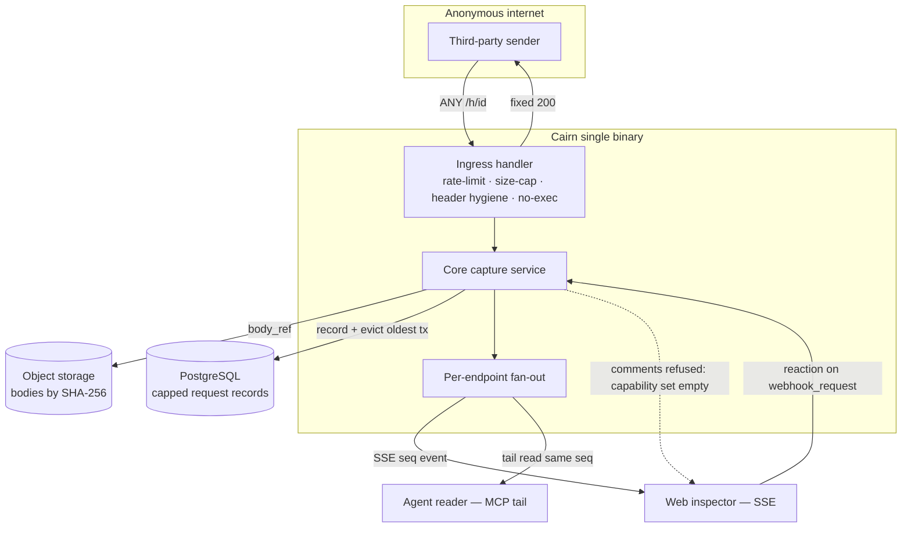
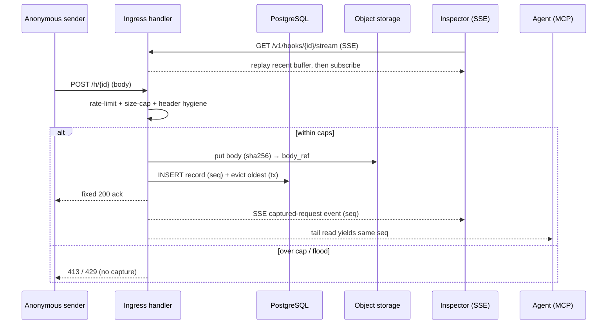

# Design: Webhook Inspector

## Context

The `webhook` share type (badge `HK`) is a **live** requestbin: an endpoint an agent or a
service points at, whose inbound HTTP requests stream into a web inspector and are readable by
agents over MCP as the *same* stream (`mcp://cairn/hook/<id>`). It is the one share type whose
body is not pushed by its owner — it is filled by unauthenticated third parties hitting an
open ingress URL. **ADR-0010** decided native capture: a Postgres-indexed request ring buffer,
object-storage bodies, and SSE + MCP fan-out off one `seq`-ordered log. This spec formalizes
that model's observable behavior and, because the ingress is an open attack surface, treats
security as a first-class, load-bearing concern.

Constraints inherited from the ADRs:

- **SPEC-0002 / ADR-0002** — a webhook is an ordinary artifact and a registry entry; it gets
  provenance, link access, expiry, and the app shell for free.
- **ADR-0008** — request bodies are content-addressed in object storage; only queryable
  metadata lives in PostgreSQL.
- **ADR-0006 / SPEC-0006** — the registry entry makes requests *reactable but not
  comment-threaded* as data, not a code branch: `webhook.reactions = { artifact,
  webhook_request }`, `webhook.comments = { }`.
- **ADR-0012** — one Go core service, REST/JSON under `/v1`, SSE for live push, keyset
  pagination, a structured error envelope.
- **ADR-0007** — link-capability reads, uniform 404s, ephemeral TTL as containment.

## Goals / Non-Goals

### Goals

- Capture inbound requests into a capped, `seq`-ordered ring buffer: metadata in Postgres,
  bodies in object storage.
- Serve one ordered log to both browsers (SSE) and agents (MCP) so a human and an agent see
  the same requests in the same order.
- Make the open ingress safe by construction: no code execution, hard size caps, rate
  limiting, unguessable ids, header hygiene, and retention caps.
- Give ADR-0006 a stable per-request row to anchor reactions to, while structurally forbidding
  comment threads.

### Non-Goals

- Being a durable archive: a strict last-N ring buffer intentionally drops older requests;
  there is no v1 export.
- A message broker as the store of record (ADR-0010 Option C) — deferred until scale demands
  it; fan-out is done in the app tier for v1.
- Fronting a third-party requestbin — that would break "the same stream over MCP" and create a
  data-residency problem.
- First-request empty-state and stream filtering by status/event — both "try next," additive,
  and absent from v1.
- Deciding the inspector's visual design (ADR-0011).

## Decisions

### Native capture over a broker or third-party bin

**Choice**: A `webhook` artifact owns an ingress URL; each inbound request becomes a capped,
append-only record (metadata in Postgres, body in object storage); SSE + MCP fan out off the
same log.

**Rationale**: Keeps the webhook inside the one-artifact model (provenance, access, expiry for
free), gives the inspector fast metadata queries (status mix, method counts) without reading
bodies, keeps arbitrary/large payloads in the right tier, and serves the identical ordered
stream to both surfaces.

**Alternatives considered**:
- Third-party requestbin (RequestBin/webhook.site): outsources the core value, adds a
  dependency and a data-residency problem, and breaks "same stream over MCP."
- Broker as store of record (Redis Streams/NATS): operationally heavier than v1 warrants; we
  would still project into Postgres/object storage anyway, so the broker is pure overhead until
  scale demands it. It remains a defensible future fan-out layer.
- Object storage only, no index: cannot answer "status mix" or "how many POSTs" without
  scanning every blob and gives ADR-0006 no stable per-request row to anchor to.

### Ring buffer + TTL as the containment story

**Choice**: A per-endpoint last-N ring buffer (evict oldest on overflow, dereference its body
blob) plus the artifact TTL.

**Rationale**: Together they cap both *how many* requests and *how long*, so an anonymous flood
can at worst churn one endpoint's buffer, never exhaust global storage; an abused endpoint
self-heals on expiry.

### No execution, ever

**Choice**: The ingress parses only content-type and size; the payload is stored bytes and
indexed metadata. Cairn never executes, deserializes-to-execute, shells out on, or follows a
payload; the inspector renders payloads as inert escaped text.

**Rationale**: Removes the scariest class of open-ingress risk by construction. This is the
single most important security decision and is enforced structurally, not by policy.

### Metadata in Postgres, bodies in object storage

**Choice**: `webhook_id`, `seq`, `received_at`, `method`, `path`, `query`, normalized
`headers`, `status`, `content_type`, `body_size` in Postgres; raw body content-addressed in
object storage, referenced by `body_ref`.

**Rationale**: The inspector's status mix, method badges, and counts are cheap Postgres
queries; arbitrary large payloads stay in the right tier and dedup by hash; bodies load lazily
on expand.

## Architecture

The ingress handler is a deliberately minimal, sanitizing front door: it enforces rate limits
and size caps, normalizes headers, writes the body to object storage, inserts the capped record
in Postgres, returns a fixed benign response, and fans the new `seq` out. Both the SSE web
inspector and the MCP tail read the *same* `seq`-ordered log — never a parallel copy.

Capture and fan-out over time — one write, two readers, recent-history-then-tail for late
joiners:

## Risks / Trade-offs

- **Open ingress is an attack surface** → mitigated by construction: no execution, hard size
  cap (413), per-endpoint + per-IP rate limit (429), unguessable base62 id, header hygiene,
  and ring-buffer + TTL caps. These are load-bearing, not optional hardening.
- **Ring buffer silently drops old requests** → a user who wanted the 501st request back
  cannot get it, and there is no v1 archive/export. Mitigation is a workflow, not a guarantee:
  "produce an artifact from what mattered," then discuss on that artifact.
- **App-tier SSE fan-out on a hot endpoint** → real per-connection work without the deferred
  broker. Mitigation: context-cancelled teardown of dropped subscribers, `Last-Event-ID`
  resume, race-tested subscriber state; the broker (ADR-0010 Option C) remains a future option.
- **No comment threads on requests surprises users** → a deliberate steer enforced by the
  ADR-0006 empty comment-capability set, not a technical limitation; discussion moves to
  produced artifacts.
- **Orphaned blob on crash** → a body written before its record commits can orphan; mitigated
  by ADR-0008's DB-authoritative refcounted GC reaper.
- **Attacker-controlled metadata in SQL** → method/path/headers are attacker-supplied;
  mitigated by parameterized queries only (a review gate) and header normalization on capture.

## Open Questions

- What is the exact ring-buffer size N, and is it configurable per endpoint or deployment?
  (ADR-0010 suggests N = 500 as an example.)
- What is the hard body-size cap, and on overflow do we reject (413) or truncate-and-flag? The
  spec permits both; a deployment default is unsettled.
- Which specific headers are on the drop/normalize list, and is that list configurable?
- What is the fixed ingress response body/status by default, and may an owner customize it
  without ever letting the *payload* steer it?
- Should the ingress live on a dedicated host (`hook.cairn.stump.wtf`) separate from the app origin to
  further isolate untrusted traffic from session cookies, and does that change the CSP story?
- What are the per-endpoint and per-IP rate-limit defaults, and are they owner-tunable?
