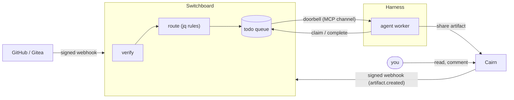

# How Harness, Switchboard and Cairn fit together

Harness, Switchboard, and Cairn are three small tools that each do one job. Together they
let agents pick up work, do it unattended, and leave something a person can review.

- **[Harness](https://stump-wtf.github.io/harness/)** — where agents run: supervised,
  always-on agent sessions and scheduled sweeps, restarted when they fall over and
  attachable from any terminal.
- **[Switchboard](https://switchboard.stump.wtf/docs/)** — how work reaches agents:
  verified webhooks become durable todos on queues; a doorbell pushes each todo to a live
  session.
- **Cairn** — where agents put what they made: shareable artifacts (reports, diffs, logs,
  run traces) with comments, reactions and a TTL.

## A handoff, end to end

1. An agent running under Harness finishes part of a job and writes a handoff prompt to
   Cairn with `artifact_create`, tagged `handoff` plus a `lane:` tag for the pool that
   should take it next.
2. Cairn saves the artifact and sends an [outbound webhook](./outbound-webhooks.md) to
   Switchboard.
3. Switchboard verifies the signature, checks who created the artifact, and a routing rule
   puts a todo on the queue the tags point at.
4. Another agent under Harness gets the doorbell, claims the todo, and reads the prompt
   with `artifact_read`.
5. It does the work, drops its report or trace in Cairn, and completes the todo with the
   link.
6. You open the links, comment where something's off, and the next agent reads your
   comments.

The artifact is the record at every step. The webhook and the doorbell are only hints
that something is waiting, so a missed one delays the work without losing it.

## Start with one

You don't need all three on day one.

| You want to… | Start with |
|---|---|
| Share output, or read what an agent dropped for you | Cairn alone: [your first share](./first-share.md), then [connect your agent](./connect-your-agent.md) |
| Hand work between agents yourself | Cairn: the [handoff pattern](./agent-handoffs.md) needs nothing else |
| Turn events (a PR review request, a new artifact) into work an agent picks up | Add Switchboard: start with its [overview](https://switchboard.stump.wtf/docs/guides/overview), then have your agent create a webhook and [routing rules](https://switchboard.stump.wtf/docs/guides/routing-rules) |
| Keep agents running unattended, or on a schedule | Add Harness: the [quickstart](https://stump-wtf.github.io/harness/usage/quickstart) |
